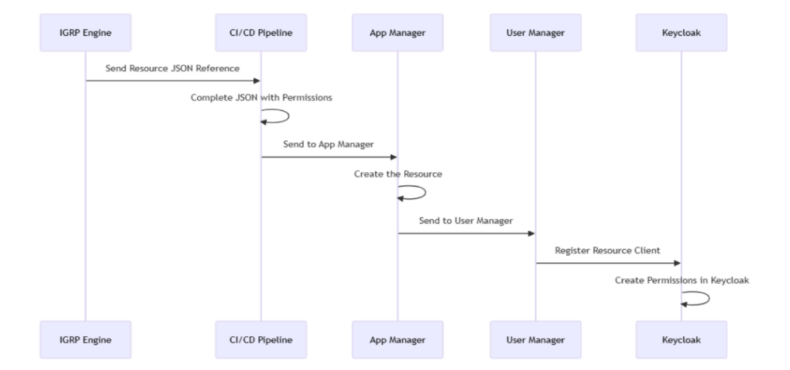

# Deployment 

Os microserviços são deployados de forma independente e podem ser orquestrados usando plataformas como **Kubernetes** ou **Docker**.

## Kubernetes
- **Gerenciamento**: Kubernetes facilita o gerenciamento de múltiplos microserviços, orquestrando o deploy, escalabilidade e recuperação de falhas.
- **Exemplo**: Cada microserviço é empacotado como um container Docker e gerenciado pelo Kubernetes.

## Docker
- Cada microserviço é encapsulado em um container Docker, garantindo que ele seja executado de forma consistente em qualquer ambiente.

## CI/CD
Utilizamos pipelines de **CI/CD** para automação do build, testes e deploy dos microserviços, garantindo entregas contínuas.

O pipeline de CI/CD automatiza a integração entre as aplicações recém-criadas pelo IGRP Engine e as APIs de gerenciamento de recursos, garantindo que todas as medidas de segurança e as permissões necessárias sejam aplicadas corretamente.

Em detalhes, o pipeline processa os dados JSON gerados pelo IGRP Engine, preenche automaticamente qualquer informação obrigatória que esteja faltando e envia a solicitação finalizada para o App Manager (que, por sua vez, encaminha para o User Manager). 

Isso aciona todo o fluxo de trabalho de criação de recursos e atribuição de permissões, assegurando um processo de deployment seguro e sem interrupções para as aplicações dentro do sistema.

