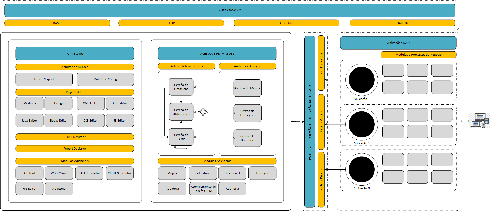
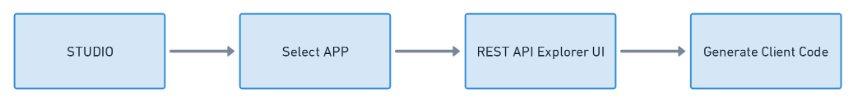
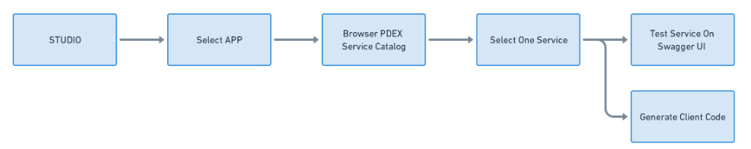

#  Visão geral

A **arquitetura do IGRP** é baseada no modelo de **microserviços**,   é baseada no modelo de microserviços, facilitando a manutenção e escalabilidade.Esse modelo facilita a manutenção e a escalabilidade, permitindo que a aplicação seja dividida em serviços independentes e auto-suficientes. Cada serviço é responsável por uma funcionalidade específica, e a comunicação entre os serviços é realizada por meio de **APIs**.

A nova arquitetura do framework do **IGRP** faz uso de containers com o Docker e de orquestração com o Kubernetes, tornando a aplicação ainda mais flexível. Essas ferramentas permitem que a aplicação seja facilmente implantada, escalada e mantida em diferentes ambientes, assegurando que cada serviço opere de forma isolada, mas de maneira integrada ao sistema como um todo. 

Adicionalmente, apresenta **integração contínua e a entrega contínua (CI/CD)**, fator essenciais para acelerar o ciclo de vida da aplicação, permitindo que atualizações e melhorias sejam implementadas de forma rápida e segura, sem comprometer a qualidade ou a performance do sistema.

Além disso, práticas de segurança, monitoramento e rastreamento de métricas de cada serviço são fundamentais para proteger os dados e garantir a alta disponibilidade da aplicação. Quando essas práticas são aplicadas de forma integrada, elas tornam a solução robusta, eficiente e altamente resiliente a falhas.

# 1. Diagramas de Arquitetura
Este diagrama representa a arquitetura de microserviços, mostrando como os diferentes serviços se comunicam entre si.

## 2.Componentes

A arquitetura é composta por vários microserviços, cada um com responsabilidades específicas. Abaixo estão os principais componentes da nossa arquitetura:

### 2.1. IGRP UI: User Interface

A interface de utilizador do IGRP permite a gestão de aplicações e utilizadores de forma intuitiva. As aplicações web são criadas através de um sistema drag and drop e configurações intuitivas

### 2.2. IGRP Studio
 Este é o componente responsável pela geração de aplicações frontend e backend. O IGRP Studio funciona como uma aplicação independente, proporcionando um ambiente low-code para a criação de aplicações e APIs.O IGRP Studio é o ambiente usado para desenvolver aplicações dentro do igrpweb, ele inclui os seguintes componentes:

- **Database designer** : Modelação visual de bases de dados com abordagens “code-first” e “database-first”, suportando vários motores de bases de dados.
 - **Gerador de API** : Geração e gestão de APIs RESTful com documentação automatizada, ferramentas de teste integradas e controlo de versões avançado.
 - **Page Builder** - gerador de interface para a geração de páginas Web responsiva e intuitiva com componentes de arrastar e largar;
 - **BPMN Designer** - gerador de fluxo de processo;
 - **Report Designer** - gerador de relatórios;
 - **Application Builder** - gerenciamento de aplicativos.
 
 ### 2.3. Engines de Geração de Código

 A geração de código no IGRP Studio é modular e realizada através dos chamados Engines. Atualmente, estão disponíveis o Spring Engine para a geração de APIs e o NextJS Engine para a criação de páginas web.

  ### 2.4. Infraestrutura Kubernetes
  A infraestrutura do IGRP foi projetada para execução em Kubernetes, garantindo segurança, escalabilidade e alta disponibilidade. Componentes padrão incluem Grafana/OpenTelemetry para monitorização e logging, Trivy Operator para auditoria de segurança, MinIO para gestão de ficheiros e Keycloak para autenticação e autorização.

  ### 2.5. Automatização de Aplicações: 
    Todas as aplicações geradas pelos Engines possuem um pipeline de CI/CD integrado, permitindo a publicação automática em um cluster com configurações mínimas e a disponibilidade imediata das aplicações no ambiente do IGRP.

## 3. Infraestrutura
O IGRP é executada em Kubernetes, garantindo segurança, escalabilidade e alta disponibilidade.

- **Containers e orquestração**
  - Utilizar containers, como o Docker, e orquestradores, como o Kubernetes, é uma boa prática para garantir que a aplicação possa ser facilmente implantada e escalada em diferentes ambientes.

- **Integração contínua e entrega contínua (CI/CD)**
  - É importante automatizar o processo de construção, teste e implantação da aplicação para garantir que as atualizações possam ser lançadas rapidamente e com segurança.

- **Segurança**
  - As aplicações modernas precisam ser seguras para proteger os dados dos usuários e garantir a privacidade. Isso inclui a implementação de medidas de segurança, como autenticação e autorização, auditoria, criptografia e validação de entrada de dados.

 - **Monitoramento e rastreamento**
   - Utilizamos ferramentas  **Prometheus** e **Grafana** para monitoramento.

  - **Escalabilidade Horizontal** 
  - Cada microserviço pode ser escalado de forma independente, utilizando Kubernetes para orquestrar os containers, permitem ser escaláveis para lidar com cargas de trabalho crescentes e garantir disponibilidade.

 - **Utilização de bibliotecas e frameworks**
   - Utilizar bibliotecas e frameworks modernos e atualizados, como Spring Boot, é uma boa prática para garantir que a aplicação seja desenvolvida com as últimas funcionalidades e melhores práticas de desenvolvimento.

## 4. Fluxo 

A comunicação entre microserviços é realizada através de APIs RESTful ou mensagens assíncronas, garantindo uma arquitetura flexível e escalável. O fluxo descrito abaixo detalha os principais componentes da arquitetura, suas interações e os processos envolvidos no desenvolvimento, consumo e integração de APIs.

#### 1. Desenvolvimento das APIs (REST) com OpenAPI 3.0

#### 2. Integração de serviços via PDEX 

#### 4. Automação CI/CD 
Portanto o fluxo do IGRP  concebido  para  oferecer aos seu utilizadores: 
- Escalabilidade e Flexibilidade
- Agilidade no Desenvolvimento
- Manutenção Simplificada
- Experiência de Desenvolvimento Intuitiva
