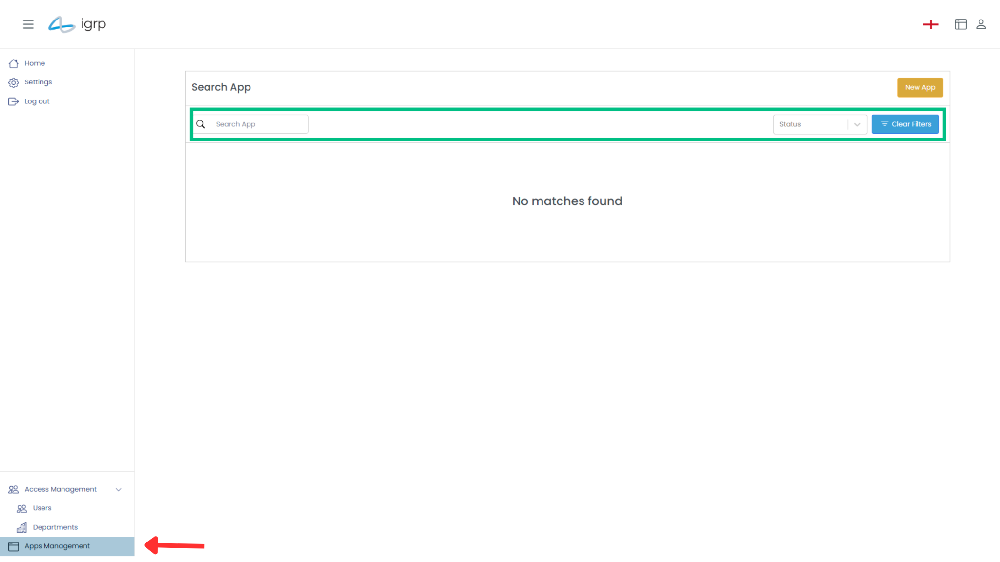
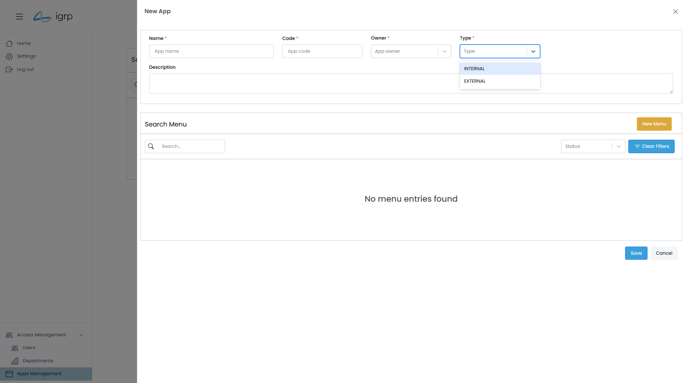
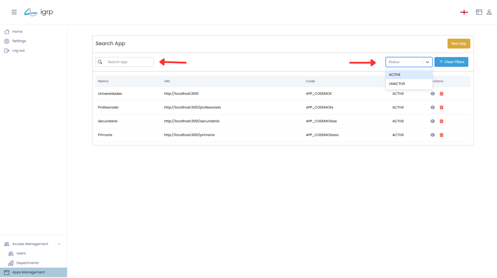

# Gestão de Applicação

Esta seção permite aos administradores visualizar, gerir e configurar todas as aplicações criadas no sistema. Através de uma interface intuitiva, é possível centralizar o controle, garantindo uma administração eficiente e organizada.

Para gerir as aplicações criadas, aceda ao menu lateral esquerdo e selecione a opção **"Apps Management"**, conforme indicado pela seta vermelha na imagem abaixo.

No painel direito, será apresentada uma lista de todas as aplicações criadas, proporcionando uma visão centralizada e facilitando a sua gestão.

## 1. Criar uma Aplicação

Esta seção permite aos administradores adicionar novas aplicações ao sistema, configurando-as de acordo com as necessidades da organização. O processo é simples e intuitivo, garantindo uma rápida implementação.

Para criar uma nova aplicação, aceda à secção de aplicações e clique no botão **"New App"**, localizado no canto superior direito.

Uma janela _pop-up_ será exibida, solicitando o preenchimento das informações necessárias. Caso opte por criar uma aplicação externa, será necessário fornecer o URL correspondente.

### 1.1 Visualizar e Filtar Aplicações

Nesta seção, todas as aplicações criadas são apresentadas em uma tabela, proporcionando uma visão organizada e de fácil acesso.

A tabela inclui opções de filtro para localizar rapidamente uma aplicação específica. Os filtros permitem buscar por estado (**Ativo** ou **Inativo**), **nome**, **URL** ou **código**, além da possibilidade de combinar múltiplos critérios para refinar os resultados.

