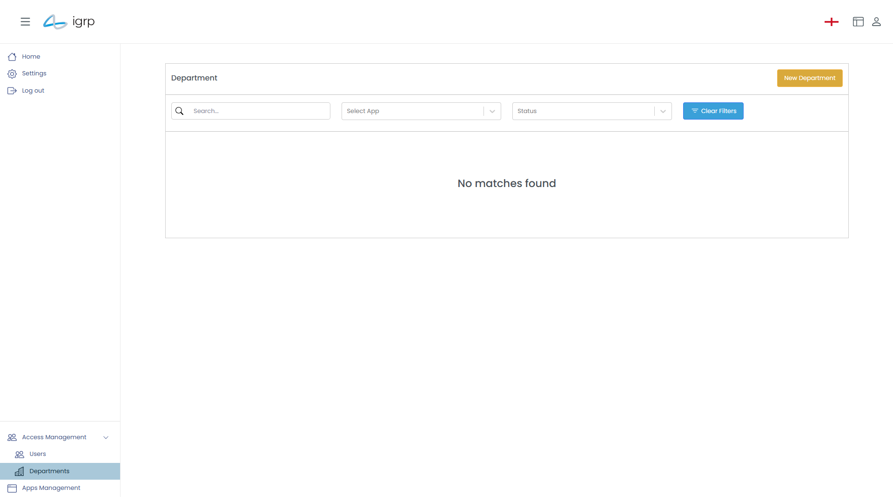
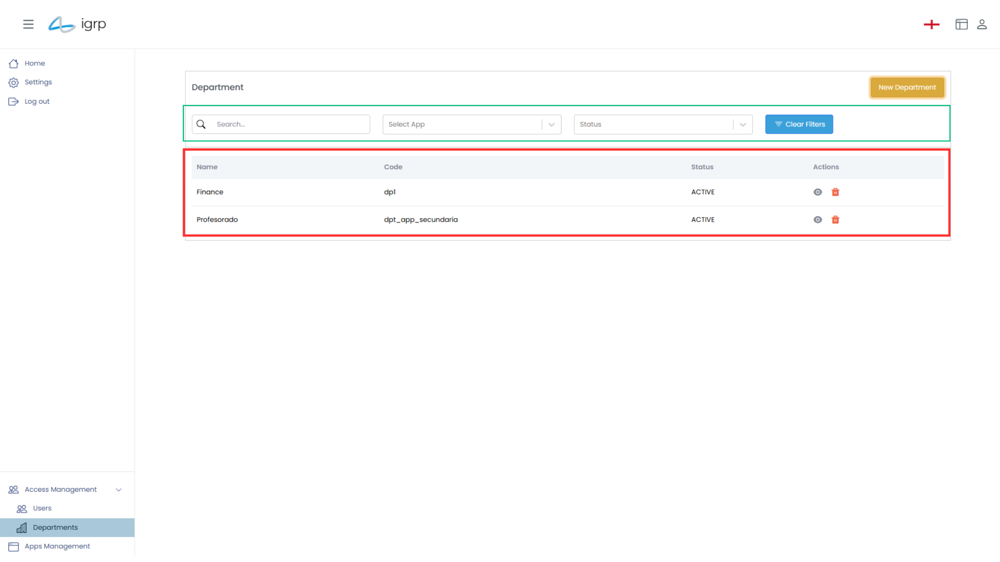
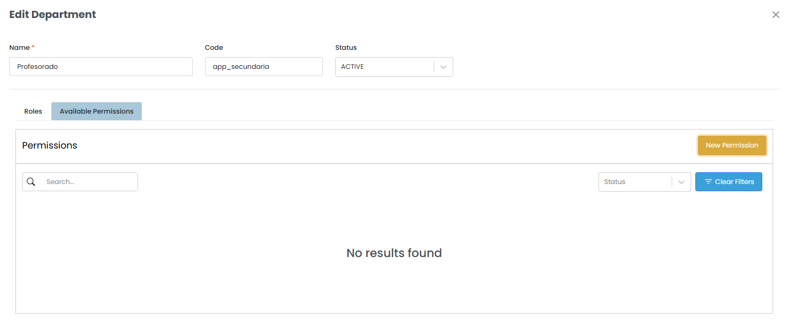
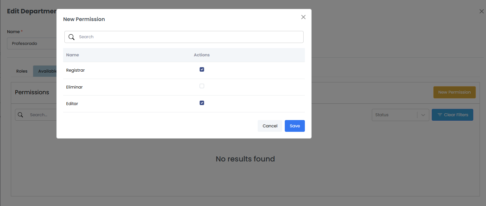
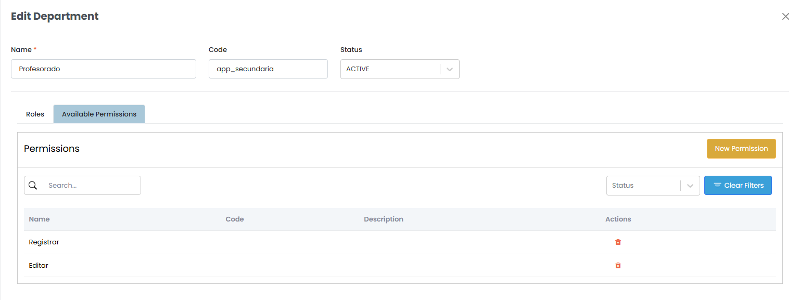
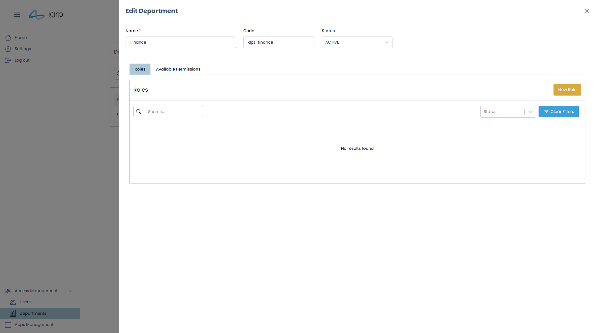
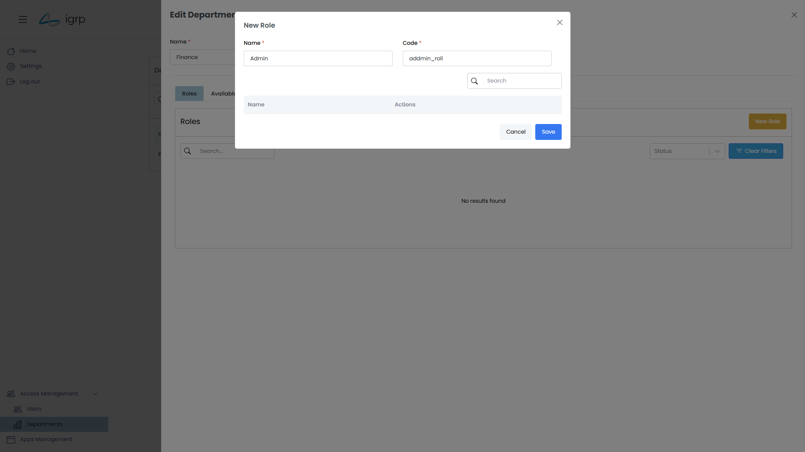

# Gestão de Departamentos

Esta seção permite ao responsável organizar e administrar os diferentes departamentos dentro da aplicação. Esta funcionalidade permite o criar, editar, excluir e visualizar departamentos, além de possibilitar a atribuição de utilizadores, funções e permissões específicas para cada unidade. Esse processo contribui para uma estrutura organizacional clara e bem definida, facilitando a administração e a comunicação interna da organização.

Para aceder à Departamentos, utilize a Barra Lateral, conforme a imagem abaixo.

## 1. Criar um Departamento

Para criar um novo departamento dentro do IGRP, siga os passos abaixo:

1. Aceda à barra Lateral e clicar em **Departments**.
2. Clique no botão **"New Department"**, localizado no canto superior direito.
3. Uma janela _pop-up_ será aberta, solicitando o preenchimento das informações necessárias, como o nome do departamento e outras configurações relevantes.
4. Após preencher os dados, clique em **"Save"** para registrar o novo departamento na estrutura organizacional.

![alt text]img/(image-4.png)

### 1.1 Filtar Departamentos

Para filtrar os departamentos, utilize os campos disponíveis na área verde. Este filtro combinado permite pesquisar por nome, código e estado dos departamentos.

Caso deseje repor o filtro, basta clicar no botão **"Clear Filters"**, e todos os critérios de busca serão removidos, restaurando a lista completa de departamentos.

### 1.2 Adicionar Permissões ao Departamento

Para adicionar uma ou mais permissões a um departamento, siga os seguintes passos:

1. Aceda à configuração do departamento correspondente.
2. Dentro da configuração do departamento, localize a seção **"Available Permissions"**.
3. Selecione as permissões necessárias e atribua-as ao departamento conforme desejado.
Esse processo garante que o departamento tenha as permissões adequadas para o seu funcionamento dentro da aplicação.

Esta seção apresenta todas as permissões disponíveis no departamento.
Para adicionar ou remover permissões, clique em **"New Permission"**, botão localizado no canto superior direito da seção.

O utilizador simplesmente precisa marcar as caixas de seleção para as permissões que deseja adicionar ao departamento ou desmarcar aquelas que deseja remover.

Após realizar as alterações, basta salvar. A lista de **"Available Permissions"** será automaticamente atualizada, refletindo as permissões atribuídas ou removidas do departamento.

### 1.3 Criar Funções (_Roles_)

Para criar uma função, o utilizador deve clicar no **View** (representado por um olho) no departamento, onde pretende adicionar a função. Isso abrirá a **visualização de edição** do departamento, onde será possível configurar e cria a nova função.

Uma vez na visualização de edição do departamento, o utilizador deve clicar no botão **"New Role"** para iniciar o processo de criação de uma nova função para o departamento.

Será exibido um _modal_ com campos para preenchimento e uma lista de permissões disponíveis dentro do departamento, cada uma acompanhada de uma caixa de seleção. O utilizador deve selecionar as permissões que deseja atribuir à nova função.

Após preencher todos os campos obrigatórios, o utilizador deve clicar no botão **"Save"** para salvar a função criada, com as permissões correspondentes.

