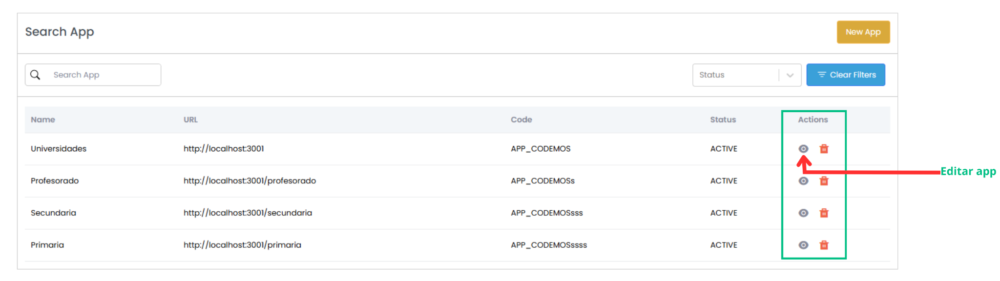
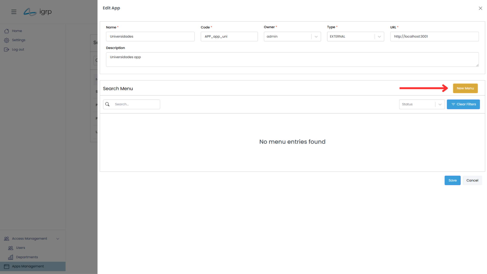
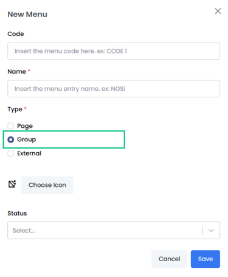
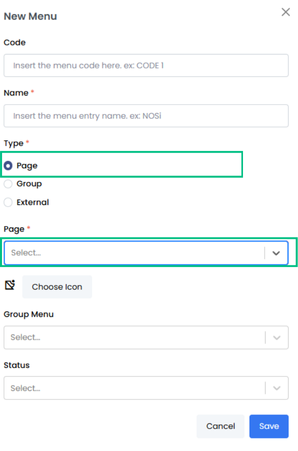
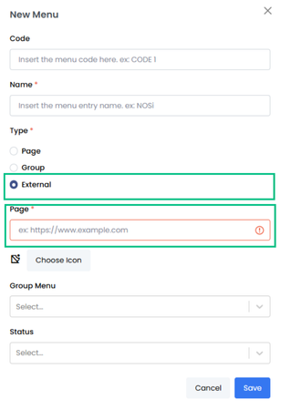
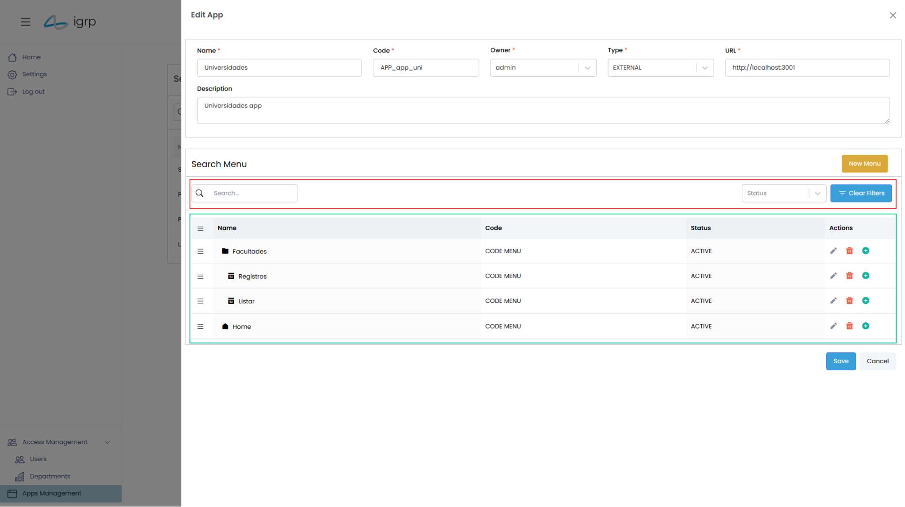
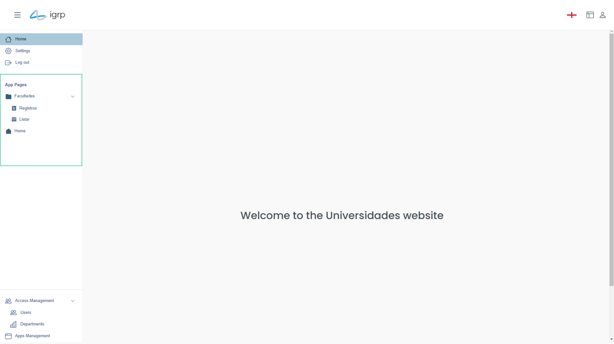

# Gestão de Menus

A Gestão de Menus é responsável por controlar a estrutura e os itens do menu na interface do utilizador, garantindo uma navegação eficiente e personalizada dentro do sistema IGRP.

Nesta seção, é possível:

- Criar, editar e organizar menus de forma intuitiva.
- Definir permissões de acesso, garantindo que apenas utilizadores autorizados acedam a determinados itens.
- Personalizar a experiência de navegação, adaptando a estrutura do menu às necessidades da organização.

Essa funcionalidade permite otimizar a usabilidade do sistema, tornando o acesso às aplicações e funcionalidades mais ágil e organizado.

## 1. Criar Menus

Para criar os menus de uma aplicação, é necessário aceder à sua seção de edição da aplicação.

Para isso, o utilizador deve clicar no ícone **"View"** (representado por um olho) na aplicação correspondente, conforme ilustrado na imagem abaixo, que permitirá gerir e configurar os menus da aplicação de forma personalizada.

Em seguida, devem clicar no botão **"New Menu"**, que abrirá uma janela _pop-up_ para a criação de menus.

### 1.1 Criar Grupo

No IGRP, é possível criar pastas para organizar vários menus de forma lógica. Essa funcionalidade permite uma navegação mais eficiente e facilita o acesso às diferentes opções dentro de uma aplicação.

Para criar um grupo de menus:

- Acesse a seção de edição da aplicação desejada.
- Clique na opção **"Group"** para agrupar menus relacionados.
- Organize os menus dentro da pasta criada, formando grupos que atendem às necessidades da organização.

Essa estrutura de pastas e grupos melhora a usabilidade, permitindo que os menus sejam facilmente acessados conforme a necessidade do utilizador.

  

### 1.2 Menu Interno (Associado a uma Página)

Para criar um menu que forneça acesso direto a uma página específica da aplicação, siga os passos abaixo:

- Crie um novo menu dentro da aplicação.
- Configure o menu para ser suspenso, permitindo que o utilizador visualize todas as páginas disponíveis.
- Ao clicar no menu, o utilizador poderá selecionar a página desejada, sendo redirecionado diretamente para ela.

Este tipo de menu é especialmente útil quando se deseja facilitar o acesso a várias páginas de forma rápida e organizada, permitindo ao utilizador escolher a página que deseja acessar de maneira intuitiva.

  

### 1.3 Menu Externo (Associação a um _Link_)

Para criar um menu que forneça acesso a uma página específica da aplicação, mas onde o URL precisa ser introduzido manualmente pelo utilizador, siga os passos abaixo:

- Crie um novo menu na aplicação.
- Ao invés de selecionar uma página específica da aplicação, forneça um campo para que o utilizador insira manualmente o URL da página desejada.
- O menu permitirá que o utilizador insira o endereço completo da página, fornecendo flexibilidade para acessar qualquer recurso ou página externa.

Este tipo de menu é útil quando o acesso não se restringe a páginas internas da aplicação e o utilizador precisa direcionar para um URL externo ou para uma página específica que não está na lista de páginas pré determinadas.

  

## 2. Visualização do Menu

Após a criação, os menus podem ser visualizados na seção de edição da aplicação. A estrutura do menu utiliza a hierarquia para representar as relações entre os itens. Os menus que estão dentro de uma pasta são apresentados em um nível mais profundo, indicando claramente a sua relação com a pasta pai.

Além disso, o sistema oferece filtros e opções de pesquisa para facilitar a localização do menu desejado. Para melhorar a organização, os menus podem ser reordenados facilmente utilizando a funcionalidade de arrastar e soltar.

Caso seja necessário mover um menu de uma pasta para outra, o utilizador deverá editar o menu e selecionar a nova pasta de destino. Isso garante flexibilidade e agilidade na organização da estrutura de menus.

Outra forma de visualizar os menus e navegar pelas suas páginas é acedendo diretamente à aplicação através da página inicial do **IGRP IU**.

Nessa visualização, os menus são listados na barra lateral, proporcionando uma navegação mais intuitiva e rápida. A estrutura organizada na barra lateral permite que os utilizadores acessem facilmente as diferentes páginas e funcionalidades da aplicação, como ilustrado na imagem abaixo.

