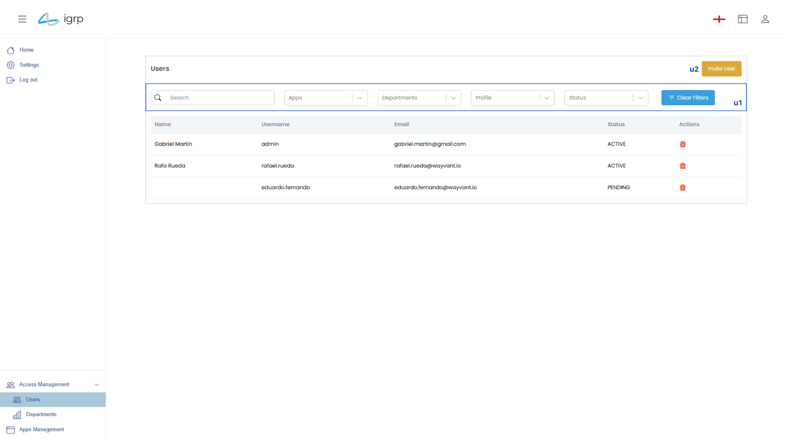
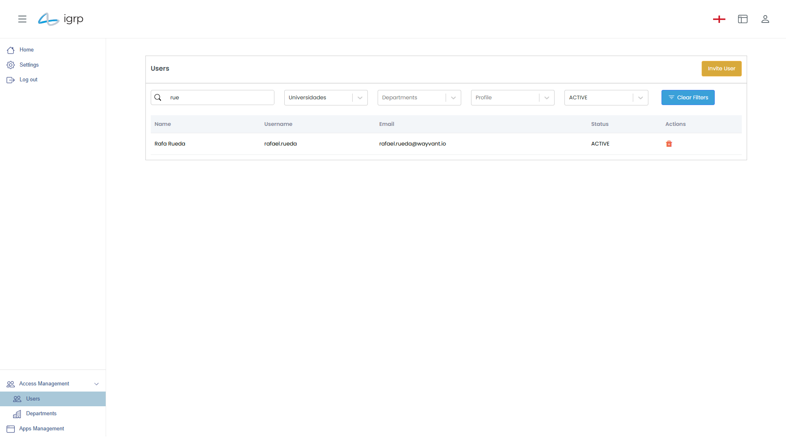
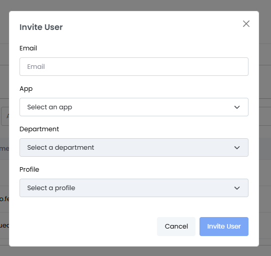

# Gestão de Utilizadores

A Gestão de Utilizadores é uma funcionalidade essencial dentro do IGRP, que permite aos administradores controlar e organizar todos os utilizadores de uma aplicação. Esta seção possibilita visualizar, filtar, excluir e convidar novos utilizadores, assegurando uma gestão eficiente e seguro dos acessos e permissões dentro do departamento.

### Filtar Utilizadores

Para filtrar utilizadores, utilize os campos em "u1". Este é um filtro combinado que permite pesquisar por nome, nome de utilizador, email, candidaturas, departamentos aos quais pertencem, funções atribuídas ou estado.

Caso deseje repor os filtros, o utilizador deve clicar no botão **"Clear Filters"**, restaurando a lista completa de utilizadores.

### Convidar Utilizadores

Para convidar um novo utilizador, clique em "u2". Isso abrirá um _modal_ com vários campos para preenchimento, onde o utilizador poderá inserir as informações necessárias para prosseguir com o convite.

  

No _modal_ de convite, deve preencher os seguintes campos:

- Email do utilizador a ser convidado.
- Aplicação para a qual será convidado.
- Departamento ao qual pertencerá dentro da aplicação.
- Perfil atribuído dentro desse departamento.

> ⚠️ **Atenção**: O menu suspenso Departamento estará inicialmente desativado, pois os departamentos disponíveis só serão exibidos após a seleção de uma candidatura. Da mesma forma, o menu Perfil permanecerá desativado até que um departamento seja escolhido.

Após preencher todos os campos corretamente, clique em **"Invite User"**. O utilizador receberá um email de convite com as suas credenciais de acesso a aplicação.