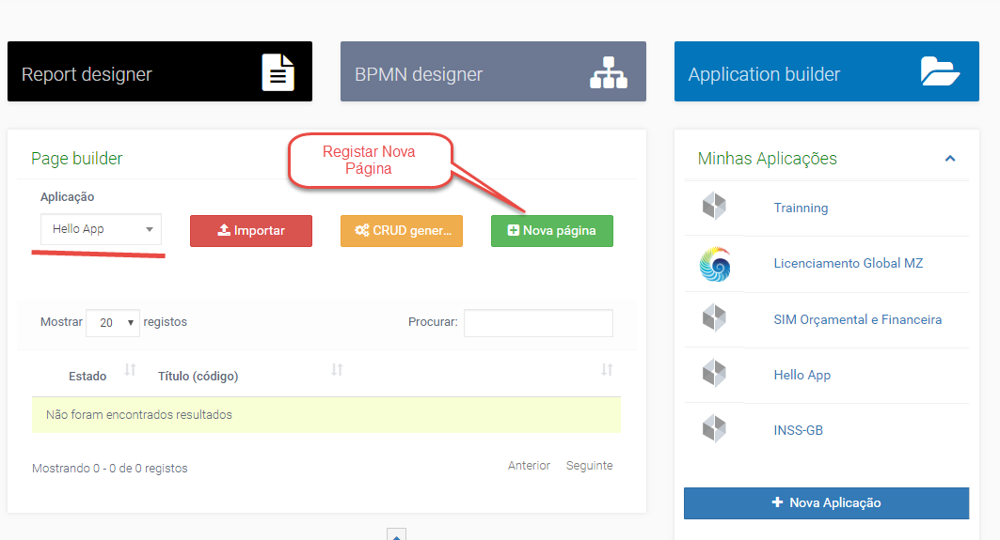
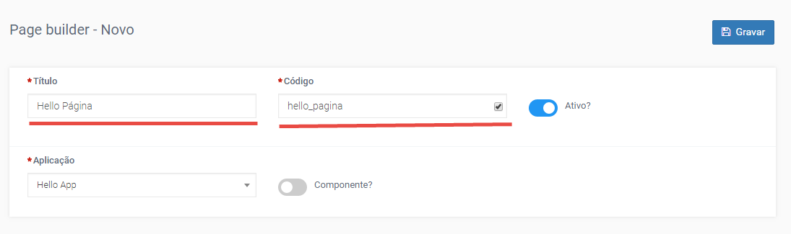
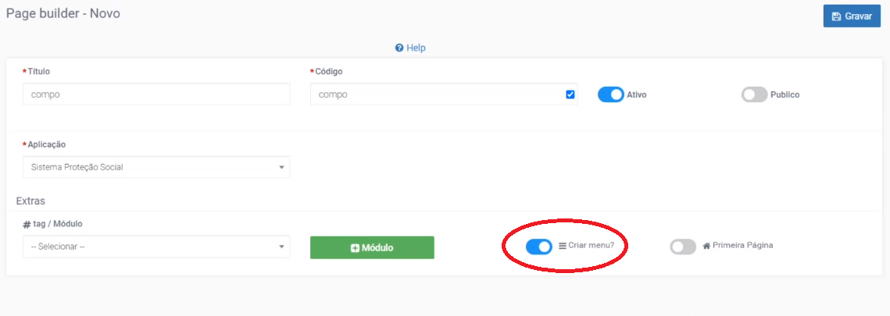
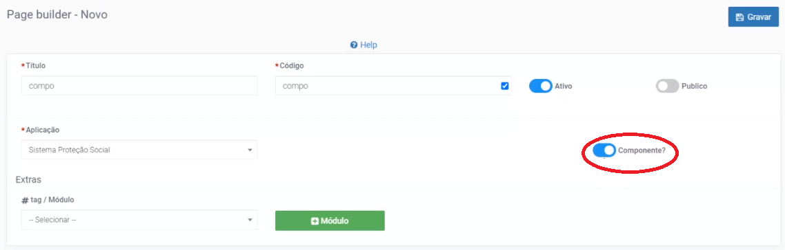
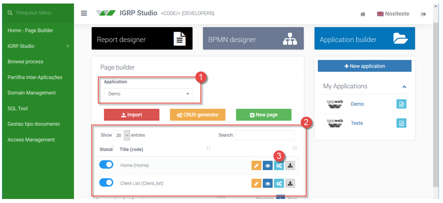
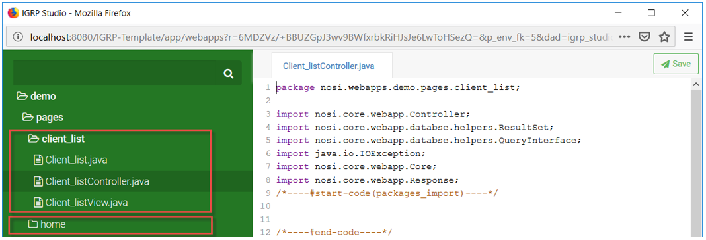
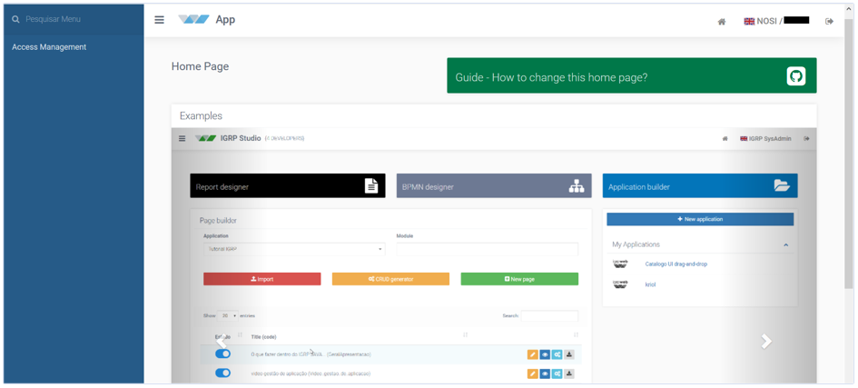

# Criação de uma Nova Página
Para criar uma nova página, acedemos ao _Page Builder_, escolhemos a aplicação pretendida e clicamos em "Nova Página" **New page** e será aberto um formulário onde podemos criar uma nova página (vera aimagem a seguir).

Após aceder ao formulário de criação de páginas, preenchemos o mesmo com os dados da página e gravar (Imagema seguir).  
Exemplo:  
**Titulo**: Hello Pagina  
**Codigo**: hello_pagina (gerado automaticamente e não pode ser igual ao código de uma outra página da aplicação).

Preenchemos o formulário da página sabendo que cada campo corresponde a:
- **_Title_** – nome da página no _layout_ [pode ser alterado posteriormente];
- **_Code_** – identificador único para cada página [não pode ser alterado posteriormente];
- **_Enable_** – para que seja possível a execução da página, e para que esteja presente na lista de páginas [alguns combobox, por exemplo] do ambiente de desenvolvimento;
- **Público** – permite que a página seja chamada por qualquer aplicação;
- **_Application_** – obrigatório selecionar a aplicação a que a página pertence;
- **_Module_** – pode organizar páginas relacionadas entre si no mesmo módulo. Não tem qualquer outro efeito na aplicação;
- **_Home Page_** – página executada quando acessamos a aplicação;
- **_Create menu_** – cria um item de menu para a página. Uma página que não é necessária aparecer no menu (imagem a seguir), é preciso desativar esta propriedade, tais como: páginas de novo ou inserir, páginas de _loockup_.

- **Componente** – opção disponível apenas se _Create menu_ estiver desativado, permite a criação de componentes padrão que podem ser importados de diversas páginas reduzindo a carga de trabalho do designer (imagem a seguir). Este tipo de página, não gera as classes MVC Java; apenas os componentes XML, XSL e JSON do gerador. A criação de páginas em componentes permite a reutilização dos campos noutras páginas, por isso esta funcionalidade é muito utilizada na implementação de processos, para haver uma reutilização de páginas.

As páginas de cada aplicação são listadas na tabela da _Home - Page Builder_ (imagem a seguir)[2] sempre que selecionarmos a aplicação correspondente [1].

Clicando sobre o botão **Gerar Código** [3], abre-se o Gerador de Código, destinado à construção da página. Os botões adjacentes permitem editar propriedades - **Editar** , pré-visualizar - **Visualizar**  e exportar - **Export** cada página.  
Notemos que cada página criada fica disponível no _File editor_, correspondendo a um package com o mesmo nome (imagem a segir) com três classes java [MVC].

### Aplicações sem Home Page definida e Páginas sem conteúdo

Quando executamos uma aplicação sem uma _Home Page_ definida veremos uma janela como a da imagem abaixo.  
Para resolver basta ir à _Home – Page Builder_ e definir uma página como tal clicando sobre o botão **Editar** correspondente e ativando a opção  **Ativar/Desativar Home Page**, na janela que se abrirá [Page Builder – Atualizar].

Do mesmo modo, quando tentamos executar uma página que foi criada, mas cujo conteúdo não foi gerado. Para resolver, devemos ir à _Home - Page Builder_ e gerar o código correspondente através do **Gerador de Código**.

