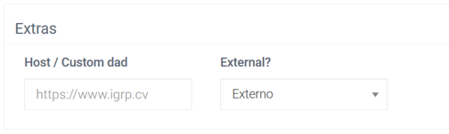
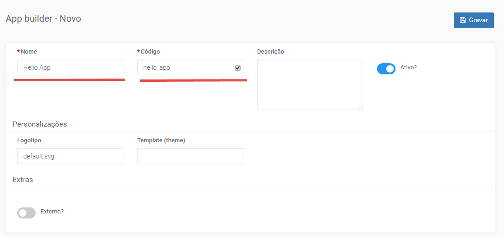
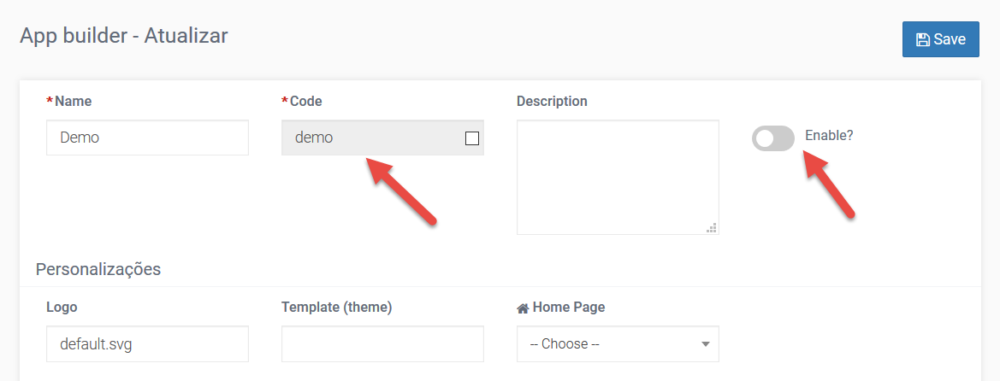
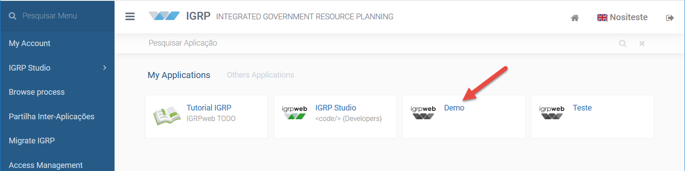
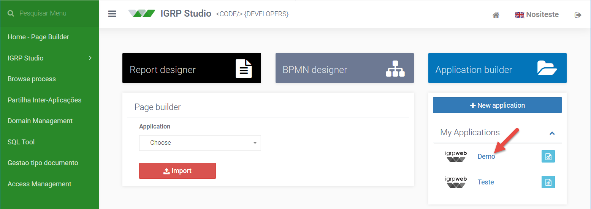

# Criação uma Nova Aplicação

Para criar uma nova aplicação clicamos sobre o botão **New Application** (imagem abiaxo), para acessarmos o formulário para o efeito. Alternativamente podemos criar aplicações a partir do _Application Builder_, acessível através do menu do lado esquerdo.  
Qualquer alteração que queiramos realizar nas definições básicas de uma aplicação [definidas no formulário de criação da aplicação] é possível através da página _Application Builder_ a partir de onde podemos editar os dados da aplicação pelo botão **Editar**, criar conexões de BD pelo botão **Criar Coneção**, exportar aplicações [botão **Export**], importar [botão **Import**] e criar novas aplicações [botão **New**].
![Home Page Builder [criando aplicação]](img/homePageBuilder.png)

Preenchemos o formulário da página que se abrirá e salvamos a informação, sabendo que:
- **Nome** – nome da aplicação no _layout_ do igrpweb [pode ser alterado posteriormente]
- **Código** – atributo único para cada aplicação, trata-se de um identificador [não pode vir a ser alterado];
- **External** – [recurso inativo, por enquanto];
- **Extras** – esta propriedade permite guardar o projeto em um local diferente do local padrão utilizado pelo igrpweb. Assim alterando o valor do campo External? aparecerá o campo _Host / Custom dad_ teremos um dos cenários descritos na tabela abaixo.

| Valor do Campo External | Valor do Campo Host/Custom dad | Descrição |
|----------------------------|---------|------------|
| Custom dad | Nome do dad | Cria um ficheiro War a parte, ou seja outra instância do igrpweb |
| Externo | Vazio | Cria um ficheiro Jar das classes a parte, forra do war do igrpweb, no mesmo local |
| Externo | url de um local externo onde ficará | Cria um ficheiro Jar das classes da aplicação guardado no local indicado pelo url |

  
A nossa aplicação aparecerá no painel do lado direito da _Home - Page Builder_, a partir de onde podemos executá-la ou aceder aos respetivos ficheiros pelo _File editor_.  
Preencher os dados da aplicação e gravar.  
O texto a seguir é um exemplo da descrição da aplicação. Repare que o campo ao lado CODIGO, será automaticamente preenchido.  
Não se preocupe com o preenchimento dos demais campos.  
**Nome**: Hello App  
**Código**: hello_app   

Após **gravar**, deverá aparecer na parte superior uma mensagem: "_operação com sucesso_".

> **OBS**: quando atualizamos os dados de uma aplicação, se esta for desativada ficará indisponível e inacessível, logo o ficaremos impossibilitados de criar uma nova aplicação com o mesmo código.

Certifique-se de fechar a janela de confirmação da aplicação para aceder à aplicação criada. 

### Aceder a aplicação criada

Poderá constatar a aplicação criada na lista Minhas Aplicações de duas formas:
- Se clicar no botão **Home**
- Na aplicação IGRP Studio
     - Minhas Aplicações 

O local padrão para execução de aplicações é a página inicial do igrpweb (imagem a seguir), onde vemos todas a aplicações que nos pertencem e aquelas a que fomos convidados.

Todavia, cada aplicação também pode ser executada a partir do painel do lado direito da _Home - Page Builder_ (imagem a seguir), pelos utilizadores que nela ela tiverem privilégios de desenvolvedor. A partir de onde podemos executá-la ou aceder aos respetivos ficheiros pelo _File editor_.

