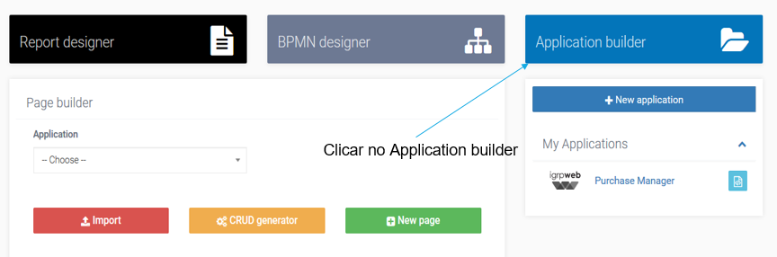
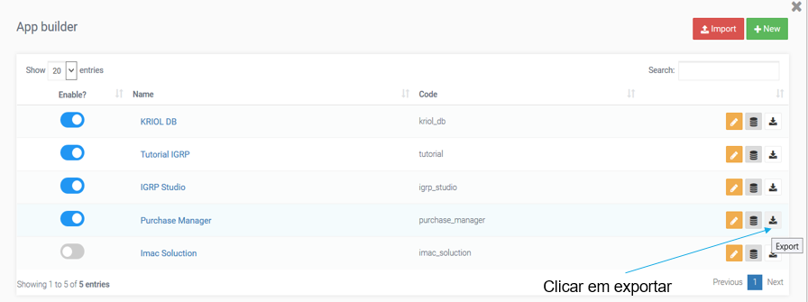
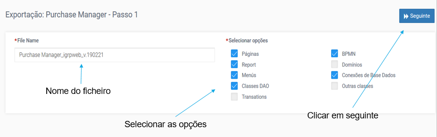
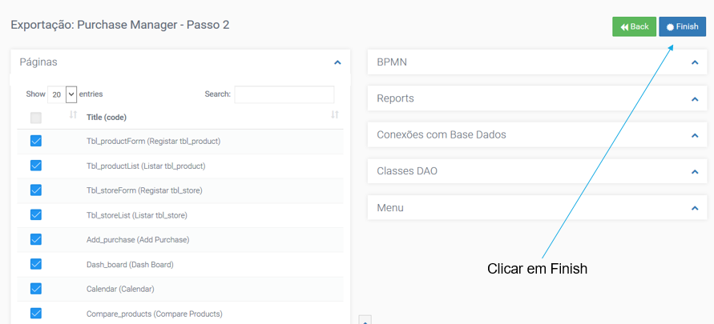
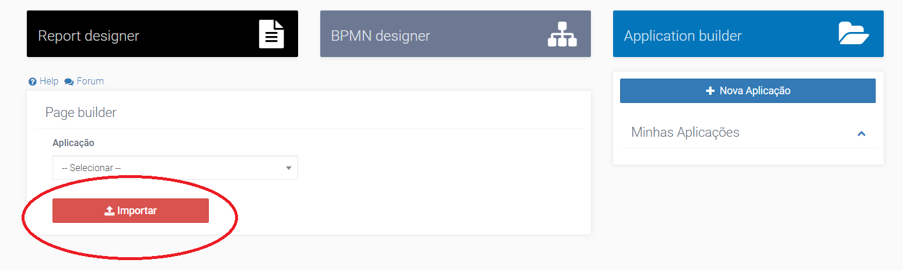
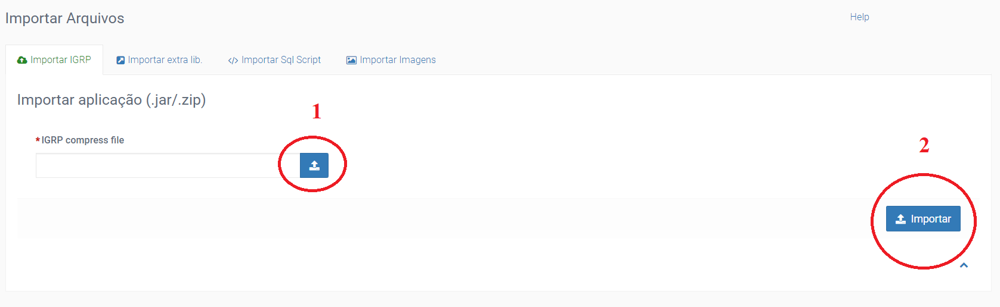
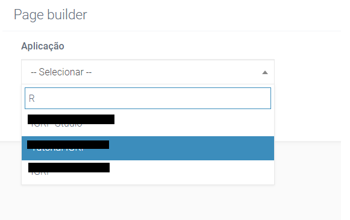

# Exportar e Importar Aplicação

### 1. Exportação da Aplicação

Após criação de uma aplicação no Igrpweb, é possível exportá-lo para um outro ambiente, este procedimento é, muitas vezes, feito para partilha de aplicações entre desenvolvedores ou para passagem de aplicações para diferentes ambientes, que é o âmbito que estamos a ver.  
A passagem de aplicações entre ambientes é necessária uma vez que permite assegurar que diferentes ambientes sejam utilizados para diferentes fins, tais como: desenvolvimento, teste, produção. E estando a aplicação em ambientes distintos permita assegurar e salvaguardar uma melhor performance da mesma em diferentes aspetos pretendido, quer a nível de capacidades de servidores, quer a nível de possibilidade de testes de carga, quer a nível de alterações e entre outros.

#### 1.1 Procedimentos de exportação de uma aplicação

A imagem seguinte ilustra a o primeiro passo a seguir para fazer a exportação da aplicação pretendida.

Após entrar no “_Application Builder_” é nos apresentado uma lista de todas as aplicações que temos no presente ambiente. E nesta lista tem a opção de editar a aplicação, configurar a base de dados da mesma, e/ou exportar a aplicação.

Na lista de aplicações tem a ação de “exportar aplicação” conforme assinalada na 2ª imagem acima. Escolhe-se a aplicação que se quer descarregar e de seguida é apresentada a tela de seleção das funcionalidades que se quer exportar (ver a 1ª imagem a seguir).

Após o término das escolhas das funcionalidades que se quer exportar, clicando no botão **Seguinte**, vem a etapa de escolha dos ficheiros de cada uma das funcionalidades escolhidas anteriormente (ver a 4ª imagem acima).  
Clicando em **_Finish_** a aplicação é descarregada num ficheiro de extensão JAR. E assim dá-se por concluída a fase de exportação da aplicação.

### 2. Importação da Aplicação

Finalizado a exportação da aplicação, vem a fase de carregá-la no ambiente pretendido.  
Primeiramente, o igrpstudio tem o botão **_Import_** representado na imagem abaixo que é utilizado para fazer a importação de aplicações para o ambiente em que se encontra.

Na tela de importação da aplicação tem ainda as funcionalidades de: importar livrarias externas, importar Script SQL, e importar imagens.

> **IMPORTANTE**: vale referir que é preciso tomar cuidado em qual dos tabs se está a fazer a importação pretendida, uma vez que se é exportada um ficheiro não esperado em um dos tabs pode causar problemas de execução do servidor e/ou do igrpstudio.

No entanto, após o clique no botão **_Import_** é apresentada a janela de fazer o _upload_ da aplicação e de seguida, clicar em _import_ para executar a importação. Após concluir esta fase a aplicação já aparece na lista de aplicações deste ambiente, com as devidas funcionalidades exportadas.  
Devemos ter a certeza que estamos no separador correto para importar aplicação. Fazemos o _upload_ do ficheiro (1) JAR baixado na exportação e depois clicar no botão de importar (2), conforme mostra a imagem abaixo.

Após a importação ele já aparece disponível na lista das nossas aplicações.  

