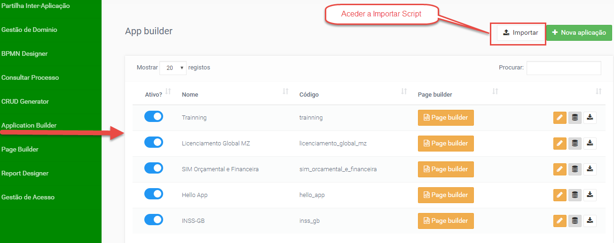
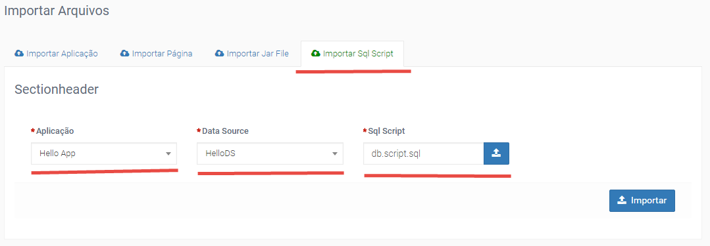

# Importar Script SQL

Importar _Script_ - funcionalidade que permite importar _ddl/script_ para criação de objetos (tabelas, views, relacções) na base de dados.



_Script_:
```
CREATE TABLE hello_table (
   id INT auto_increment,
   nome VARCHAR(50) NOT NULL,
   sexo VARCHAR(1),   
   data_nasc DATE                  
);

insert into hello_table (nome,sexo,data_nasc) values('Adilson Rodrigues','M','1983-10-25');
insert into hello_table (nome,sexo,data_nasc) values('Marcos Birto','M','1983-10-03');
``