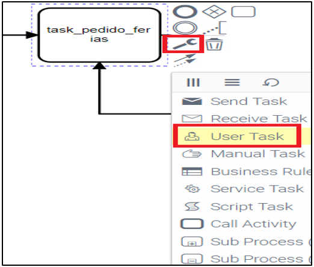
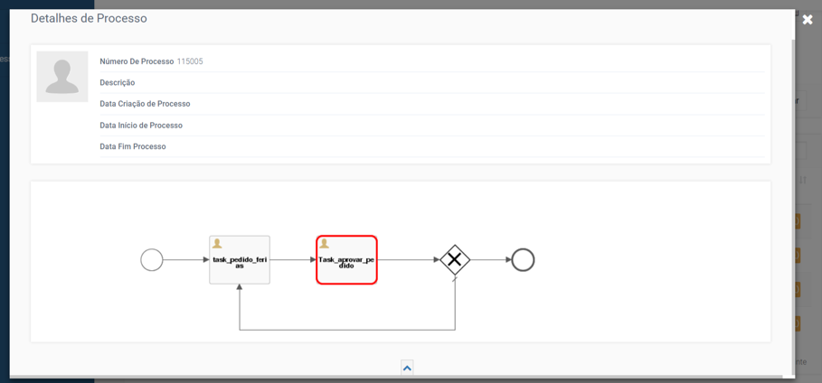

# BPMN - Business Process Model Notation
### 1. Processo BPMN

Tratando-se de um _framework_ de criação de aplicações transacionais, o igrpweb oferece uma ferramenta de desenho de processos de trabalho para aplicações nele desenvolvidas, o _BPMN Designer_ acessível pelos botões assinalados na 1ª imagem. No documento BPMN o desenvolvedor pode acompanhar a construção de um exemplo para se basear e desenhar os processos de suas aplicações.

Qualquer um dos setores da administração pública funcionam em processo, ou seja, existe sempre um pedido e uma resposta a esse pedido. Pelo meio pode ou não existir um fluxo de decisão mais ou menos complexa.  
Portanto existem alguns elementos que fazem parte de um processo de negócio:  
- Objetivo do Processo;
- Etapas – que devem ser executadas numa determinada sequencia;
- _Inputs_ – os documentos e informações necessárias para a execução de tarefas;
- _Outputs_ – notificações e documentos gerados;
- Resultado esperado;
- Mapa de processos é um ambiente onde as áreas, subáreas e respetivos processos são apresentados e podem ser despoletados;
- Público-alvo deste módulo normalmente são os atendedores.

### 1.1 Minhas Tarefas
Iniciados os processos, as suas etapas devem ser executadas pelos utilizadores cujo perfil lhes permite executar etapas.  
O IGRP contem um ambiente de execução de etapas, que em grosso modo apresenta a lista de tarefas por executar e permite que utilizadores com perfil de coordenação monitorizem o trabalho de seus colaboradores.  
Estatísticas de execução de etapas individual e de grupo são também apresentadas neste módulo.

#### 1.1.1 Consulta Processo
Este módulo permite a pesquisa e consulta dos detalhes de todos os processos iniciados estejam eles finalizados ou em execução. Os detalhes de cada etapa, os utilizadores que executaram as etapas, os inputs anexados e os outputs gerados.

#### 1.1.2 Estatísticas de Utilização
Este módulo apresenta gráficos que permitem a instituição acompanhar a _performance_, logs de utilização da aplicação.  
O igrpweb oferece uma ferramenta de desenho de processos de trabalho de suas aplicações. No documento BPMN o desenvolvedor pode acompanhar a construção de um exemplo para se basear e desenhar os processos de suas aplicações.

### 2. Exemplo prático
Principal finalidade desse documento de instrução do Técnico é mostrar, de uma forma geral como criar um processo de uma aplicação dentro do IGRP WEB. O processo da aplicação “Nha Feria”, demostra um pedido de férias por um developer e em seguida a aprovação ou não do seu coordenador.

### 2.1 Configurar ambiente BPMN
Já no ambiente do _BPMN designer_, vamos desenhar o nosso processo. Primeiro passo é escolher a nossa aplicação [1], depois definir o _id_ e o nome do processo [2] e certificar-se de que o _check_ está marcado no _executable_ [2], (Ver a imagem a seguir).

### 2.2 Desenhar o processo
Para uma melhor compreensão, será apresentado o processo completo e em seguida uma explicação de cada evento utilizado no processo para a sua construção (imagem a seguir).

Um processo pode ser constituído por vários _task_, nesse caso temos 3 _tasks_ (pedido de ferias, aprovar pedido e uma condição aprovar). Um _task_ é configurável, para tal, _click_ na tarefa e depois escolher a configuração que desejar. Nesse caso foi escolhido _user task_ por ser uma tarefa executada por um utilizador (ver a imagem a seguir).

Em seguida temos de associar a página a essa tarefa, para tal, no lado direito, com a tarefa selecionada, _click_ em **_Forms_**, depois em **Pesquisar** (imagem a seguir).  

Depois é só escolher a página que desejar (ver a imagem a seguir).  

Ainda no BPMN podemos editar a página, clicando **_Open File_** e adicionando os códigos java que desejar no editor (ver a imagem a seguir).

Uma pequena observação, é que uma página que será associada ao _task_ deve ser marcado que vai ser utilizado num processo. Para isso, abrir a página no gerador _click_ em **_Settings_** e _check_ em processo (ver a imagem a seguir).

Próximo _task_ aprovar pedido, é a mesma coisa que o _task_ anterior, somente a página que é diferente.

Já no _task_ condição aprovar, o _flow_ segue em duas direções, temos de escolher um _default flow_ e no outro colocar a um tipo de condição. Para esse caso foi utilizado expressão regular para realizar a condição (ver a imagem a seguir).

Com o processo já criado e guardado (botão gravar), vamos passar para gestão de acesso das etapas.

### 2.3 Gestão de acesso das etapas
É aconselhável dar uma leitura como funciona gestão de acesso do igrpweb, mas resumidamente nesse caso, temos uma aplicação com dois tipos de perfis (coordenador e técnico) pertencente a uma organização “pidi feria NOSi” (imagem a seguir). 

Agora, em seguida vamos atribuir acesso das etapas para a organização “pidi feria NOSi” clicando em **Task** e escolher a etapa a ser atribuída para esta organização (imagem a seguir). 

Com a permissão das etapas garantida na organização, podemos ver essas etapas nos perfis, podendo atribuir/retirar permissões sobre as etapas associadas na organização. Para esse efeito _click_ em **Mostrar Perfil** depois em **Task** e atribuir etapas conforme a regra do seu negócio.

Estamos quase prontos, na mesma página clicando em **Acess Management** utiliza-se a mesma lógica explicada anteriormente para atribuir acesso das etapas aos utilizadores.

No do **Home** do IGRP WEB, _click_ na sua aplicação, na barra em cima, vai aparecer o **Task** somente se o _user_ tem acesso a permissão de iniciar o processo. Quando clicar nesse botão é listado um conjunto de processos que tem acesso para iniciar (ver a imagem a seguir). 

Depois é só clicar no processo que desejar iniciar,"Processo_pedido_feria_nosi" por exemplo, _click_ em **Iniciar Processo** e depois seguir o fluxo do processo normal de acordo com as permissões definidas. 

Uma vez iniciado o processo, ele vai aparecer nas tarefas disponíveis para utilizadores com perfil que tem acesso para executar essa tarefa. E esse utilizador pode assumir essa tarefa clicando em **Assumir** e a mesma vai aparecer em **Minhas Tarefas** (ver a imagem a seguir).

Uma vez assumido a tarefa pelo utilizador, estas vão ser listadas em **Minhas Tarefas**.

Numa tarefa podemos executar três ações:
- Liberar esse _task_ para poder ser assumido por outro utilizador, clicando em **Libertar**;
- Ver detalhe do processo (ver a tarefa atual em que o processo está a decorrer no momento) clicando em **Detalhes**;
- Correr essa tarefa clicando em **Executar**.

Seguindo o exemplo da aplicação “Nha Feria”, depois de ter inicializado o processo e o utilizador ter assumido a tarefa de pedido de férias, vai a aparecer a página que a tarefa está associada. 

Depois de preencher os dados no formulário, clicando em **Seguinte** o processo segue em frente passando para outra tarefa, onde a mesma vai ficar disponível, permitindo a um outro utilizador com o perfil de acesso para esse _task_ assumir o mesmo.

Depois de ter aceitado o pedido de férias pelo coordenador, ele pode listar as férias dos _developer_, caso o pedido for recusado o processo volta para o _task_ pedido de férias.

