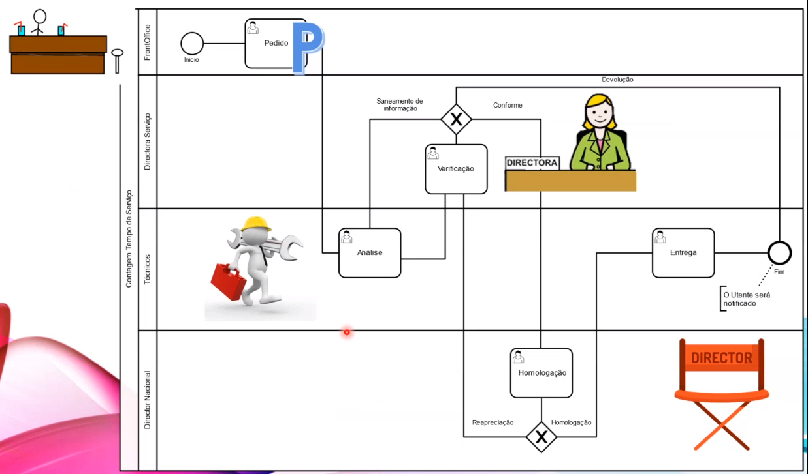
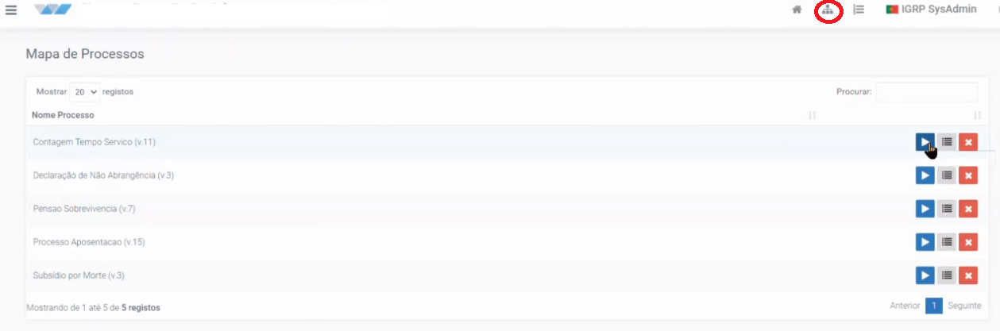
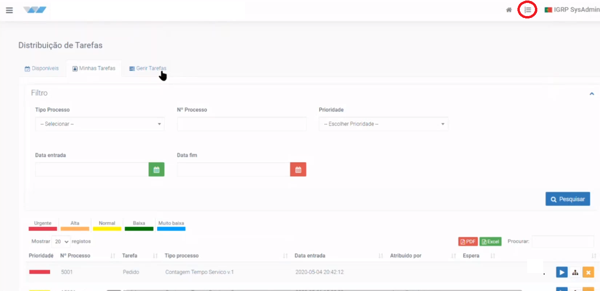
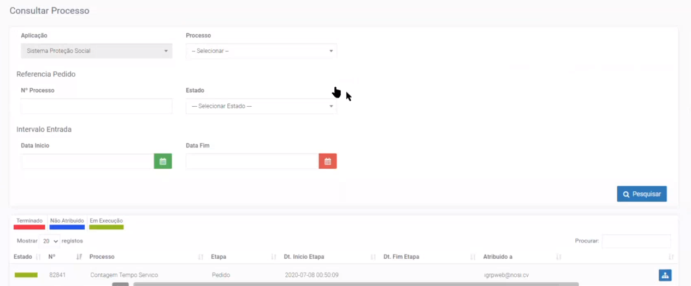
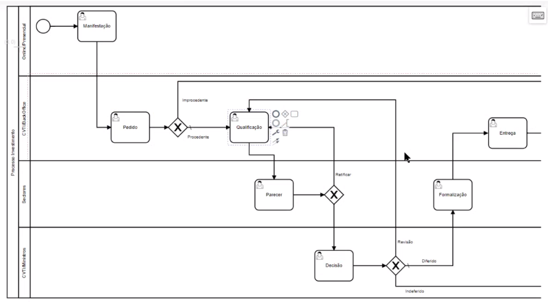
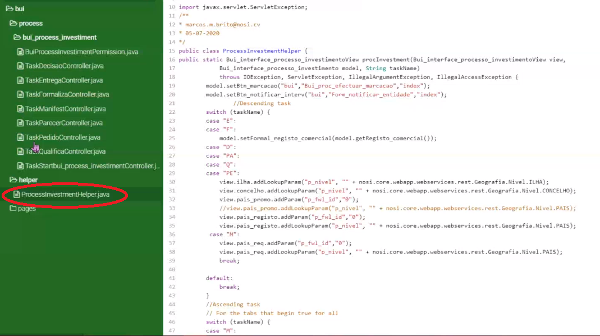
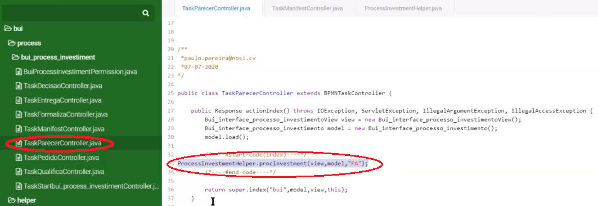
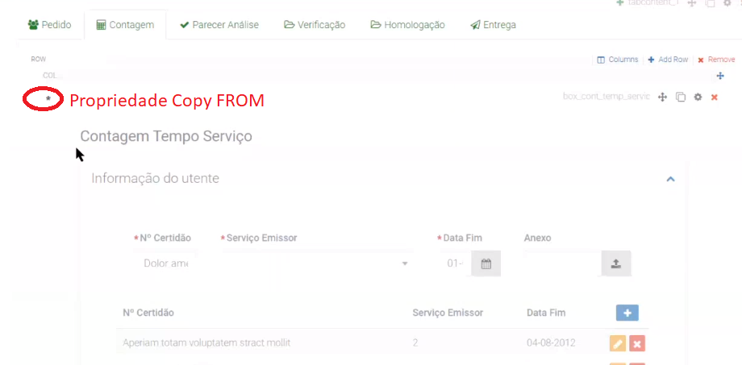

# BPMN - Criação de Processos com Tabs

A criação de tarefas por _Tabs_, é uma disponibilização de processos utilizando o componente _tab_ que permite desenvolver todo o processo numa só página, sendo assim, facilmente possível o utilizador ver outras etapas do processo.

Neste exemplo de processo a ser estudado temos o _FrontOffice_ a fazer o pedido, o Técnico a fazer a análise, a Diretora a fazer a verificação, o diretor a fazer a homologação e o Técnico a fazer a entrega. Sendo a diretora com propriedades de atribuir tarefas aos diferentes utilizadores.

No mapa de processos, prodemos ver as operações que é possível realizar no decorrer de um processo, tais como: a inicialização de tarefas no botão **_play_**, também pode-se consultar detalhes do processo no botão de **detalhes**, e ainda pode liberar um processo no botão **eliminar**.

Na página de distribuição de tarefas, o utilizador pode ver as tarefas que estão disponíveis, ver as suas tarefas e gerir as suas tarefas, Tambésm alterar a prioridade de uma tarefa.  
O _tab_ de Gerir Tarefas, normalmente tem a propriedade **_Transation_** ativada que permite essa funcionalidade ser atribuidada aos perfis de coordenadores, gestores ou diretores, ou seja, aqueles que tomam as decisões. Neste _tab_ pode-se: transferir tarefas, alterar prioridade ou desassociar tarefas. 

Na página de consulta e processos, o utilizador tem o conjunto de filtros que pode aplicar sobre a lista de processos apresentados. Sendo possível ver as tarefas que foram terminadas, que não foram atribuidos, e as que estão em execução.

A programaão de processos em _tabs_ tem algumas vantagens de seguida apresentadas e permite utilização de processos em _tabs_, onde é possível ter o acesso ao processo em geral.  
**Recomendações e Vantagens**:
- Utilizar o nome assocido à etapa associada ( exemplo: email-pedido, em vez de email);
- Não utilizar palavra "_task_" no _Id_ da etapa, uma vez que a palavra _task_ e acrescentada pelo igrpweb;
- Utilizar _radio-list_ sempre do tipo _String_, porque o BPMN reconhece como _string_ e o _radio-list_ por defeito é inteiro;
- Evitar _tags_ repetidos uma vez que estamos a utilizar _tabs_ em vez de páginas;
- A utilização de _tabs_ facilita o _load_ de etapas anteriores com apenas uma linha de código;
- Não atribuir tarefa à um perfil que está atualmente logado;
- Ao utilizar páginas copiadas nos _tabs_ facilita na alteração dos nos dos _tags_.

Esta imagem acima mostra-nos a configuração do processo em estudo no igrpweb, utilizando a ferramenta do IGRP Studio denominado de _BPMN Designer_. Neste caso como estamos a estudar a disponibilização de processos em _tabs_, todas as etapas do processo, estão associados à mesma página.

A programação de processos com _tab_ tem como principal objetivo a criação de uma classe _Helper_ que permite a visualização e/ou ocultação de etapas de processos correspondentes à um determinado tab utilizando a propriedade _switch-case_ que oculta e mostra _tabs_ do processo de acordo com o perfil associado.  
Neste caso o utilizador, pode facilmente ver os dados preenchidos nas etapas anteriores sem precisar carregar dados da base de dados, apenas utilizando o _id_ do processo.

Após a criação do "_swicth-case_" na classe _Helper_, é preciso determinar qual etapa a ser mostrada. Para isso, é preciso programar o _Action Index_ de cada uma das _Tasks_ de acordo com o exemplo da figura 7, neste caso, respectivo ao _TaskParecer_, onde a classe _Helper_ recebe o parametro _view_, model e "PA", utilizado para mostrar os _tabs_ que deve aparecer na etapa Parecer.

Apesar de apresentar as páginas no _tab_, o desenvolvedor sempre cria todas as páginas referentes à etapas, em separado no IGRP Studio, e depois copia-os nos respectivos _tabs_, inserindo a página criada num componente denominado **_box_** que permite-nos determinar quais os componentes a copiar. A propriedade _Copy FROM_, permite copiar componentes de uma outra página, e neste caso não é desativado a propriedade de _copy from_ conforme o asterístico assinalado nesta imagem acima, que permite facilitar na alteração dos nomes, caso assim for necessário.

