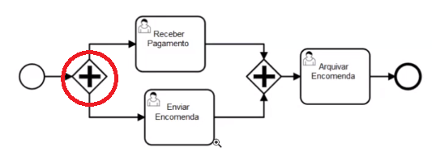

# BPMN - Dicas de Design
### 1. Tarefas Paralelas

No _BPMN Designer_ é possível executar duas tarefas em paralelo, ou seja enquanto está a ser executada uma etapa, pode também ser executada outra antes da realização da próxima fase.  
Isto permite com que seja eliminado lógicas de programação que seria necessário caso fosse pretendido chamar uma etapa num modal para ser executado no decorrer de um determinado proceso.  
Para realização de etapas em paralelo podemos ver com é feito a montagem conforme nos apresenta a imagem a seguir.
