# BPMN - Exemplo Prático
### 1. Criando de um campo na gestão de domínio
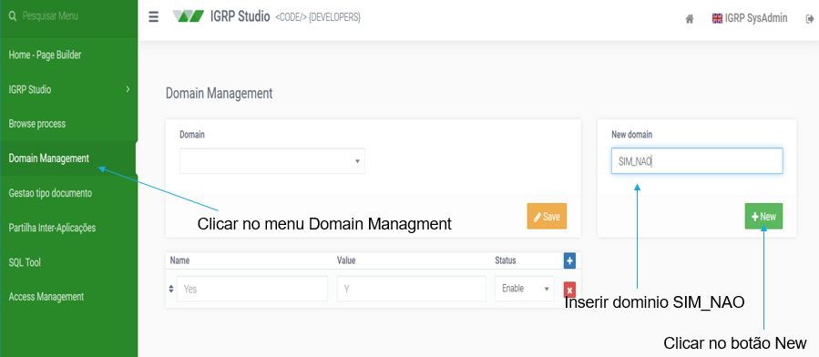
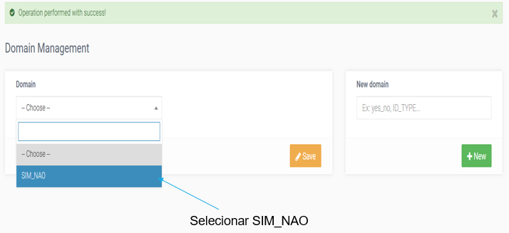
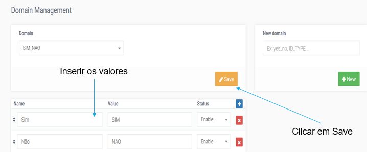

### 2. Criando do Processo BPMN
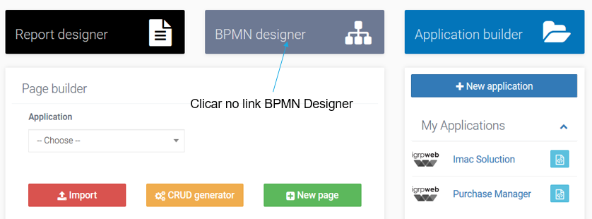
 
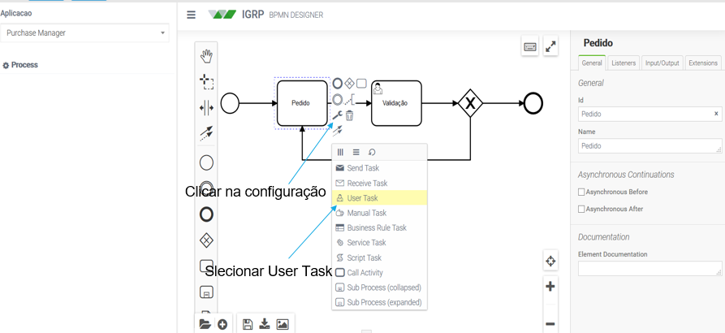
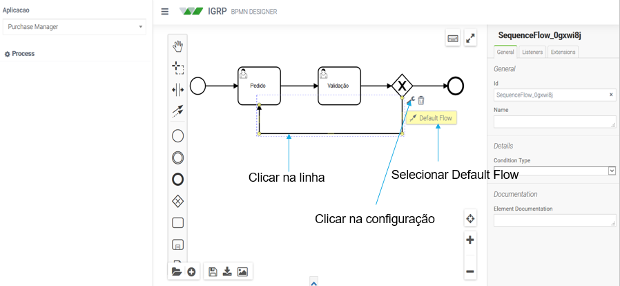
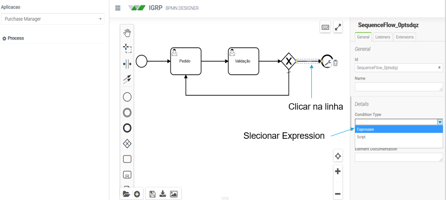
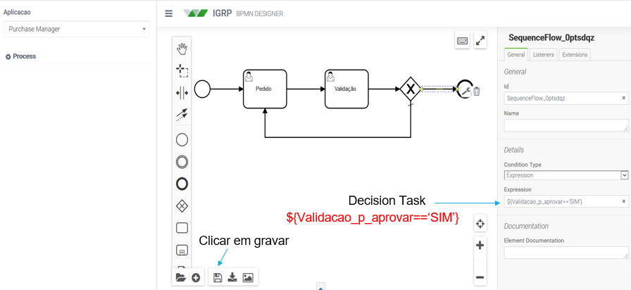
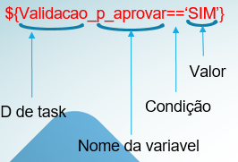

### 3. Criar uma página para registar pedido
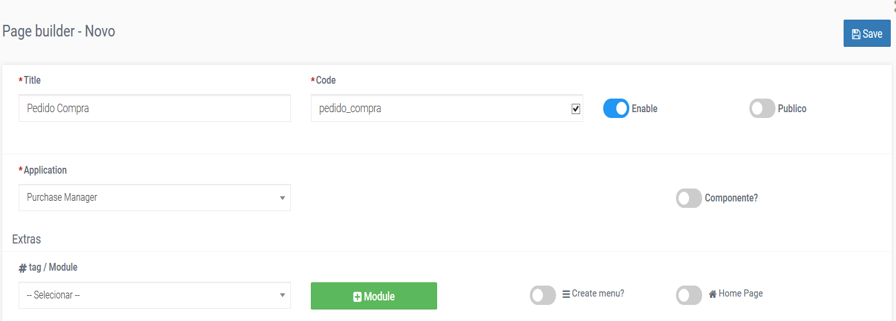
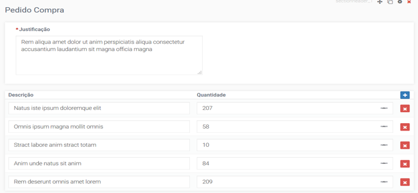
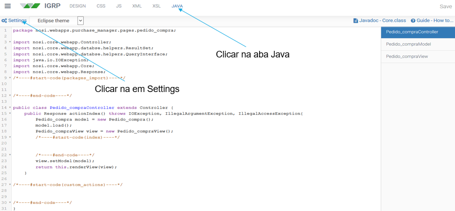
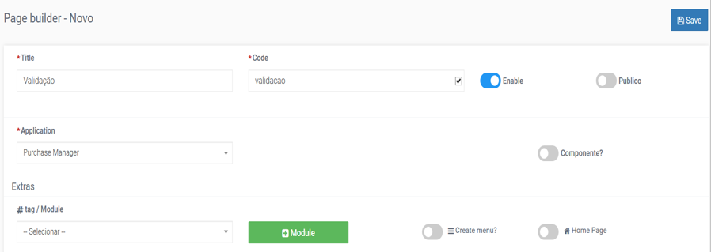
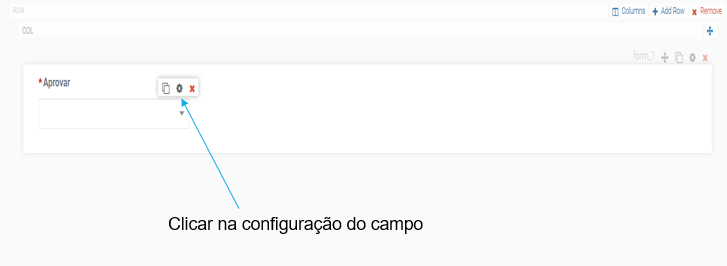
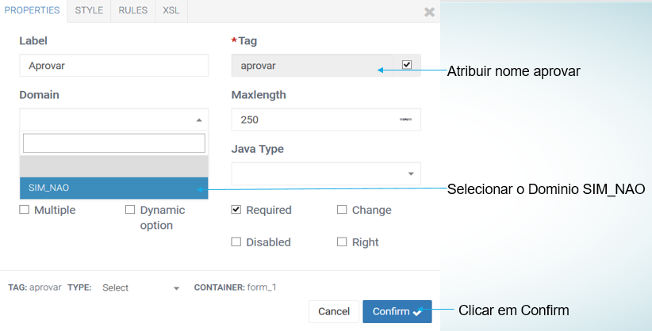
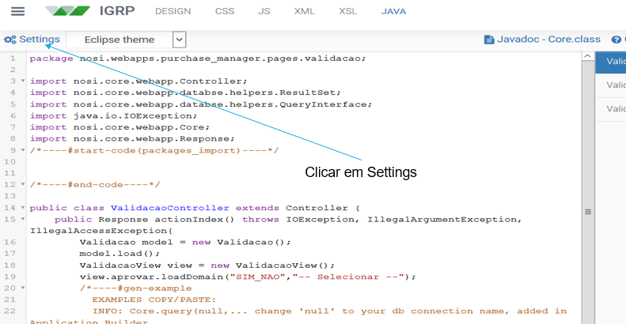
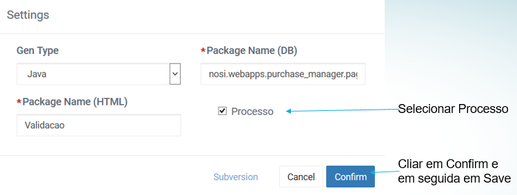
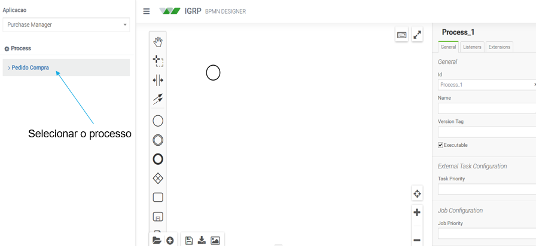
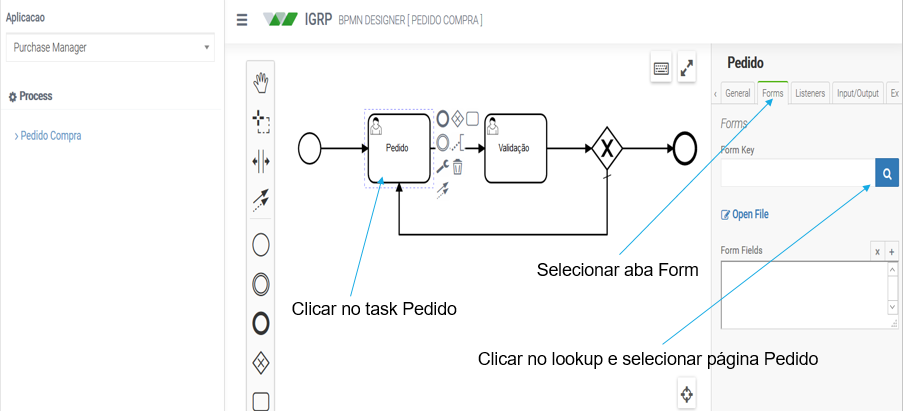
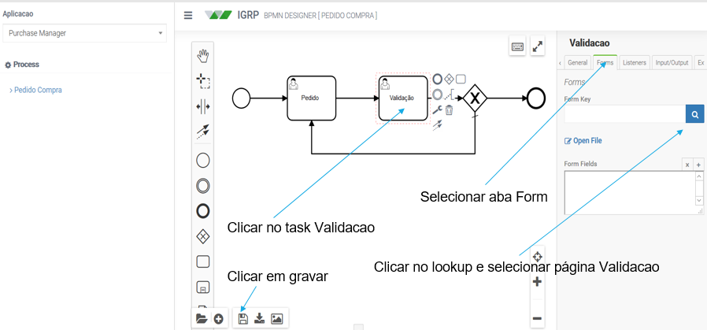
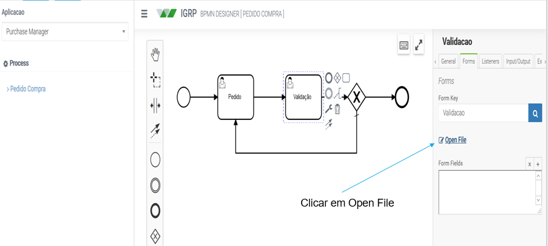
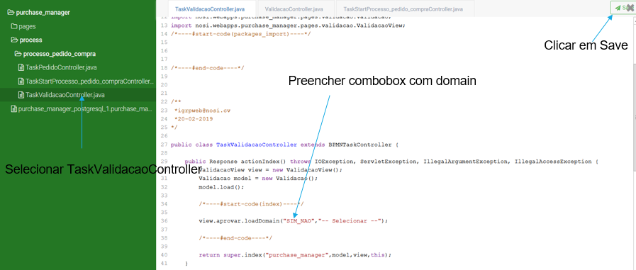
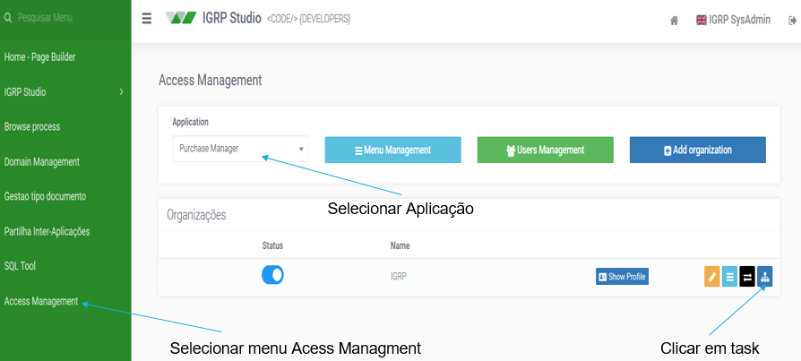
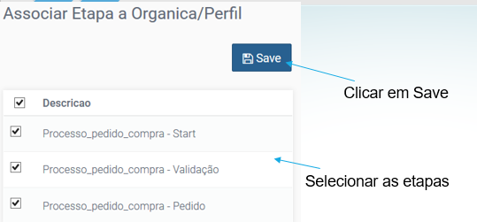
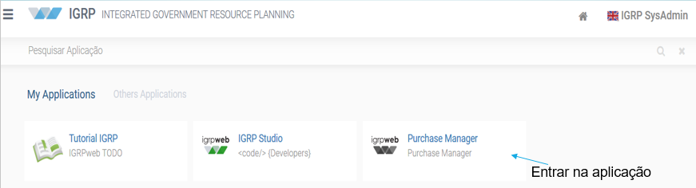
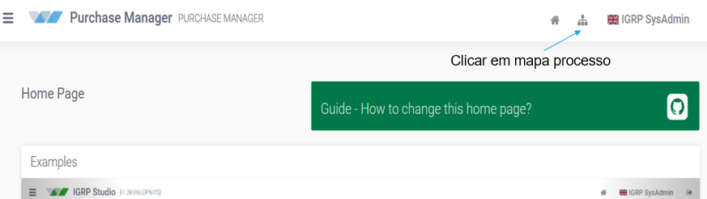
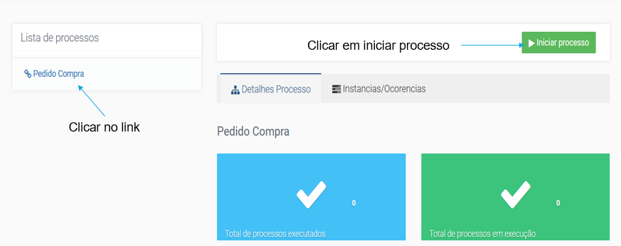

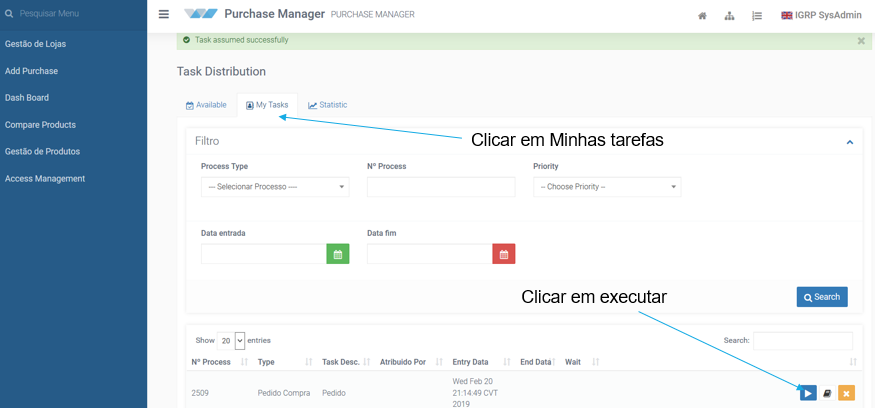

### 4. Preencher model com dados de etapa
Na classe TaskValidacaoController;  
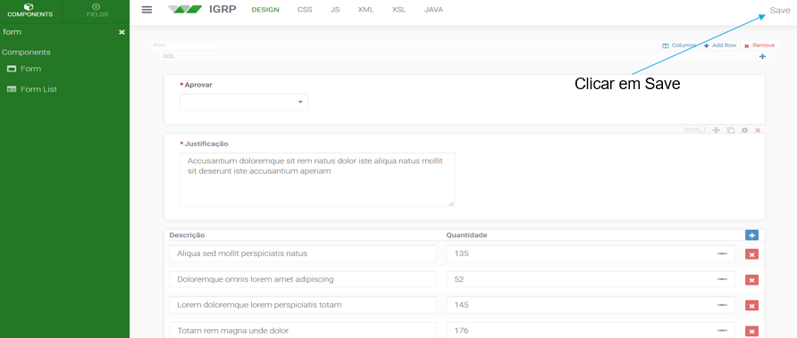
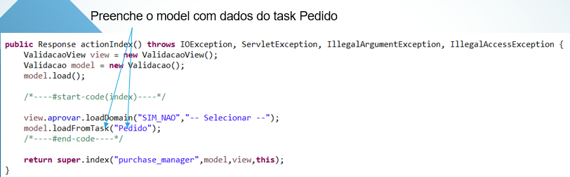

### 5. Ler parâmetros de um processo
Obtem o valor da variável p_justificacao do processo Processo_pedido_compra;  
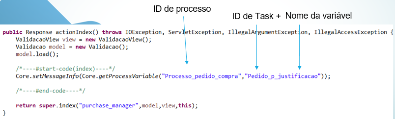

### 6. Ler parâmetros de uma etapa
Obtem o valor da variável p_justificacao da etapa Pedido;  
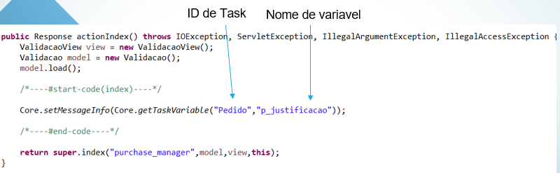

### 7. Injetar variável na Etapa
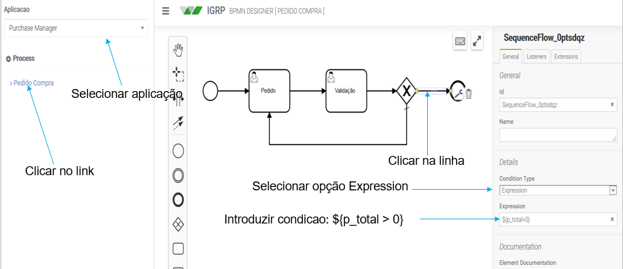
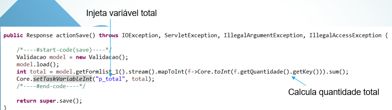

