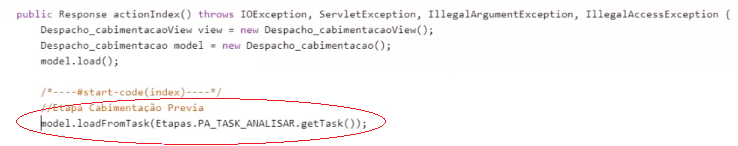
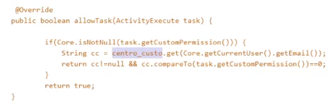
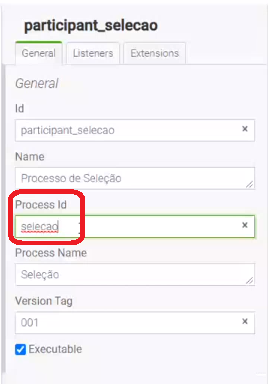
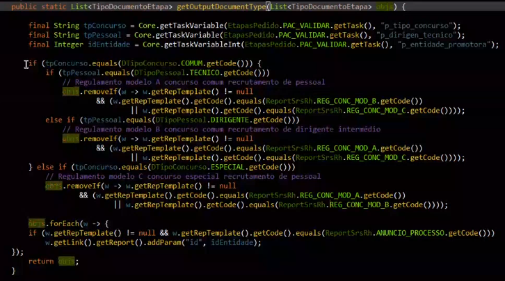

# BPMN - Funções Úteis
### 1. Model.loadFromTask

Esta função permite o carregamento de dados preenchidos de uma etapa anterior, neste caso se estivermos a utilizar componentes com nomes iguais entre as duas etapas em quetão, permite fazer o mapeamento na hora de carregar a página, por isso, aconselha-se a utiliza campos com mesmo nome de tags, ou utilização de propriedade "Componente" e/ou _Copy FROM_ na hora de criar as páginas.


### 2. ActionSave

O _action Save_ no processo BPMN dá-se quando é clicado no botão seguinte, portanto nesta ação programa-se a ação que pretendemos ao clicar no botão "**Seguinte**", que normalmente pretende-se guardar infromações numa base de dados.

### 3. AllowTask

Este método permite controlar um perfil que pode ou não ver uma tarefa, fazendo o return true quando é possível ver, ou false caso não poder ver ou realizar o processo. Como podemos ver na implementação do exemplo na imagem abaixo, onde só um verificado pelo email é que pode ver o processo.<br></br>


### 4. Core.getProcessDefinitionByProcessKey

Esta função foi criada no _Core igrpweb_ como forma de retornar todas as informações de um determinado processo através do envio do chave do mesmo.<br></br>
A chave do processo pode ser é o _Process Id_ no _BPMN Desginer_.<br></br>
Ex:<br></br>
    `ProcessDefinitionService processDefinition = Core.getProcessDefinitionByProcessKey(selecao);`
    

### 5. Core.startProcess

Este função permite inicializar um processo através de uma página da aplicação, em vez de iniciar o processo na mapa de processos. Para fazer essa inicialização é precisso usar a função **_startProcess_** e enviar os parametros necessários para a inicialização do processo, tais como: **chave do processo**, **o seu ID** (obtido através da função _getProcessDefinition_, definida no ponto 4 que nos dá várias informações sobre o porcesso e uma delas é o seu ID) e também permite enviar um **conjunto de parametros** que se pretende utilizar no processo de acordo com a lógica de negócio a ser implementada.
> **Nota**: Os parametros que vão ser enviados para o processo convêm serem enviados com o prefixo **x_**.
Ex:<br></br>
```
Map  params = new HashMap<>();
params.put(Processo.X_ID_CONCURSO, concurso.getId()+"");
Response response = Core.startProcess(selecao, processDefinition.getId(), params);
```
### 6. validateInputDocs

Uma vez que os documentos de _input_ no processo são inseridos subjacentes ao processo, temos a variavel **_validateInputDocs_** que permite validar se os documentos necessários para submissão foram ou não submetidos antes de fazer a execução do código pretendo ao clicar no botão "**Seguinte**" no processo. Isto proíbe o envio de dados para base de dados quando não forem validados os documentos de _input_. Se esta variável for diferente de nulo significa que os documentos não foram inseridos.
Ex no acti:<br></br>
```
final Response validateInputDocs = this.inputDocsHasErrors();
if(validateInputDocs != null)
     return validateInputDocs;
```

### 7. List TipoDocumentoEtapa

Esta função permite controlar quais os documentos de _Output_ devem aparecer numa determinada etapa. Por exemplo, pode haver caso em que numa mesma etapa, o utilizador pode ou não ver todos os documentos de _input_ inseridos, de acordo com a lógica de negócio ou de acordo com as permissões do utilizador.

Neste caso, é possível limitar os documentos a serem apresentados mesmo que estejam todos assinalados como documentos associados à respectiva etapa.<br></br>
Ex: A função aparesentada na imagem abaixo, mostra-nos uma lista de documentos apresentadas de acordo com o regulamento do concurso.<br></br>


### 8. Core.getTaskHistory

Esta função permite-nos receber os dados preenchidos numa determinada etapa. Mas, convém relembrar que esta função tras apenas os dados preenchidos da última vez em que a tarefa foi executada. É uma função muito utilizada para mostrar os dados da etapa numa etapa mais avançada onde é necessário averiguar os dados preenchidos na etapa anterior.

Esta função recebe por pârametro o id da Etapa como podemos ver na implementação do código seguinte que solicita os dados de um etapa anterior na execução de um _link_.<br></br>
`model.getForm_fundamenta_link_1().addParam(BPMNConstants.PRM_TASK_ID, Core.getTaskHistory("Task2").getId());`