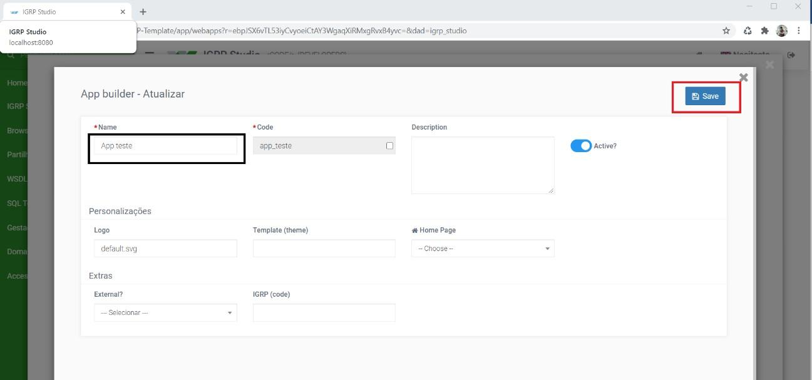

# Manual de instalação de Activiti no Framework igrpweb

O _Activiti_ é o principal mecanismo de BPMN de código aberto centrado em Java que oferece suporte às necessidades de automação de processos do mundo real. _Activiti cloud_ é agora a nova geração de plataforma de automação de negócios que oferece um conjunto de blocos de construção nativos da nuvem projetados para rodar em infraestruturas distribuídas.  
O procedimento a seguir, mostra-nos como instalar o _activi framework_ e rodar dentro do projeto igrpweb.  
 1 - Importação do projeto do GitHub.  
 1.1 - Entrar no [GitHub](https://github.com/NOSiCode-CV/activiti);
 
 1.2 - Após clicar em Code, copiar o _link_.

 

 2 - Processo de importação no Eclipse.  
 2.1 - Abrir o eclipse, no campo superior esquerdo opção _File_, clicar na opção _Import_;
 

 2.2 - Clicar em Next;  
 

2.3 - Clicar no Clone URI;  

2.4 - Colar o _link_ copiado do Github;   

2.5 - Se caso já tiver o Projeto Template do _framework_ arrancado no Tomcat, é preciso removê-lo;

2.6 - Clicar no botão direito do rato e escolher a opção _clean_ para limpar o Servidor Tomcat;

2.7 - Esperar o processo de _clean_ esta a decorrer.  

3 - Configuração do projeto _Activiti-rest_ - Dentro do novo projeto _activi-rest_ que foi importado é preciso configurar a base de dados onde vai ser instalado o _activiti framework_.  
3.1 - Clicar em _activiti-rest -> Java Resources -> src_. Abrir o ficheiro _db_properties_ onde é preciso configurar a base de dados e adicionar o _password_. Esta _password_ é da base de dados onde posteriormente vamos criar a base de dados de nome _db_activiti_;

3.2 - Antes de criar a base de dados vamos, configurar o _Java Buid Path_ do nosso projeto _activiti-rest_, clicando em cima do projeto, de seguida em _Properties_;
3.3 - Clicar opção _Java Build Path_ e configurar as opções;  

3.4 - Na opção _Libraries_ clicar no _add library_, vamos adicionar o servidor do projeto;  
3.5 - Depois de clicar no _next_, clicar no _Apache tomcat_ que é o servidor que temos disponível;

3.6 - Ainda no _Java Build Path_, escolher a opção _Order and export_, clicar na opção _select all_ e de seguida clicar na opção _Apply and Close_.  

4 - Agora abrimos o PgAdmin onde vamos criar a base de dados para o _framework activiti_.
4.1 - Entrar no PostgreSQL para criar database;

4.2 - Neste caso dando o nome de _db_activiti_ que é o nome escolhido no ficheiro de conexão _db_properties_ (passo 3.1) e salvar (**_Save_**).

5 - Execução do Projeto _Ativiti-rest_.  
5.1 - Já com database criado, voltar para o eclipse,escolher a opção _activiti_, _click_ direito e escolher a opção _run as_ para arrancar o nosso projeto no servidor;  
5.2 - Ao clicar no _run on server_, irá abrir uma janela onde vai ser inserido o nome e o _password_, ambos escrever a palavra _kermit_;

5.3 - Ao fazer _sign in_, obteremos um erro HTTP 404;  

5.4 - Utilizamos o _link_ http://localhost:8080/activiti-rest/service/repository/deployments
Para testar se o serviço _rest do ativiti_ está a responder corretamente. Caso vermos a estrutura JSON do serviço significa que já temos o _activiti_ instalado corretamente.

6 - Voltar novamente para o Eclipse, para execução do projeto IGRP-Template e testar a funcionalidade _BPMN Designer_.  
6.1 - Na opção IGRP-Template, clicar botão direito do rato, fazer o _run as –run on server_;

6.2 - Irá abrir uma janela para fazer _log in_;  

6.3 - Ao entrar na plataforma, clicar no IGRP Studio;  

6.4 - Escolher a opção _Application Builder_  para criação de uma aplicação teste;  

6.5 - De seguida clicar no _New_, onde abrirá um campo para criar uma nova aplicação;  

6.6 - Preencher o nome da aplicação e salvar (**_Save_**);

6.7 - Depois de guardar, clicar no _BPMN Designer_;

6.8 - Escolher a aplicação criada;

6.9 - Dar um nome a um processo teste e clicar em **_Save_**. Se a compilação for efetuada com sucesso, já estás apto de criar qualquer processo dentro do seu _framework igrpweb_.  
                                                                                        

