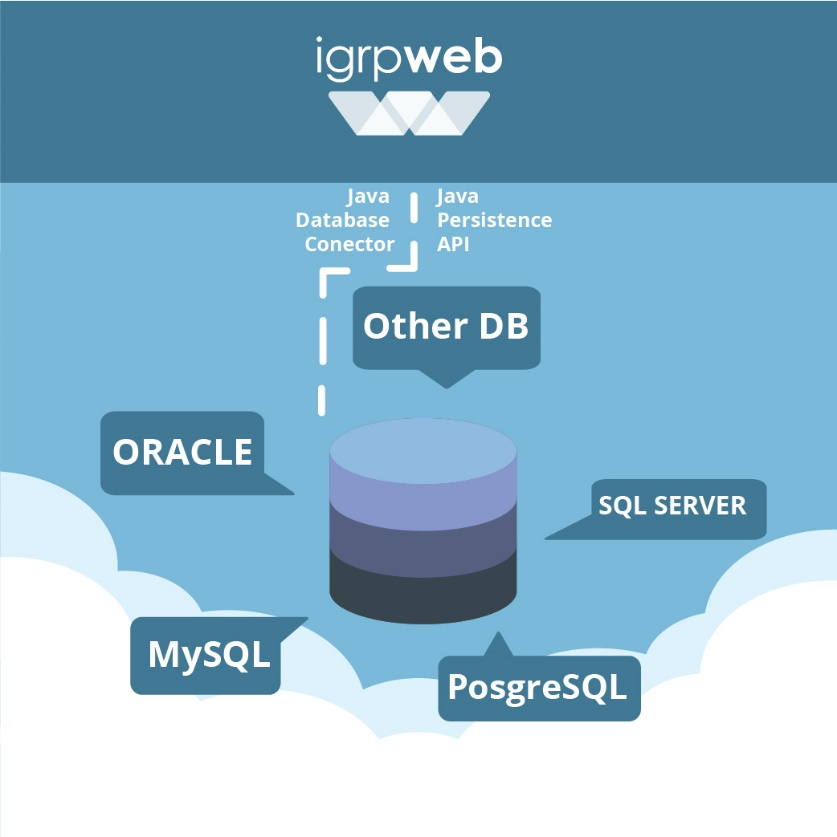
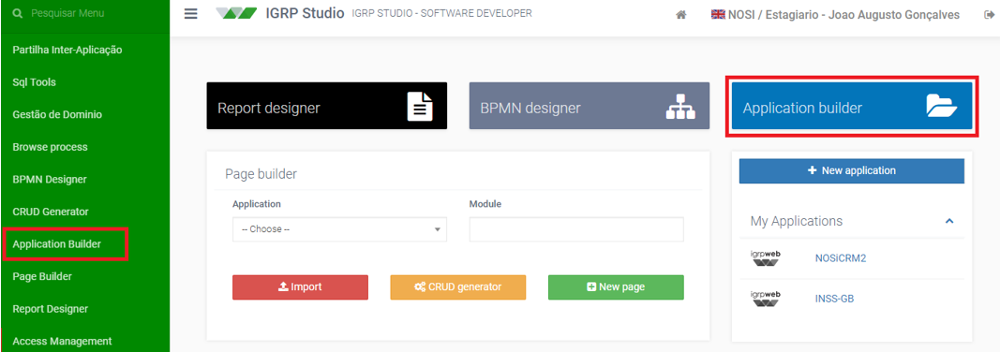
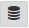
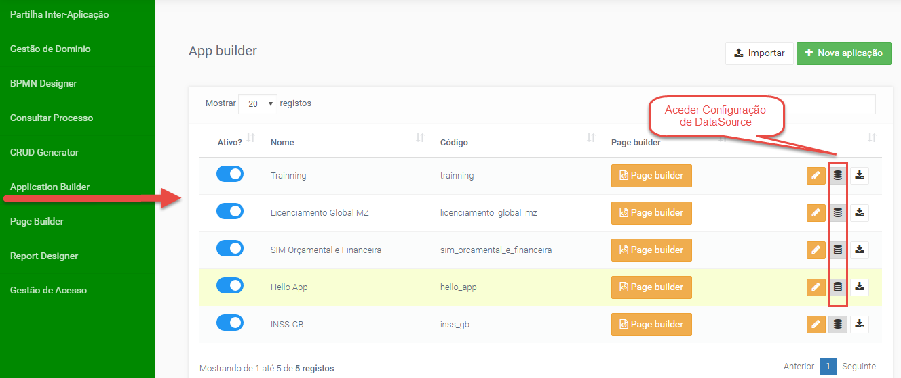
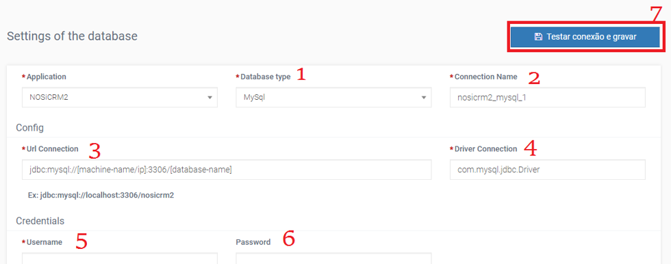
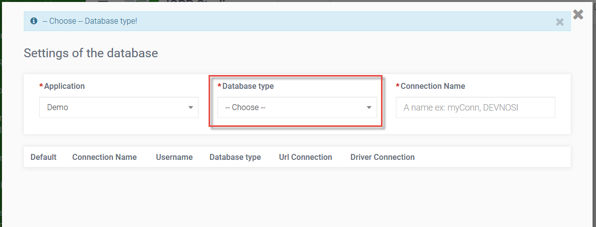
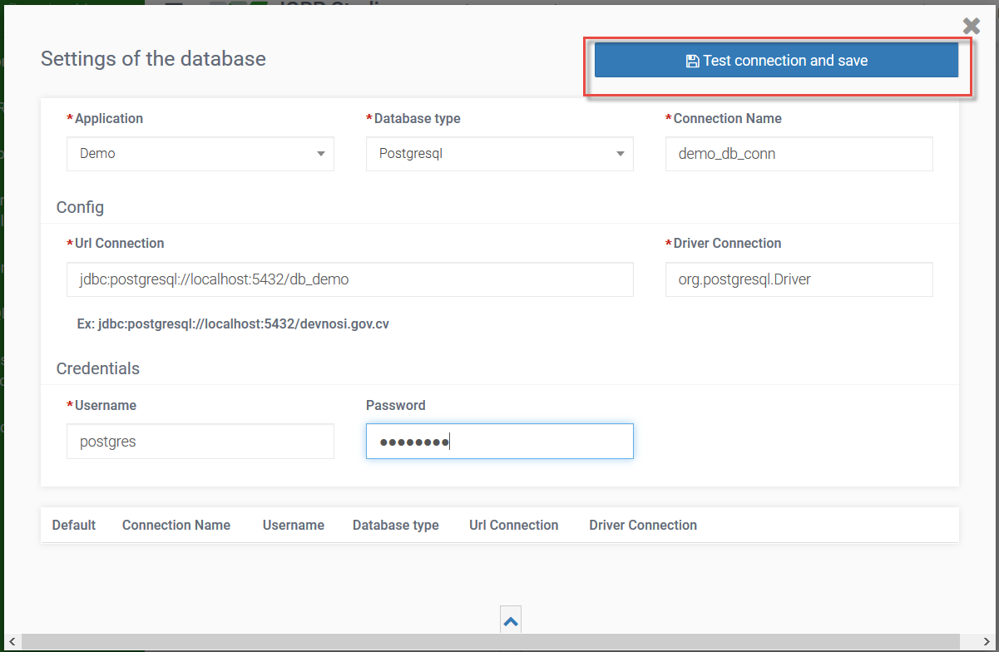
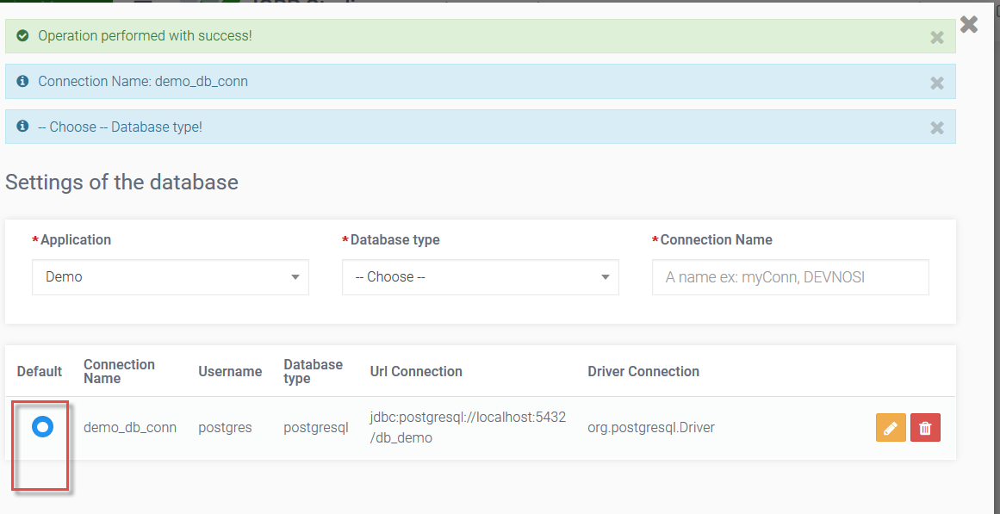

# Base de Dados - Configuração

As aplicações do igrpweb, implementadas em java, servem-se do JPA implementado com o _Framework Hibernate_ para se comunicar com a base de dados, de modo a facilitar o trabalho do programador neste processo. Assim, no documento Interagindo com a Base de dados, falamos do JPA, suas vantagens, e detalhamos as duas formas de acesso, via _querys_ e através de uma _package_ DAO onde se encontram mapeadas em classes as tabelas da BD.


Ambiente onde é criado a(s) conexão(ões) a fonte de dados usado pela aplicação. Cada aplicação pode utilizar uma ou várias base de dados de qualquer tipo (oracle, postgresql, mysql, sqlserver, h2...).<br></br>
Estando na página inicial do IGRP web, podemos conectar uma aplicação a uma base de dados clicando num desses botões apresentado na figura abaixo:


A página _Application Builder_ é utilizada para configurar as aplicações disponíveis. Na página será apresentada uma lista de todas as aplicações disponíveis. Nesta lista temos alguns botões, uma chamada “Configurar Base de Dados” e representado pelo ícone .


Ao clicar no botão, uma janela flutuante aparecerá com um formulário a ser preenchido com os dados para a configuração da base de dados.


#### Legenda da figura:

**[1] _Database Type_**<br></br>
Primeira ação é escolher o tipo de base de dados. Após a escolha alguns campos já se encontrarão preenchidos com sugestões que facilita na introdução de dados pelo utilizador.

**[2] _Connection Name_**<br></br>
Por padrão vem com o nome da aplicação, seguido de um _underscore_(_), seguido do nome da base de dados, seguido de outro _underscore_ e o número de conexão nesta aplicação neste tipo de base de dados.

**[3] _Url Connection_**<br></br>
Por padrão já vem preenchido com o _link_, precisando só substituir os elementos entre colchete. No caso da imagem, temos [machine-name/ip] que deve ser substituído pelo nome ou pelo endereço IP da máquina e [database-name] que deve ser substituído por um nome de base de dados existente.

**[4] _Driver Connection_**<br></br>
Nome do _driver_ utilizado para comunicação com a base de dados. Já vem preenchido com o _driver_, não é preciso alterar.

**[5] _Username_**<br></br>
Nome do utilizador para acesso à base de dados.

**[6] _Password_**<br></br>
Palavra passe utilizado juntamente com o username para acesso à base de dados.

**[7] Testar conexão e gravar**<br></br>
Tendo tudo corretamente preenchido, clicando neste botão, o sistema irá reunir todas as informações dadas, irá testar a conexão e, caso a conexão for um sucesso, salvar a conexão.

**Exemplo**:
```
Aplicação: Hello App
Tipo Base Dados: H2
Nome Conexão: HelloDS
Host: ~
Porta: 0
Nome Base de dados: hellodb
Username:root
```
Estando na _Application Builder_ ao clicarmos sobre o botão **Configurar Base de Dados** acessamos a página de conexões de Base de Dados da nossa aplicação. Escolhendo o tipo de Base de Dados aparecerão novos campos, onde podemos configurar uma nova conexão e guardar através do botão **Test connection and save**.



Se a operação for realizada com sucesso a conexão criada aparecerá na tabela imediatamente abaixo, na mesma janela,onde podemos fazer a sua edição / eliminação ou selecionar a conexão padrão através do choice .


No caso temos apenas uma conexão, logo ela vem definida como padrão. A conexão padrão é utilizada sempre que fizermos acesso à base de dados sem especificar que conexão estamos a utilizar.<br></br>
Para cada conexão criada será criado um ficheiro xml [nome_da_conexao.nome_da_aplicação.cfg.xml], acessível pelo file editor, onde podemos fazer o mapeamento de classes na área assinalada, caso queiramos utilizar classes de um _package_ dao.
![File Editor [acesso ao ficheiro de conexão]](img/fileEditorAcessoFileConexão.png)