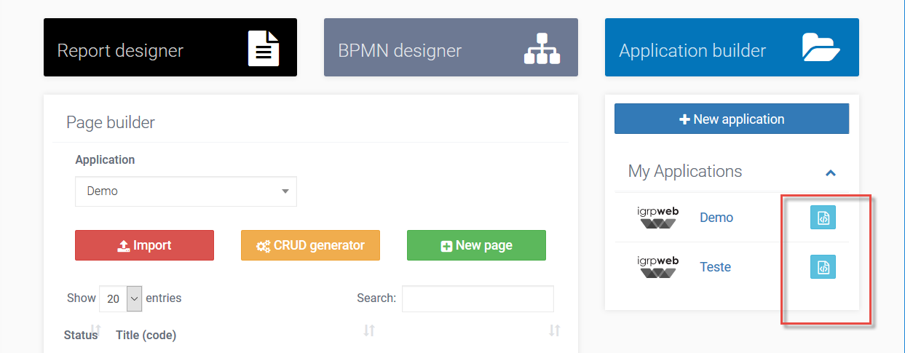
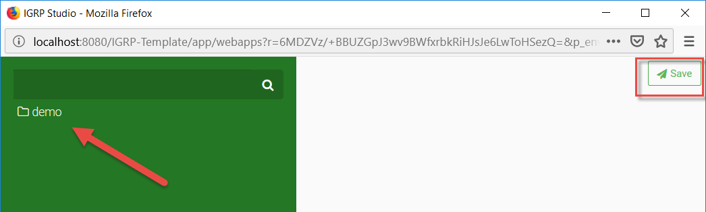

# File Editor

O _File Editor_ é uma ferramenta que permite a criação e edição dos diversos ficheiros do projeto, desde _packages_ e classes Java a ficheiros de configuração – XML.

Acessível através do botão **File Editor** , na lista de aplicações do lado direito da _Home - Page Builder_, o _File editor_ é uma janela que nos dá acesso aos ficheiros da aplicação, nomeadamente, classes e ficheiros de configuração, através de uma estrutura de pastas em forma de árvore no seu lado esquerdo. Qualquer alteração realizada em algum ficheiro deve ser valva pelo botão **Save** . Caso contrário as alterações serão perdidas.   
O _File Editor_ é uma ferramenta que permite a criação e edição dos diversos ficheiros do projeto, desde _packages_ e classes Java a ficheiros de configuração – XML. É acessível no _Home - Page Builder_ através do botão **File Editor**  na lista de aplicações – painel do lado esquerdo.

A imagem mostra o aspeto do _File Editor_ de uma aplicação criada ainda sem páginas nem conexões. À medida em que formos desenvolvendo a aplicação, o conteúdo passará a estar disponível nesta página.  
O _File Editor_ é a ferramenta que permite criar e alterar novos _packages_, classes e ficheiros de configuração da aplicação. _Click_ com o botão direito do rato sobre cada item [ficheiro/pasta] no painel à esquerda exibe a lista de ações que podemos realizar sobre o mesmo.