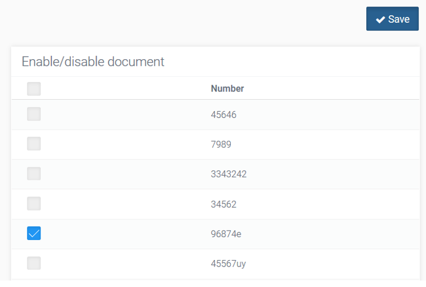
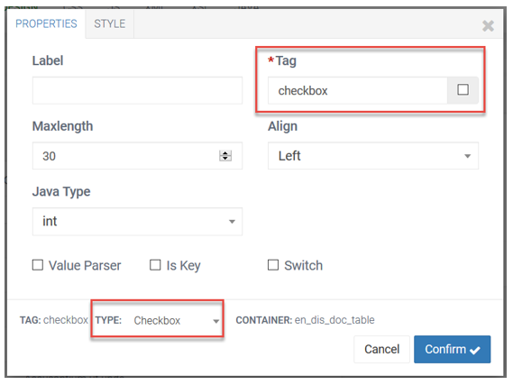

#  Check-box - Configuração e Programação

**Switch** – altera o desenho do campo;
<div style={{ textAlign: 'center' }}>
  
</div>

O *Checkbox* é um campo cujo valor na prática é boleano.

Na janela de propriedades do componente devemos escolher o tipo de dados com que o pretendemos fazer input e output. Neste caso vamos utilizar o tipo **Integer**.

O campo é checado quando recebe o valor 1, se utilizado como inteiro.

`model.setActive( 1 );`

É deschecado para qualquer outro valor. Exemplos:

``` 
model.setActive( 0 );
model.setActive( 22 );
model.setActive( -1 );
```

**Captura de status do _Checkbox_**

``` 
Integer val = model.getActive();
if( val == 1 )
       system.out.println("Checkbox Active is checked.");
else
       system.out.println("Checkbox Active is not checked.");
```
Quando utilizamos este campo com o tipo **String** este é checkado se receber o valor "1" e deschecado para qualquer outro valor. Retorna "1" se checkado e "" caso contrário.

>**Obs:** o *Checkbox* tem outro campo de nome tag\_do\_checkbox + \_check no caso active\_check.

**Código**

```
model.setActive\_check( 1 );
Integer val = model.getActive\_check();
```

### Checkbox / Switch em Tabela

Neste exemplo implementamos uma tabela com um campo *checkbox* onde definimos um documento como ativo/inativo. A informação é gravada na DB pelo botão **Save**.



Desenhamos a tabela com os campos *number* e *checkbox* (figura acima).



**Imports**

```
/*----#start-code(packages\_import)----*/
import nosi.core.webapp.helpers.CheckBoxHelper;
import java.util.List;
import java.util.ArrayList;
/*----#end-code----*/
```

No preenchimento o campo *checkbox* recebe dois valores pois compreende duas variáveis:

1. A primeira de nome igual à tag do componente [no caso **checkbox**] é o id referente à linha. Logo, dispensa o uso de um **hidden** para guardar o id da linha.
2. A segunda de com o mesmo nome mais o sufixo \_check [no caso **checkbox\_check**] recebe o valor que define o estado do campo, se está selecionado ou não. O valor **-1** significa que o campo não está selecionado. Para qualquer outro valor o campo é assumido como selecionado.

```
/*----#start-code(index)----*/
List docList = new Document().findAll();
List table = new ArrayList<>();
for(Document d: docList){
        EnableDocument.Document\_table row = new EnableDocument.Document\_table();
        row.setCheckbox( d.getId() ); //
        row.setCheckbox\_check( d.getStatus().equals("ACTIVE") ? d.getId() : -1 );
        row.setNumber( d.getNumber() );
        table.add( row );
}
model.setEnableDocument.Document\_table( table );
/*----#end-code----*/
```

No método ***actionSave*** recebemos como parâmetros dois arrays [o primeiro com a lista de *ids* e o segundo com a lista de *ids* das linhas selecionadas] nos quais nos baseamos para realizar as ações pretendidas.

```
/*----#start-code(save)----*/
CheckBoxHelper cbh = CheckBoxHelper.extractCheckBox(view.checkbox);
```
ou
```
String[] p\_checkbox = Core.*getParamArray*( "p\_checkbox" );
String[] p\_checkbox\_check = Core.*getParamArray*( "p\_checkbox\_check" );
CheckBoxHelper cbh = Core.*extractCheckBox*( p\_checkbox, p\_checkbox\_check );
ResultSet r = null;
// code for checked ids action
 for (String id: cbh.getChekedIds()) {
                r = Core.*update*("db\_conn","public","document")
                               .addString( "status", "ACTIVE" )
                               .where( "id=:id" )
                               .addInt( "id", Core.*toInt*(id) )
                               .execute();
                if( r != null && r.hasError() )
                               Core.*setMessageError*( r.getError() );
}
// code for unchecked ids action
for (String id: cbh.getUncheckedIds()) {
                r = Core.*update*( "db\_conn","public","document" )
                               .addString( "status", "INACTIVE" )
                               .where( "id=:id" )
                               .addInt( "id", Core.*toInt*(id) )
                               .execute();
                if( r != null && r.hasError() )
                               Core.*setMessageError*( r.getError() );
}
/*----#end-code----*/
```
