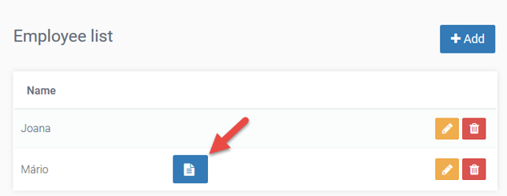
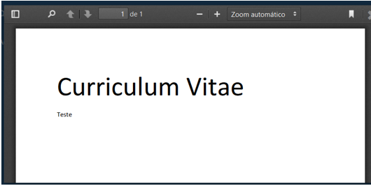
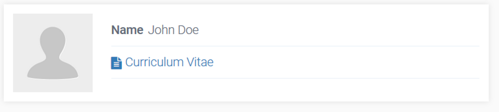
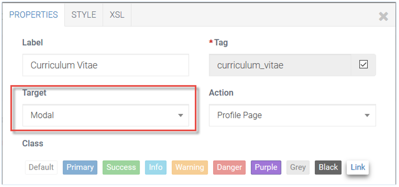
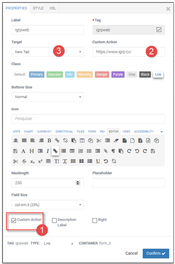
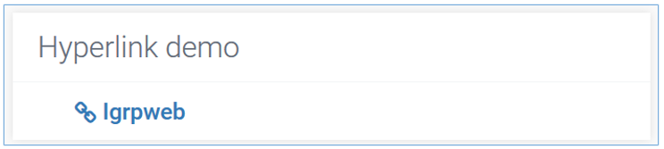

# Hyperlink - Configuração e Programação

Lidando com ficheiros, dando seguimento à abordagem implementada em **Upload**, apresentamos uma tabela para listar as informações registadas através do formulário do tópico anterior. Ou seja, listamos o nome dos empregados e os respetivos _curriculum vitae_.

Cada _currirulum vitae_ é representado na tabela por uma _field_ do tipo _link_ para ficheiro [assinalado com a seta na imagem] sobre os qual podemos clicar para aceder ao respetivo ficheiro.


A imagem abaixo é um exemplo de ficheiro pdf aberto em janela modal ao clicar sobre o _link_.


### 1. Configurações no Design
Desenhamos nossa tabela com os três campos “name”, “curriculum_vitae” e “id” [hidden], e configuramos nosso _link_ escolhendo, por exemplo, a forma de acesso que pretendemos [no nosso caso uma janela do tipo modal [2] ] e o valor da tag [1].

O _Hyperlink_ é um _field_ altamente configurável, como o _Button_, utilizado para acessar localizações dentro e fora do domínio da aplicação, porém, sem a execução de código Java. Logo, não corresponde a nenhum método no Controller.

Vamos agora ilustrar dois exemplos de uso deste _field_ e pressupor, que a partir destes o desenvolvedor se possa orientar para outras situações que possam surgir.

- **Action** – página requisitada/invocada pelo _link_;
- **Button** [em _HyperLink_ de _Separator List_] – bloqueia click sobre o _link_ no formulário do _SeparatorList_;
- **Buttons Size** – tamanho do botão;
- **Custom Action** – permite personalizar o _Action_ com um valor que não esteja presente no _combobox_ desse campo;
- **Class** – cor do botão. Pode também ser personalizado no separador _STYLE_;
- **Icon** – ícone do botão;
- **Target** – define o método de chamada utilizado para invocar o _Action_;
- **Show Header** [em _HyperLink_ de tabela] – limpa titulo coluna na tabela; 
- **Refresh Parent** [quando o _Target_ selecionado é _Modal / Submit modal_] – atualiza a página ao fechar a janela [Modal] correspondente. 
 
## 2. Programação

Vejamos agora o código java dos _imports_ e métodos correspondentes a essa implementação a seguir.

**Imports**

```
/*----#start-code(packages\_import)----*/
import nosi.webapps.igrp.dao.CLob;
import nosi.webapps.igrp_tutorials.dao.Employee;
import java.util.List;
import java.util.ArrayList;
/*----#end-code----*/
```

**Método actionIndex**

```
/*----#start-code(packages\_import)----*/
List empolyeeList = new Employee().findAll();
if ( Core.isNotNull( empolyeeList ) ) {
List empTable = new ArrayList<>();
for ( Employee emp: empolyeeList ) {
               EmployeeList.Employee_table row = new EmployeeList.Employee_table();
               row.setId( emp.getId() );
               row.setName( emp.getName() );
               if ( emp.getFileId() != null )
                               row.setCurriculum_vitae( "igrp_tutorials",
                                               "EmployeeList", "download&file_id="+ emp.getFileId() );
               empTable.add( row );
}
model.setEmployee_table( empTable );
}
/*----#end-code----*/
```
 
Ao carregar dados na tabela configuramos o _link_ para o acesso ao documento de cada linha.

Note que os valores do terceiro parâmetro do _link_ ("download&file_id=") devem coincidir com o nome do método _actionDownload_ e do parâmetro file_id assinalados em _Custom actions_ para que a invocação deste ultimo seja realizada com sucesso.

**Custom Actions**

Finalmente, em _Custom actions_ - espaço reservado no final do Controller, devemos implementar o método responsável pelo download do ficheiro no momento em que clicamos no _link_ respetivo.

```
/*----#start-code(packages\_import)----*/
public Response actionDownload() throws IOException, IllegalArgumentException,
IllegalAccessException{
int fileId = Core.getParamInt( "file_id" );
CLob c = Core.getFile( fileId );
byte []content = c.getC_lob_content();
String name = c.getName();
String contentType = c.getMime_type();
boolean download = false;
return this.xSend( content, name, contentType, download );
}
/*----#end-code----*
```
 
### 2.1 Link para ficheiro

Pedir o _link_ de um ficheiro a partir do id
`String linkFile = Core.getLinkFile( String p_id );`

Pedir o _link_ de um ficheiro a partir do id
`String linkFile = Core.getLinkFile( int p_id );`

## 3. Exemplo 2 - Hyperlink para Download de Ficheiro num View

Como complemento à abordagem do **UPLOAD** vamos implementar um _Hiperlink_ através do qual vamos exibir um ficheiro previamente inserido na Base de dados. Então, vamos partir do princípio que tínhamos registado um objeto **dao** do tipo Person com name e idCurriculumVitae [id do ficheiro inserido na BD].

O _Hyperlink_ está em um View e a partir dele podemos abrir em um Modal o Curriculum Vitae.
 


Tendo nosso campo configurado conforme a acima, vamos receber o id do Person como parâmetro buscar o objeto na BD e exibir suas informações, necessitando então implementar os códigos que vêm a seguir.

O _Hyperlink_ invocará o método actionDownload, que implementaremos em _Custom Actions_ [final do Controller], responsável por trazer o ficheiro da BD para a página.

**Método actionIndex**

```
/*----#start-code(packages\_import)----*/
// receiving employee id as parameter
Integer employeeId = Core.getParamInt( "p_id" );
if( employeeId != null ){
       // getting employee data from DB
       Employee employee = new Employee().findOne( empployeeId );
       // setting data in fields
       if( employee != null && !employee.hasError() ){
              model.setName( employee.getName() );
              model.setCurriculum_vitae( "demo_app","Profile_page", "download&file_id="+ employee.getFileId() );
              model.setCurriculum_vitae_desc( "Curriculum Vitae" ); // hyperlink text
       }
}
/*----#end-code----*/
```
 
Notemos que os valores do terceiro parâmetro do _Hiperlink_ ("download&file_id=") devem coincidir com o nome do método actionDownload e do parâmetro file_id assinalados em Custom actions para que a invocação deste ultimo seja realizada com sucesso.

**Custom Actions**

```
/*----#start-code(packages\_import)----*/
public Response actionDownload() throws IOException, IllegalArgumentException, IllegalAccessException{
int fileId = Core.getParamInt( "file_id" );
nosi.webapps.igrp.dao.CLob clob = Core.getFile( fileId );
byte []content = clob.getC_lob_content();
String name = clob.getName();
String contentType = clob.getMime_type();
boolean download = false;
return this.xSend( content, name, contentType, download );
}
/*----#end-code----*/
```

Podemos perceber a partir desta implementação que podíamos ter uma tabela com _Hyperlinks_ para uma lista de ficheiros, cada um com o id do ficheiro correspondente.

 
## 4. Hyperlink para Fora da Aplicação

A maioria dos _Hyperlinks_ abrem locais do nosso domínio. Entretanto se pretendermos abrir _Links_ externos devemos selecionar o _Checkbox Custom Action_ [assinalado na Fig 6 com o número 1 ] e especificar o endereço pretendido no _Text Custom Action_ [ numero 2 ], que então aparece e utilizar como _Target [3] New Tab_, _Self_, ou algum outro valor aplicável.



O _Hyperlink_ configurado na imagem tem o aspeto da imagem abaixo e abre o endereço https://www.igrp.cv/



Se quisermos enviar parâmetros, basta utilizar no método actionIndex um código como o abaixo, sabendo que a tag é igrpweb:

```
/*----#start-code(packages\_import)----*/
view.igrpweb.addParam( "id", "1" );
```

Então o _Hyperlink_ passaria a invocar https://www.igrp.cv/&id=1