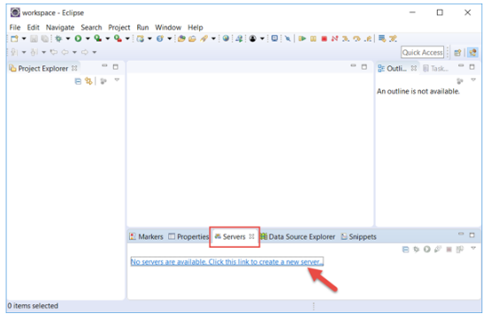
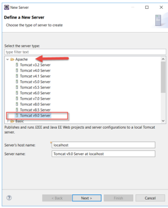
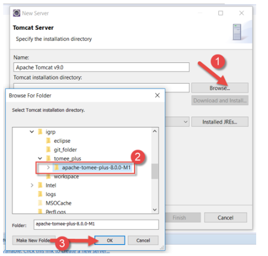
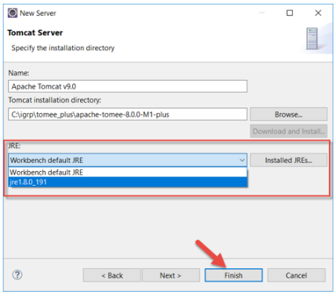
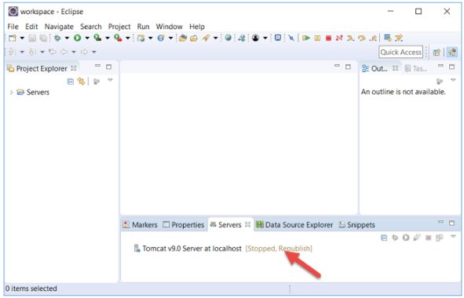

# Adição do Servidor Apache no Eclipse

**Passo 1**: Após a abertura do Eclipse, no separador **Servers** clicamos sobre o *link* assinalado pela seta, que permite a adição de servidores.

**Passo 2**: Navegamos até a pasta **Apache** e escolhemos a **versão superior do Tomcat correspondente ao Tomee Plus que instalamos**. No caso temos o Tomee Plus 8.0.5 correspondente ao Tomcat 9.0 e clicamos sobre o botão **Next**.

**Passo 3**: Na janela seguinte clicamos sobre o botão **Browse** [1], navegamos até a pasta para onde extraímos o TomEE Plus [1], selecionamos aquela pasta, e clicamos sobre o botão **Ok** [3].

**Passo 4**: Em seguida, escolhemos o JRE que acabamos de instalar, ou podemos deixar a opção default, e clicamos sobre o botão **Finish**.

O servidor Tomcat aparece no separador **Servers**, sinal de que foi configurado com sucesso.

**Passo 5**: Salvamos as alterações clicando sobre o botão **Save** e o servidor Tomcat fica a partir desse momento pronto para ser executado.

