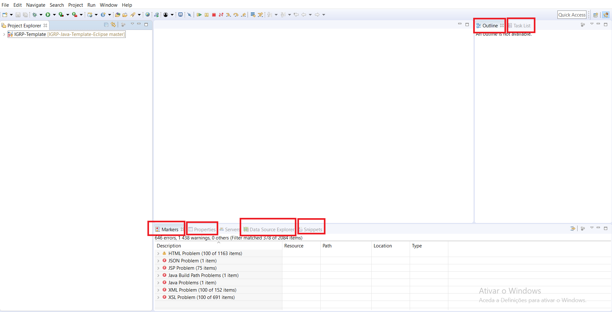
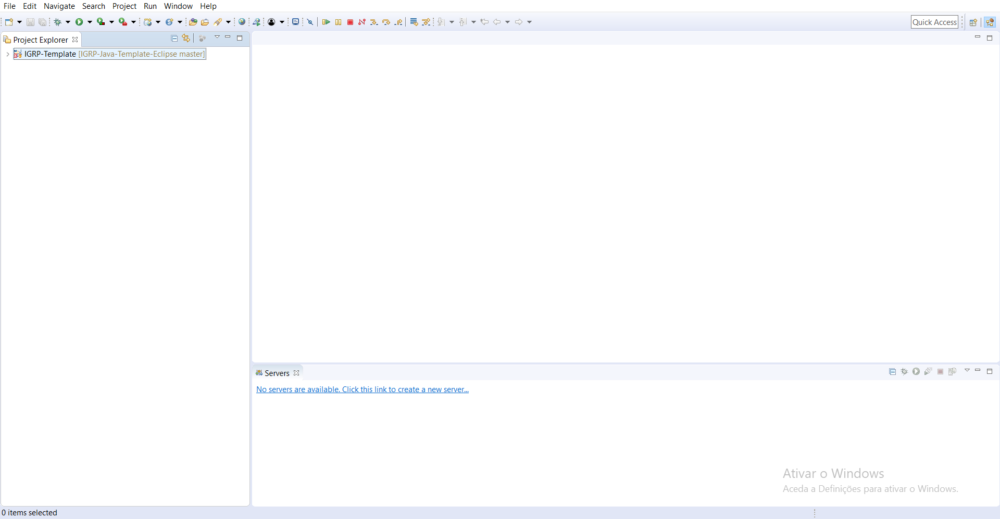
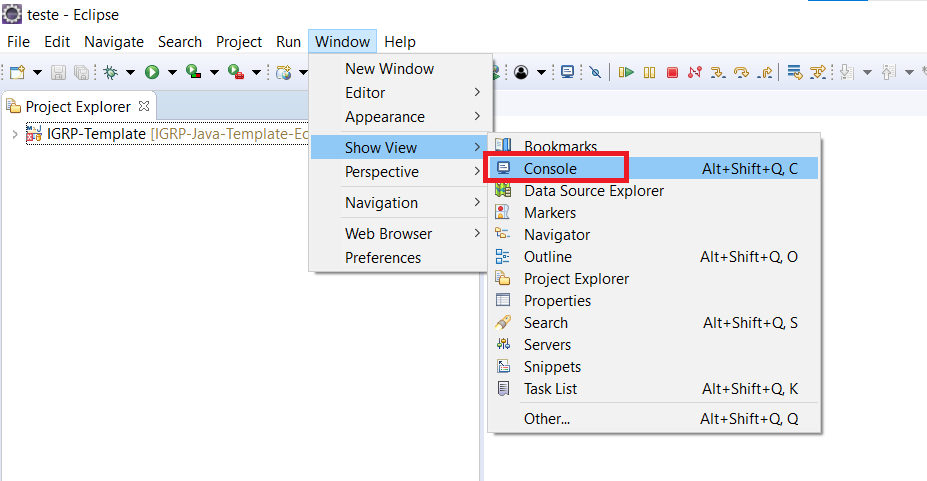
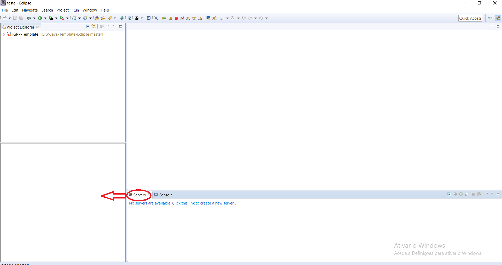
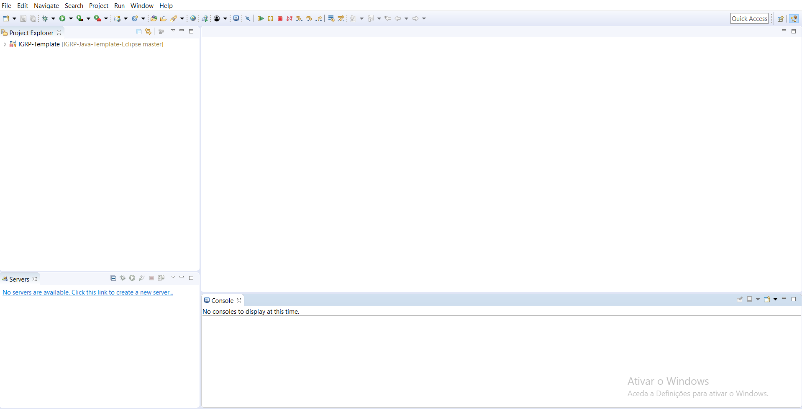
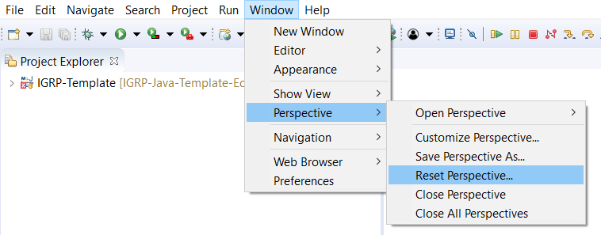

# Configuração do Ambiente Eclipse

Após a importação do projeto, vamos configurar o nosso ambiente de desenvolvimento para prosseguir com o arranque do _framework_.

**Passo 1**: Fechar todas as janelas desnecessárias.

**Passo 2**: Visão do nosso workspace após fecho das janelas desnecessárias.

**Passo 3**:  Adição da Consola.

**Passo 4**: Mover o Server para o lado esquerdo.

**Passo 5**: Visão final do nosso workspace.

 
  **Atenção**: Caso houver algum problema com a arrumação do <em>workspace</em>, podemos fazer o <em>reset</em> do <em>workspace</em>.

