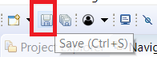

# Configuração do Servidor Apache Tomcat

Após a adição Servidor Apache Tomcat, agora temos de configurá-lo.

**Passo 1**: Fazemos duplo click sobre o servidor Tomcat instalado.

**Passo 2**: Devemos incrementar os **Timeouts** do servidor de forma a que dê tempo para o servidor arrancar. Em vez de 45 e 15 coloca **120 e 60**. Fazer **Save**.

**Passo 3**: Agora, abir a opção "**_Open launch configuration_**".

**Passo 4**: Clicar no separador **_Common_**. 

**Passo 5**:  Alterar o Encoding do Apache para UTF-8 para evitar erros de caracteres especiais e clicar em **_Apply_** para aplicar as alterações, depois clicar em **OK**.

**Passo 6**: Clicar em **Save**, para salvar as configurações feitas.

