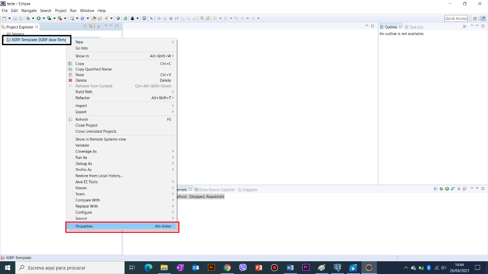
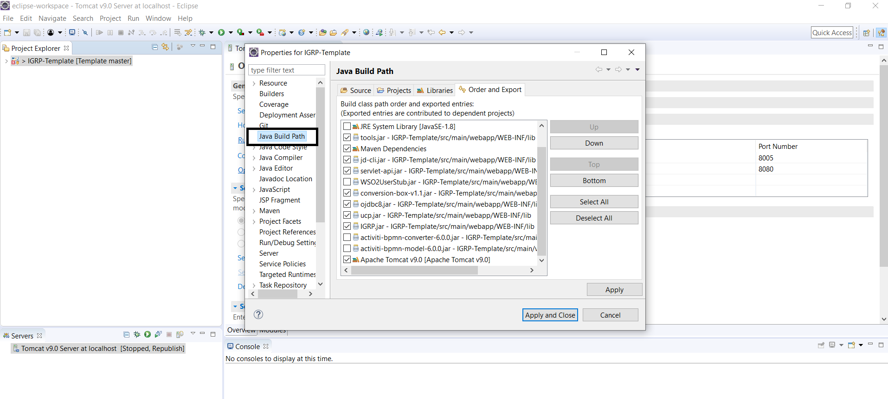
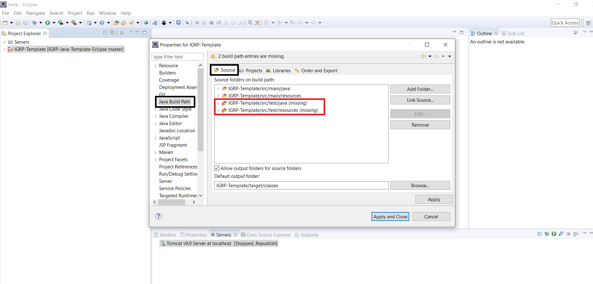
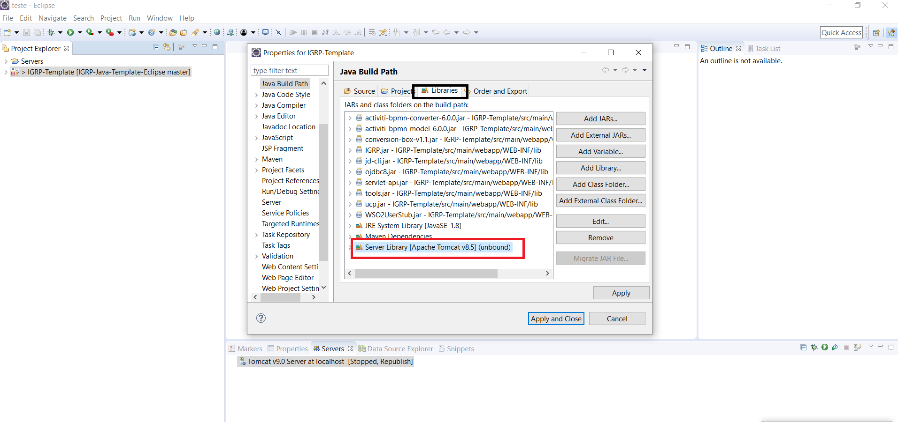
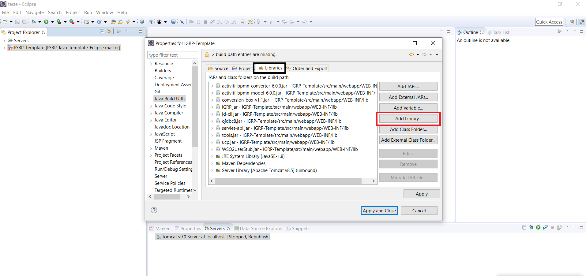
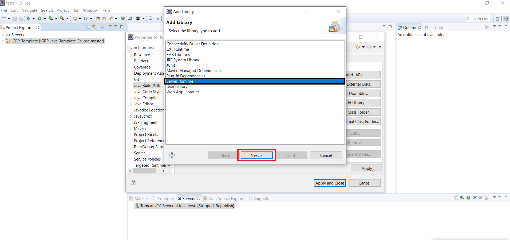
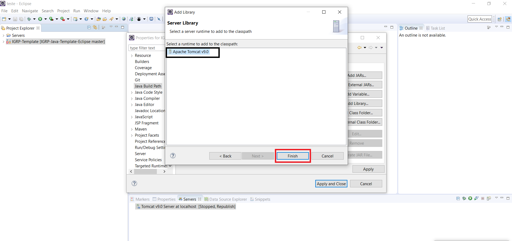
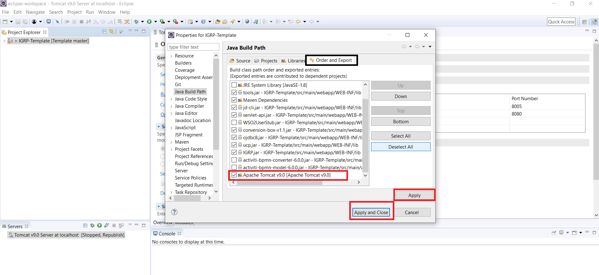

# Configuração do Java Build Path

**Passo 1**: Após fazer a importação do projeto e a adição do servidor é preciso configurar o **Java Build Path** do projeto. Clicar botão direito no **IGRP template** escolher _properties_.

**Passo 2**: Ao clicar no botão direito, escolher a opção _properties_ e clicar em **Java Build Path**.

**Passo 3**: Clicar no tabulador **Source** e remover as duas pastas do (_missing_) que podem aparecer no projeto. Estas pastas são ficheiros que estão adicionados no Servidor do projeto e que não pertencem ao nosso projeto importado.

**Passo 4**: Clicar no **Libraries** e remover o servidor que aparece como _Unbound_ (fora de banda), é o servidor que estava pré-escolhido no projeto adicionado. E vamos ter de adicionar o nosso servidor Apache.

**Passo 5**: De seguida em **add library** para adicionarmos o Servidor Apache correspondente ao nosso projeto.

**Passo 6**: Escolher a opção **Server Runtime** e depois clicar em **next**.

**Passo 7**: Selecionar a opção **Apache Tomcat v9.0**, que é a versão que tínhamos adicionado ao nosso ambiente de desenvolvimento e clicar em **finish**.

**Passo 8**: Finalmente, no tabulador **Order and Export**, ativar o apache Tomcat v9 adicionado e clicar nos botões **apply** e **apply and close**.

