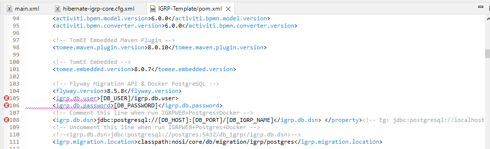
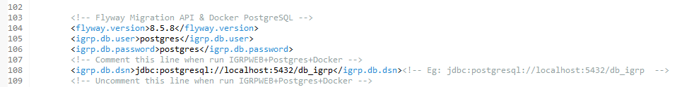

# Configuração do Pom.xml

Antes de arrancar o projeto é preciso também configurar o diretório do **Flyway Migration** no ficheiro pom.xml.
Portanto no atalho de pesquisa de ficheiro **CTRL+SHIFT+R** procura pelo ficheiro **pom.xml** que é o ficheiro onde temos todas as dependências do nosso projecto.
Nas linhas apresentadas na imagem a segui, introduzir as configurações que são pedidas.


> **NOTA: Certificar que todas as tags foram fechadas corretamente!**

Podemos ver um exemplo de configuração, conforme mostra-nos a imagem abaixo, com:
```
db.user = postgres
db.password = postgres
db.dsn = jdbc:postgresql://localhost:5432/db_igrp
```
