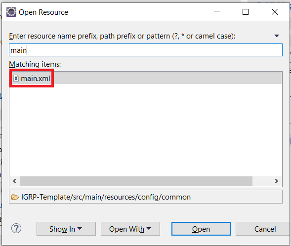
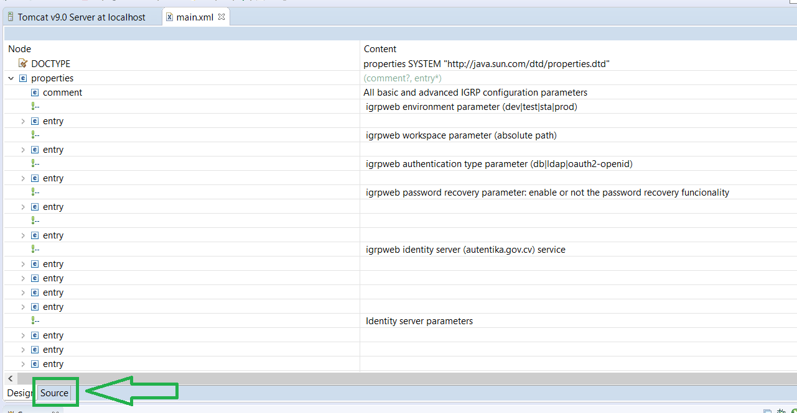
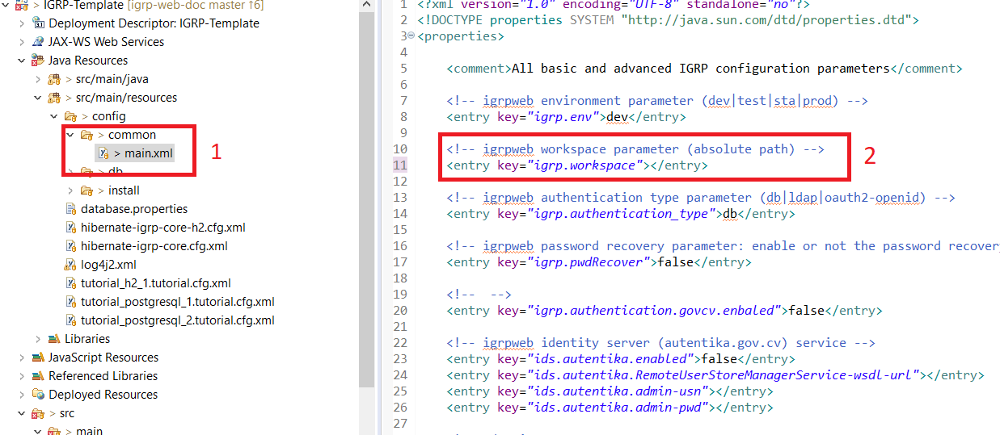
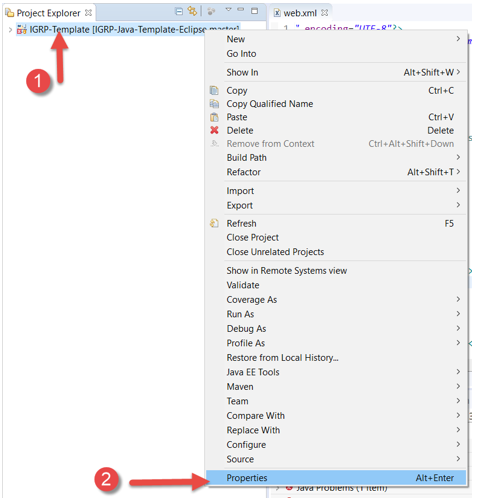
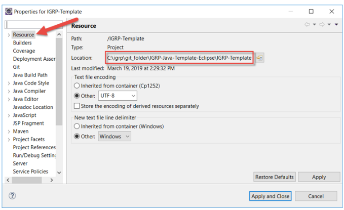
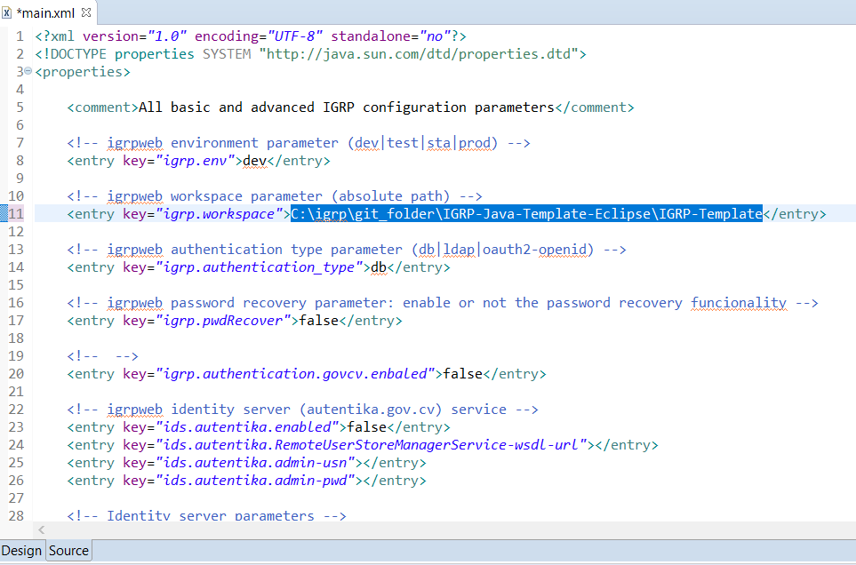
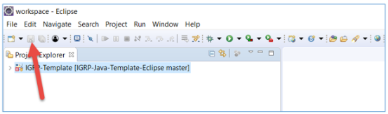

# Configuração do ficheiro main.xml

O main.xml é um ficheiro que precisamos para configurar o workspace do nosso projeto.

**Passo 1**: No eclipse, utilizar atalho **CTRL+SHIFT+R** para procurar o ficherio main.xml.

>Caso não conseguir procurar pelo atalho ctrl+shift+R, encontramos o ficheiro em: [ IGRP Template -> Java Resources -> src/main/resouces -> config -> common -> main.xml]. 

**Passo 2**:  Alterar o ficheiro main.xml para modo Source.

**Passo 3**: Identificar **igrp.workspace** [2].

**Passo 4**: Botão direito do rato sobre **IGRP Template** e selecionamos _Properties_.

**Passo 5**: Selecionamos **Resource** no painel direito e copiamos o endereço que aparece selecionado na imagem. 

**Passo 6**: No ficheiro **main.xml** preenchemos o campo do igrp.workspace, logo a nossa _tag_ deverá ficar assim:

**Passo 7**: Clicamos no botão **Save**.

