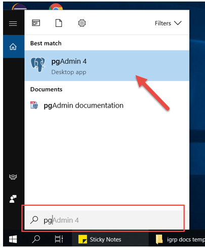
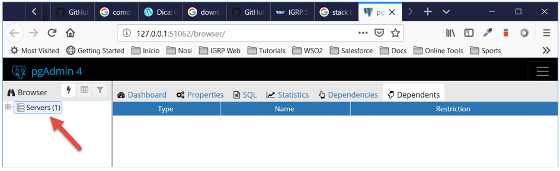
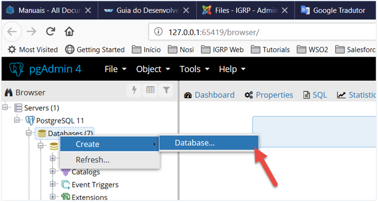
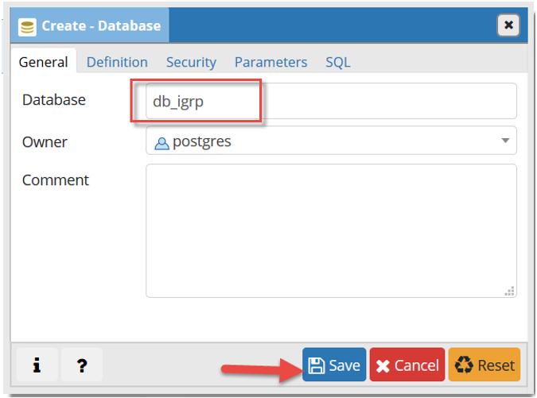
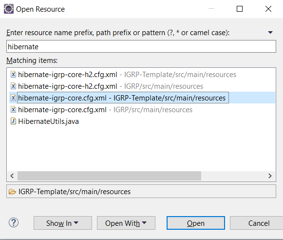
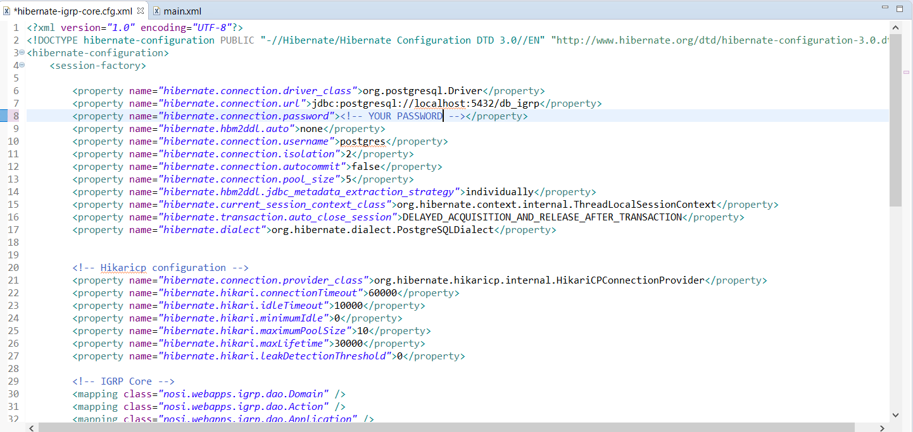

# Criação de base de dados e Configuração do "db_igrp_config.xml"

**Passo 1**: Criar base de dados de instalação do framework no **pgAdmin**.

>Atenção: É provável que na execução ocorra um erro, basta fecharmos esta janela e executarmos novamente o pgAdmin.

**Passo 2**: Inserir a _password_ definida ao criar a aplicação e clicar em _Servers_.

**Passo 3**: Em cima da opção **Database**, criar uma nova base de dados.

**Passo 4**: Definimos um nome para a Base de Dados [neste caso, **db_igrp**] e clicamos sobre o botão **Save**. 

**Passo 5**: No Eclipse, procurar **(ctrl+shift+R)** pelo ficheiro _xml_ de configuração de base de dados do projeto **IGRP-Template**: _"hibernate-igrp-core.cfg.xml"_.

Se não conseguir pesquisar, vais encontrar o ficheiro na pasta: [IGRP Template -> src -> main -> resources].

 
**Passo 6**: Colocar a _password_ escolhida ao instalar o PostgreSQL.

**Passo 7**: Clicar **Save** para gravar as alterações.

