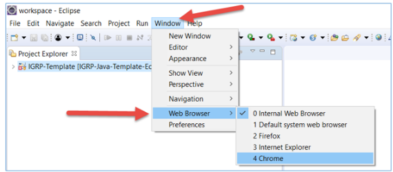
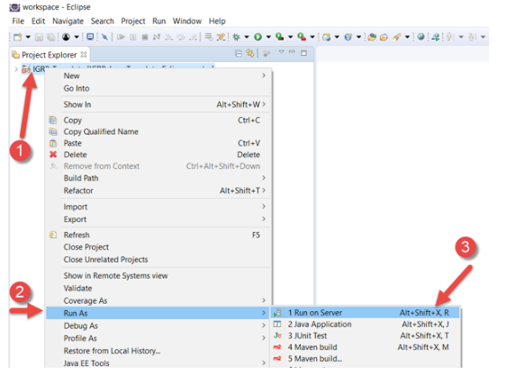
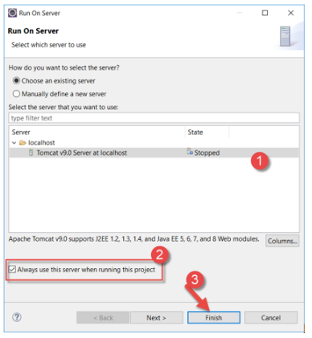
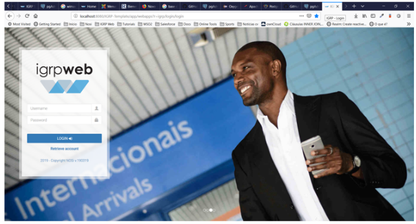

# Execução do Projeto igrpweb Template

**Passo 1**: Definir no eclipse web browser onde o pretendemos utilizar em **Window -> Web Browser**.

**Passo 2**: Para executar o IGRP Template, escolhemos **Run as -> Run On Server**.

**Passo 3**: Na janela que aparece, escolhemos o Servidor Apache que instalamos previamente, clicamos sobre o botão **Finish** e aguardamos o IGRP Template ser aberto no Web Browser que definimos no Eclipse.

**Passo 4**: Se o processo ocorrer como esperado o Web Browser nos exibirá a página onde fazemos o login com as credenciais abaixo e começamos a desenvolver.   
    Username: demo@nosi.cv
      Password: demo

