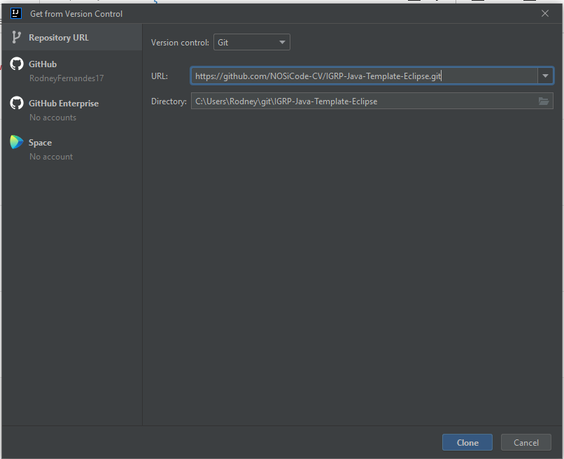
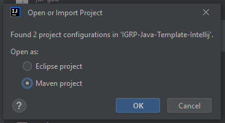
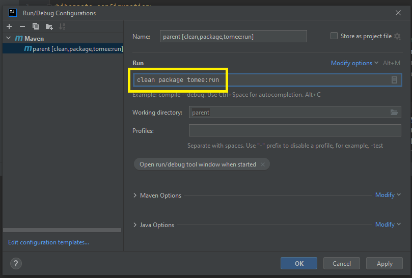
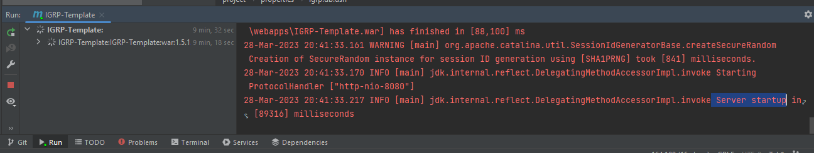

# Execução do Projeto no Intellij IDE

**Passo 1**: Abrir o Intelij IDE, clicar no botão de importação do projeto (imagem a seguir)

**Passo 2**: Assim como descrito no documento [Gerar archetype ou Importação do Projeto](<Geração de archetype ou Importação do Projeto/Gerar archetype ou Importação do Projeto.md>), copiar o URL do repositório GIT do projeto IGRP-Template e fazer o clone do projeto no Git (imagem a seguir).

**Passo 3**: Após fazer o clone do projeto escolher a opção de fazer importação como **_Maven Project_** (imagem a seguir).   

**Passo 4**: De seguida escolher a opção **_Trust Project_** (imagem a seguir).   

**Atenção**:
No Intellij **não** aparece o passo de escolha do _workspace_, com isso temos de escolher manualmente o _workspace_ correto para execução do projeto.

**Passo 5**: Para isso, clicamos no botão direito no projeto importado no Intellij e escolher a opção descrita na imagem abaixo.   

**Passo 6**: Então podemos ver onde está localizado a pasta IGRP-Template importada no nosso computador (imagem a seguir).   

**Passo 7**: Ao voltar ao Intellij e abrir o projeto IGRP-Template na opção **"File -> Open..."** e percorrer o diretório de pastas que consultamos na imagem acima, conforme nos é demonstrado na imagem a seguir.

**Passo 8**: Após a abertura do projeto IGRP-Template, ficaremos com a seguinte arquitetura de pastas no nosso Intellij (ver a imagem a seguir).   

**Passo 9**: De seguida, fazer a configuração do ficheiro main.xml como é explicado na documentação [Configuração do ficheiro main.xml](<Configuração e Execução do projeto igrpweb Template/Configuração do ficheiro main.md>), no Intellij utilizar o atalho **CTRL+SHIFT+A** para a procura de ficheiros, neste caso como é um ficheiro xml, escolher o tabulador **All** (ver a imagem a seguir).   

**Passo 10**: Para saber o diretório que devemos copiar, seguimos o mesmo passo 5, depois copiamos o diretório da pasta IGRP-Template e copiamos no campo _workspace_ como é demonstrado na imagem a seguir.

**Passo 11**: Após a configuração do ficheiro main.xml, seguimos os passos para criação de base de dados e configuração do ficheiro db_igrp_config.xml, como explicado na documentação [Criação de base de dados e Configuração](<Configuração e Execução do projeto igrpweb Template/Criação de base de dados e Configuração.md>).

**Passo 12**: Após isso fazer a configuração do ficheiro pom.xml, conforme é explicado na documentação [Configuração do Pom.xml](<Configuração e Execução do projeto igrpweb Template/Configuração do Pom.md>) .

**Passo 13**: Após a configuração desses três ficheiros e criação da base de dados, vamos fazer a configuração de _run_ do projeto. Clicar no **_Edit Configuration_** como nos mostra a imagem a seguir.   

**Passo 14**: De seguida aparece a opção de adicionar uma nova configuração e nesta escolhemos a opção _Maven_, como nos mostra a imagem a seguir.   

**Passo 15**: Na janela seguinte escrever o seguinte comando no campo run "**_clean package tomee:run_**" (ver imagem abaixo). No campo **Name** podemos escolher qualquer nome.

**Passo 16**: Salvar a configuração no botão **Apply** e depois **OK**, e após fechar a configuração fazer o Run do projeto clicando botão **play** do Intellij (ver a imagem a seguir).   

**Passo 17**: Após executar o comando, é possível verificar no console o _building_ do projeto feito pelo _Maven_ e um conjunto de _logs_ da inicialização do _Embedded TomEE_. Após fazer o run do projeto, no _Log_ do Intellij na aba Run, podemos ver quando o nosso _server_ estiver executando o projeto, conforme nos mostra a imagem abaixo.

**Passo 18**: Se o processo ocorrer como esperado o Web Browser nos exibirá a página onde fazemos o login com as credenciais abaixo e começamos a desenvolver.   
    Username: demo@nosi.cv
      Password: demo