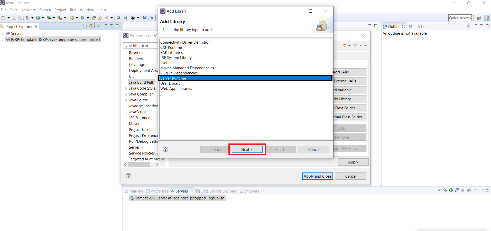
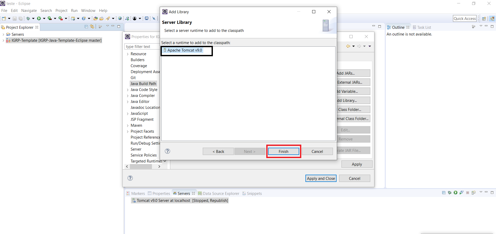
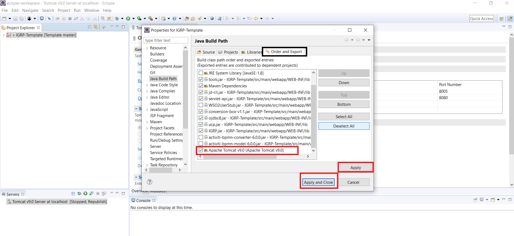

# Falha na sincronização Eclipse-Servidor Local (Troubleshooting)

## Sincronia entre eclipse e servidor local

Por vezes estamos a programar e as mudanças no eclipse não surtem efeito no servidor local, normalmente este erro ocorre devido ao servidor que se encontra fora de banda, provocada por algum deploy mal feito ou erros em Classes Java.
Neste caso as mudanças feitas no eclipse não surtem efeito no servidor é porque o servidor não está em sincronia com o servidor local.

<em> JRE System Library (unbound) and Server Library (unbound) solutions appear when importing java web project in Myeclipse - Programmer Sought</em>.

**Passo 1**: Como resolver o problema, é preciso **remover** o servidor _unbound_ e voltar a adicionar o nosso servidor local.

**Passo 2**: Escolher a opção Server Runtime na opção de **_Add Libraries_** e depois clicar em next.

**Passo 3**: Selecionar a opção Apache Tomcat v9.0, que é a versão que tínhamos adicionado ao nosso ambiente de desenvolvimento e clicar em finish.

**Passo 4**: Finalmente, no tabulador **_Order and Export_**, ativar o apache Tomcat v9 adicionado e cliacar nos botões **_apply_** e **_apply and close_**.

