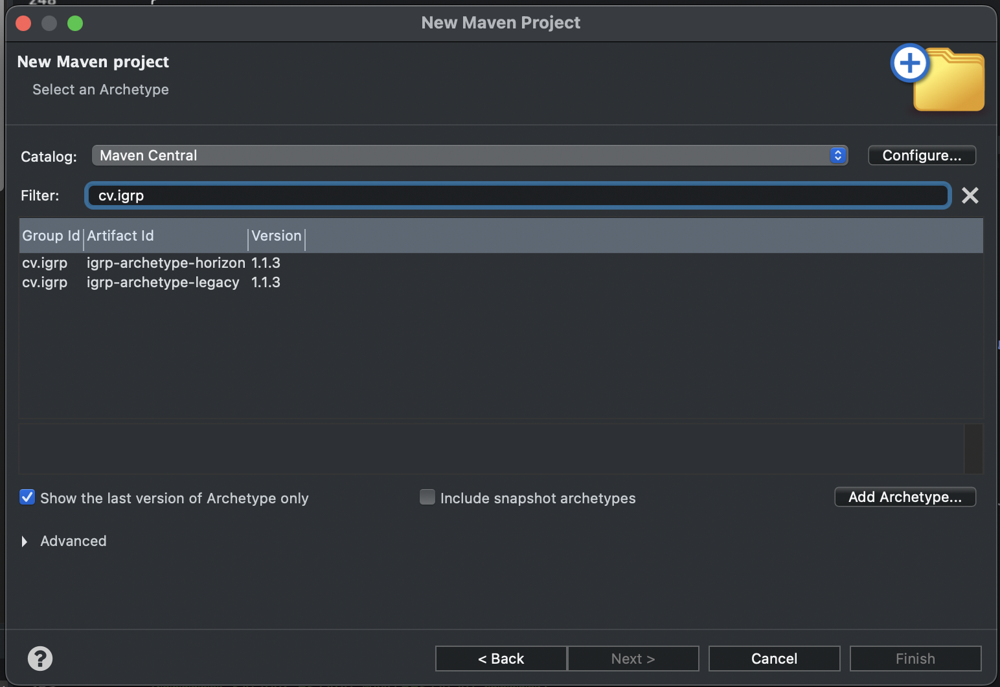

#  Gerar archetype ou Importação do Projeto
>**Observação**: Apartir de agora é recomendado utilizar o _archetype_ alojado no mvn _repository_ que pode ser gerado por um IDE como Eclipse, IntelliJ (ver foto) ou pelo comando _maven_ baixo.

UTILIZAR COMANDOS NO README DE https://github.com/NOSiCode-CV/IGRP-Framework

>`PARA DOWNLOAD: mvn archetype:generate -Dfilter=igrp -DdbUser=user1 -DdbPassword=mypassword -DdbJdbcUrl=jdbc:postgresql://localhost:5432/my_igrp_db`

**OU** para _download_ do _artifact maven_ fazer **IMPORT WIZARD PROJECT DE ECLIPSE ou INTELLIJ**

> PARA ARRANCAR: mvn package tomee:run

