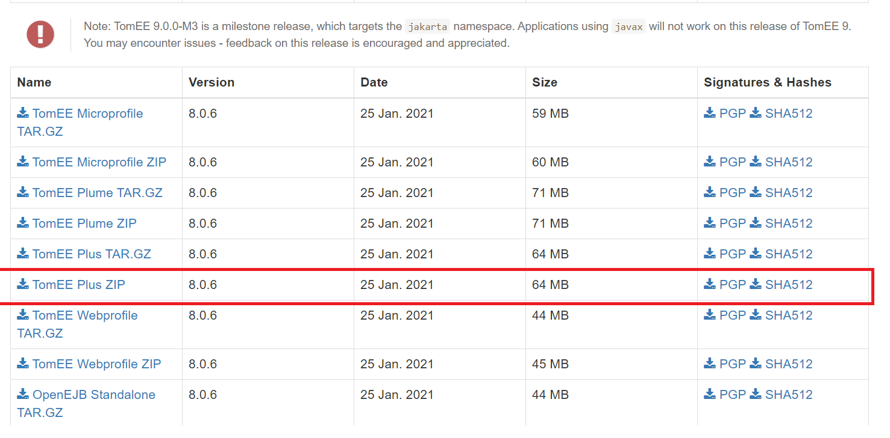
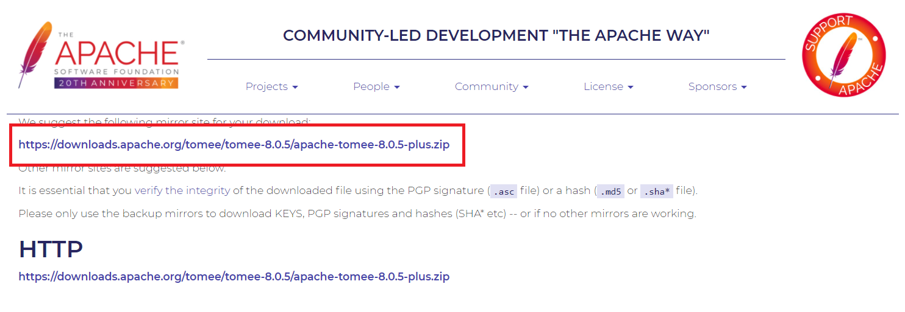
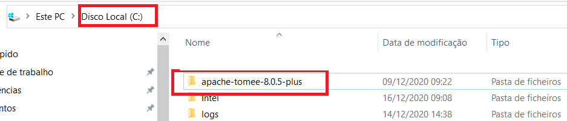

# (Opcional) Instalação Apache TomEE

>**Observação**: Se usar o comando maven package tomee:run ou package tomee:debug não irá necessitar de ter o Apache TomEE dedicado porque o maven faz o donwload

>**NOTA**: esta documentação está preparada para a versão legacy por isso algumas coisas podem estar desatualizadas

O Apache TomEE é o servidor que o igrpweb utiliza para fazer o deploy das suas aplicações. Em vez de incorporar o Tomcat em um servidor de aplicativos, o TomEE incorpora as tecnologias EJB, CDI e as outras features do Java EE dentro do Tomcat, resultando em um servidor Web Profile totalmente compatível, mas mantendo o Tomcat como o servidor mestre. O pacote TomEE é criado descompactando o Tomcat, adicionando os jars específicos e adicionando um único listener a "conf/server.xml" e zipando tudo novamente.

Para baixar o Apache TomEE Plus, baixamos a versão Zip  versão 8.0.6 - [AQUI](https://tomee.apache.org/download.html).

**Passo 1**: Clicar em Baixar o ZIP do Apache TomEE plus.

**Passo 2**: Baixar o zip.

**Passo 3**: Extrair a pasta no Disco C

