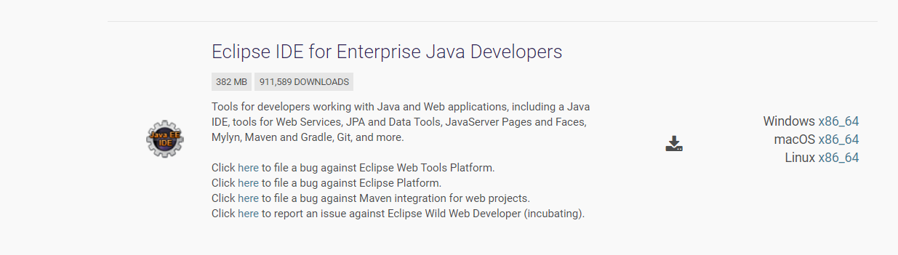
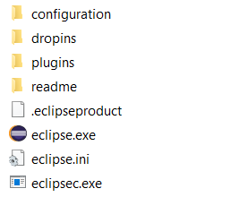

# Instalação Eclipse ou qualquer IDE Java
> **Nota**: pode sempre instatar outro IDE como IntelliJ Community e arrancar pelo maven

Para executar o Eclipse é preciso ter previamente Java instalado, e as suas variáveis de ambiente bem configuradas.
Deve instalar a segunda opção **Eclipse IDE for Enterprise Java Developers** para baixar a última versão do Eclipse – [AQUI](https://www.eclipse.org/downloads/packages/);
**Passo 1**: Escolher o Sistema Operativo do computador.

**Passo 2**: Baixar o ficheiro Zip.

**Passo 3**: Extrair a pasta num diretório do nosso computador, preferencialmente no Disco C e executar o eclipse.

