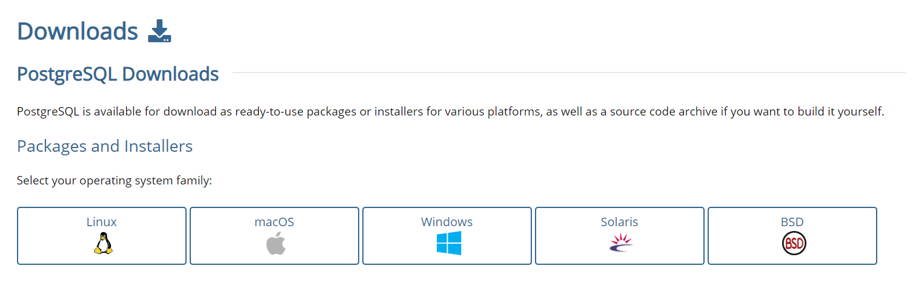
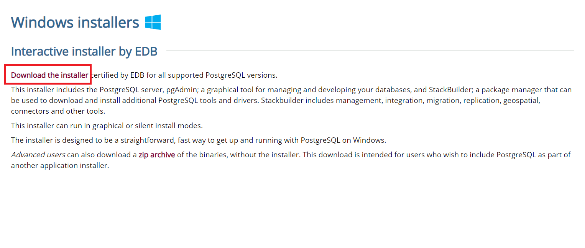
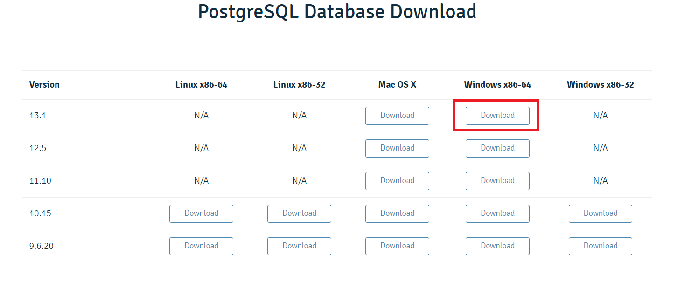
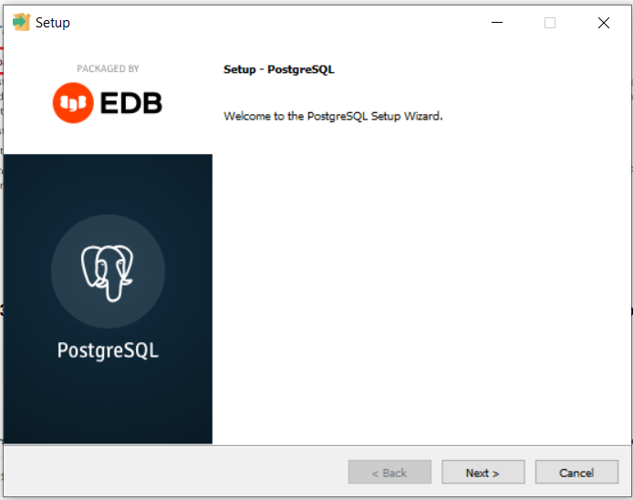
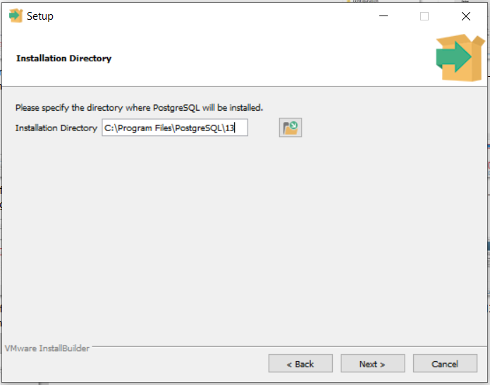
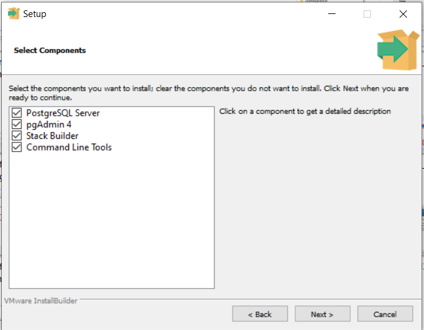
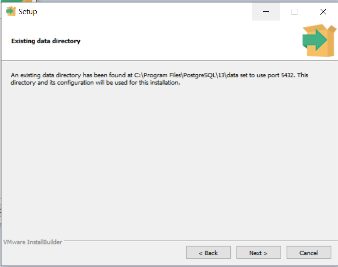
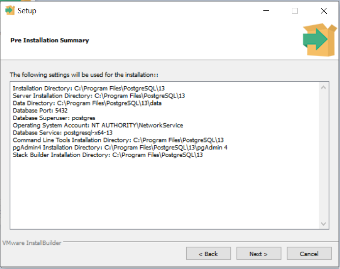
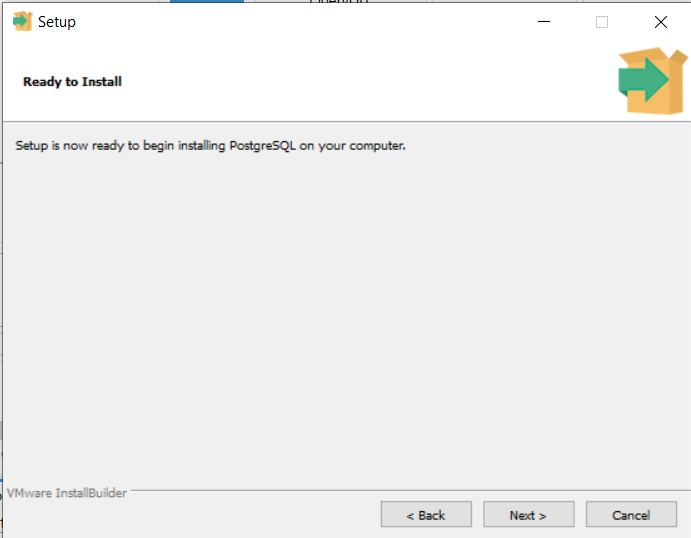
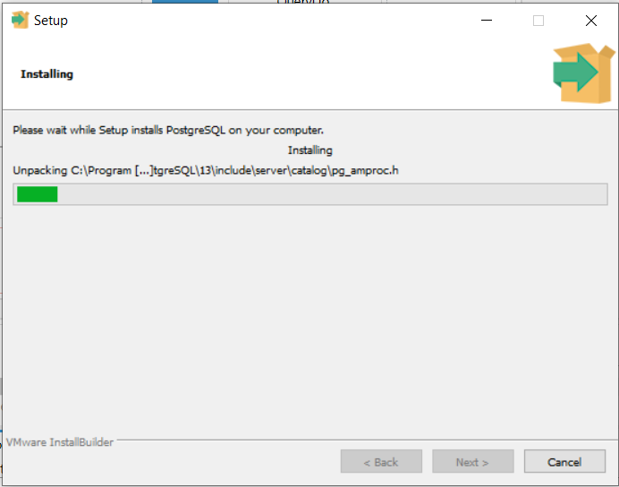

# Instalação PostegreSQL

Neste tutorial utilizamos o PostgreSQL como a base de dados para armezenar os dados da aplicação e do próprio framework igrpweb, mas é possível utilizar qualquer base de dados que pretender.  
Para baixar a base de dados PostgreSQL,  baixamos [AQUI](https://www.postgresql.org/download/).

**Passo 1**: Escolher o Sistema Operativo do computador.

**Passo 2**: Clicar em "Download the installer"

**Passo 3**: Baixar a versão mais atualizada que estiver disponivel para o nosso Sistema Operativo.

**Passo 4**: Após baixar o executável, executar o instalador.

**Passo 5**: Clicar em Next.  

**Passo 6**: Clicar em Next.  

**Passo 7**: Clicar em Next.  

**Passo 8**: Clicar em Next.  

**Passo 9**: Clicar em Next.  

**Passo 10**: Escolher uma palavra-passe para a base de dados e clicar em Next.

**Passo 11**: Clicar em Next.  

**Passo 12**: Após esta instalação clicar em **Finish**. Não preciso instalar os outros instaladores que aparecem como sugestão.

