# Instalação Java

### 1. Baixar e instalar o JDK17 para horizon ou JDK8 para legacy
> **NOTA**: esta documentação está preparada para a versão legacy por isso algum texto ou imagem pode estar desatualizada

Para correr o igrpweb Template no nosso computador, o primeiro software que devemos instalar é o JDK (Java Development Kit), que é o pacote que inclui tudo o que é necessário para escrever aplicações em linguagem JAVA e também o JRE (Java Runtime Environment), um programa que permite ao utilizador rodar aplicativos Java em seu computador para poder rodá-los após finalizá-los.  
Para baixar o JDK8 podemos ir no site do software e baixá-lo [AQUI](https://www.oracle.com/java/technologies/downloads/#java8?msgid=bugsview8).

**Passo 1**: Escolher o respectivo Sistema Operativo do computador.
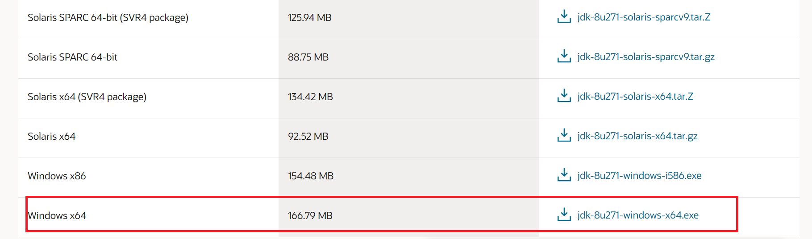

**Passo 2**: Clicar em Next para efetuar a instalação.
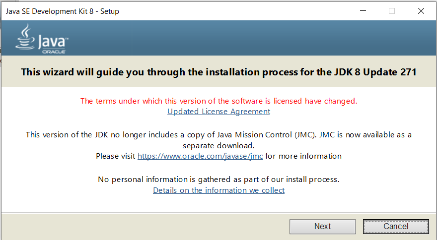

**Passo 3**: Clicar em Next para continuar.  
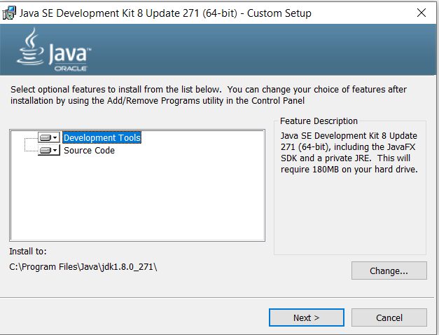

**Passo 4**: Clicar em Close para fechar a janela.  
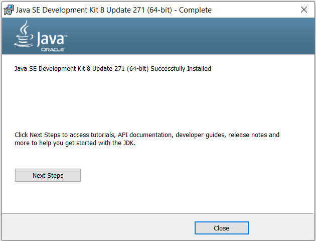

### 2. Configurar Variáveis de ambiente

Instalamos o JDK pois contém os recursos para desenvolvimento e execução de aplicações Java. Geralmente durante a instalação do JDK, Java é adicionado às variáveis ambiente. No entanto, isso nem sempre acontece. Para estes casos, fazer a configuração dessas variáveis manualmente.  
**JAVA_HOME**:  Diretório raiz de instalação do Java, além de ser utilizado para configurar as variáveis seguintes também é continuamente referenciado por aplicativos e frameworks desenvolvidos com Java.

**Passo 1**: Ir às propriedades do computador.  
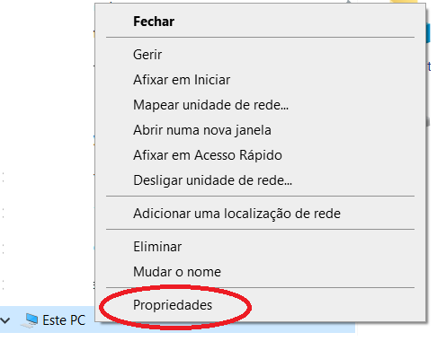

**Passo 2**: Escolher a opção "Definições avançadas do sistema."  
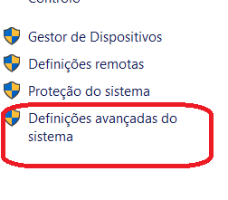

**Passo 3**: Escolher a opção definições de variáveis de ambiente.
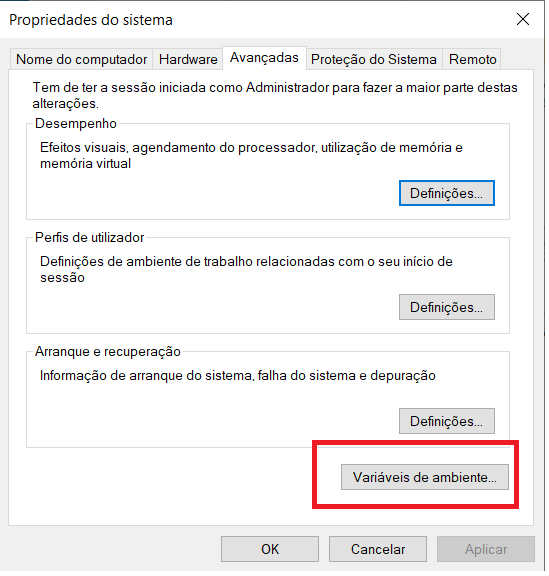

**Passo 4**: Adicionar uma nova variável de ambiente ao Sistema.
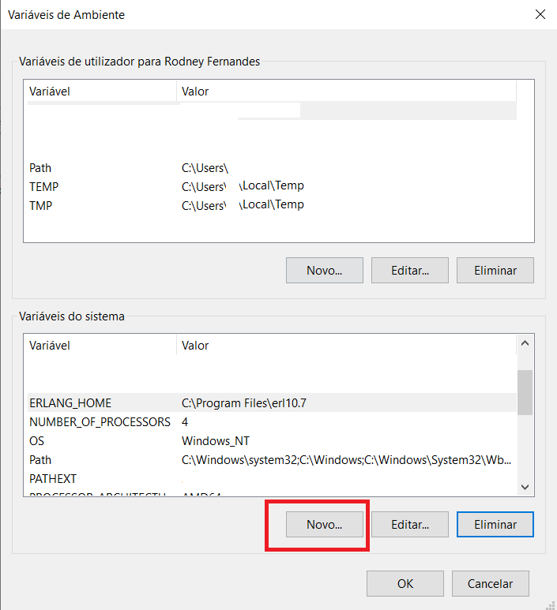

**Passo 5**: Dar o nome de JAVA_HOME no campo nome.
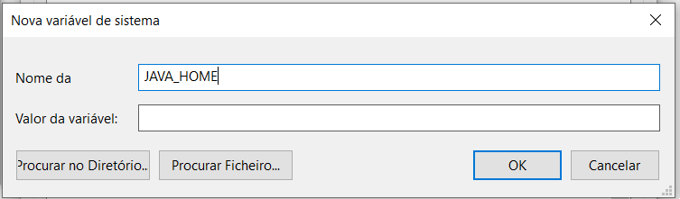

**Passo 6**: Procurar pela pasta de adição da variável de ambiente JDK.
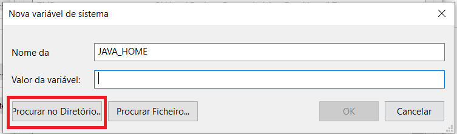

**Passo 7**: É pasta onde está instalada o nosso JDK. Normalmente está na pasta: **C:\Program Files\Java\jdk..**   
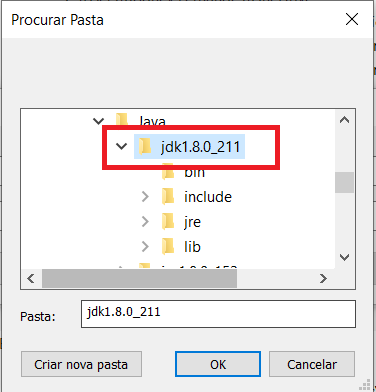

**Passo 8**: Seleciona a pasta JDK.
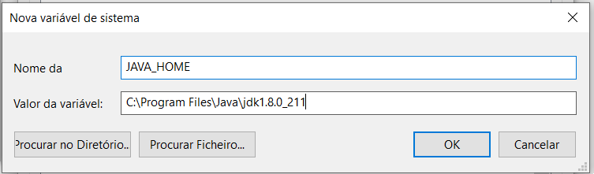

Cica em OK e repetir os passos, de 4 a 8 para adicionar uma nova variável de ambiente, agora em vez de JDK para adicionar a pasta JRE.  
Desta vez, dando o nome de JRE_HOME, conforme nos mostra o passo 9 e adicionar a pasta JRE, conforme nos mostra o passo 10, que normalmente está no directório **C:\Program Files\Java\jre..**

**Passo 9**: Adição da pasta JRE.  
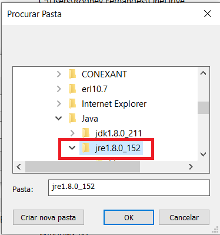

**Passo 10**: Seleção da pasta JRE.  

Após ser adicionado as duas variáveis de ambiente é preciso editar o ficheiro path. O Path é uma lista de diretórios que contém aplicativos que podem ser chamados pelo console. Com o PATH apontando para o diretório de executáveis do Java, podemos chama-los de qualquer local do mesmo computador.  
Para isso, clicar em editar o ficheiro Path, conforme mostra o passo seguinte.

**Passo 11**: Edição do ficheiro Path.  
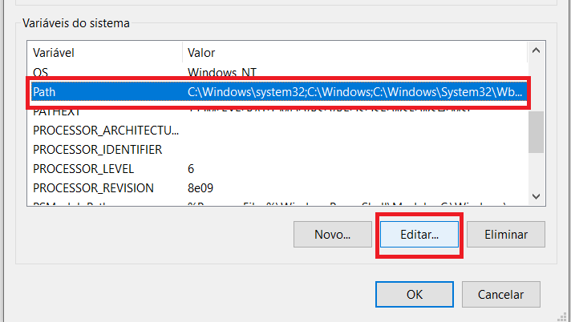

**Passo 12**: Adicionar um novo directório executável.
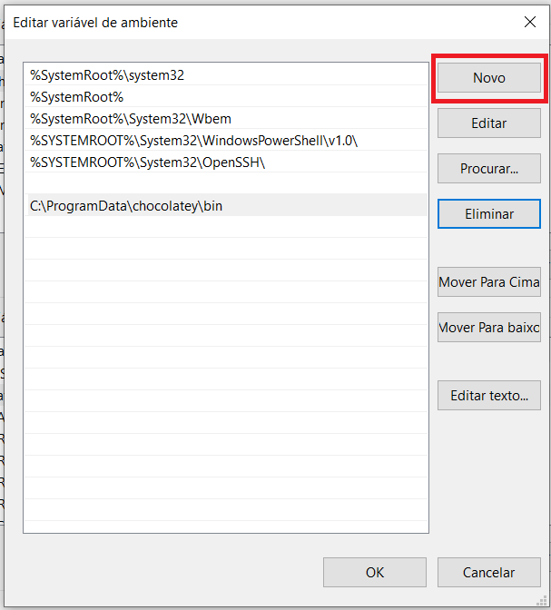

**Passo 13**: Clicar em procurar para adição do directório JDK.
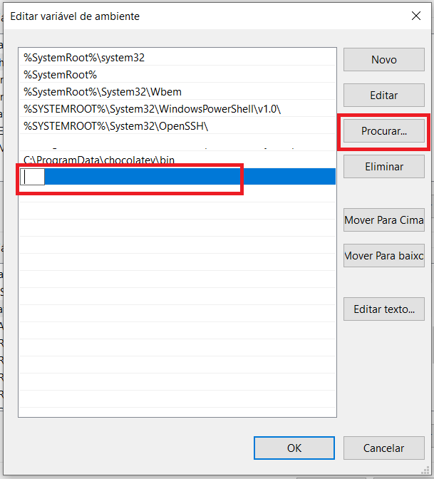

**Passo 14**: Seleção da pasta bin que normalmente está no diretório **C:\Program Files\Java\jdk..\bin**   
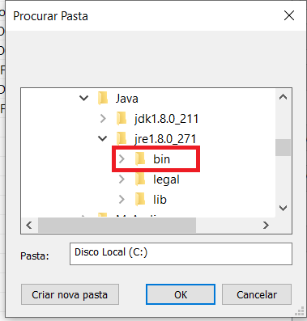

Repetir os passos 12, 13 e 14, desta vez para adicionar o directório bin, da pasta JRE, que normalmente está na pasta **C:\Program Files\Java\jre..\bin** 

**Passo 15**: Adição dos dois directórios executáveis.
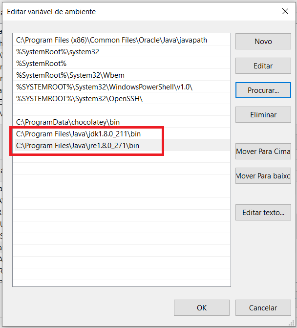

**Passo 16**: Clicar OK em todas as janelas abertas para guardar as alterações.

**Passo 17**: No windows do computdor pesquisar por linha de comandos.  
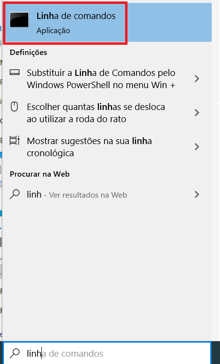

**Passo 18**: Na linha de comandos, executar como administrador e verificar se as duas variáveis estão bem configuradas, utilizando os camandos:   
**java -version** e **javac - version**  
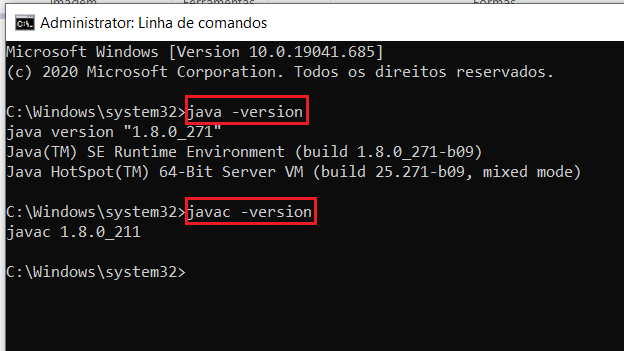