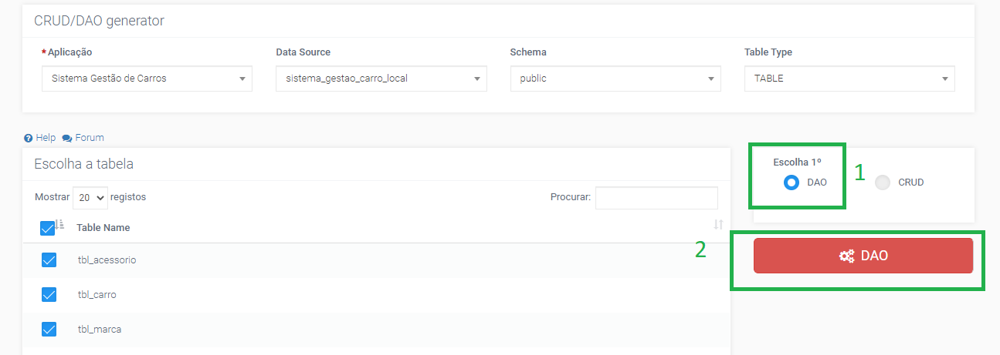

# CRUD/DAO Generator

O **_CRUD Generator_** é uma funcionalidade de geração automática de páginas completas para operações de CRUD [_create, read, update, delete_] em tabelas da base de dados. Utiliza uma abordagem de programação com querys e para cada tabela da BD selecionada e gera duas páginas – uma com uma tabela para listagem e outra com tabela e um formulário para inserção e edição de dados. Assim, trata-se de uma ferramenta que pode ser utilizada para fins de aprendizagem, já que ela gera o código completo das referidas páginas.

Podemos acessar o _CRUD Generator_ através do menu do lado esquerdo do IGRP Studio ou através do botão **CRUD generator**, visível no IGRP Studio quando tivermos uma aplicação selecionada no _Combobox_ respetivo (imagem a seguir).

Uma vez na página do _CRUD Generator_ (imagem a seguir) selecionamos de forma sequencial selecionamos a aplicação, a conexão de Base de Dados e o _Schema_ cujo CRUD pretendemos gerar. Na tabela que aparece abaixo, selecionamos as tabelas de BD que queremos e clicamos sobre o botão **Gerar CRUD** para finalizar a operação.

As páginas geradas aparecerão na _Home Page Builder_, na lista de páginas da aplicação escolhida (imagem a seguir). Escolhemos gerar _Crud_ da tabela _department_, logo foram geradas as páginas Registar _Department_ e Listar _department_.

O _DAO Generator_, por sua vez permite-nos ter uma representação da nossa base de dados em uma classe DAO, onde é possível acessar os nossos campos de uma tabela de base de dados, com uma Programação Orientada a Objetos (POO), isto é, é possível aceder ou definr esses campos atravès dos seus métodos **_gets_ e _sets_**. Os passos para gerar as classes DAO das nossas tabelas de base dados são iguais ao Gerar um CRUD (1ª e 2ª imagem desta página) a única diferença é que escolhemos a opção **GERAR DAO**, em vez de gerar CRUD (imagem a seguir).
