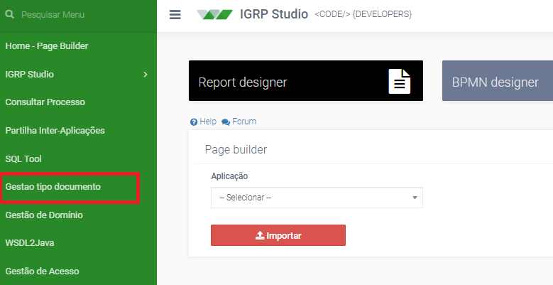
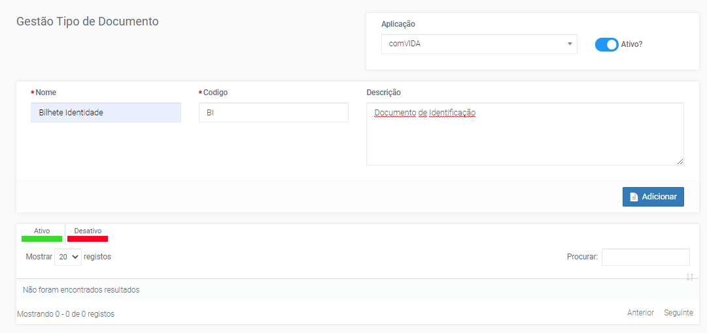
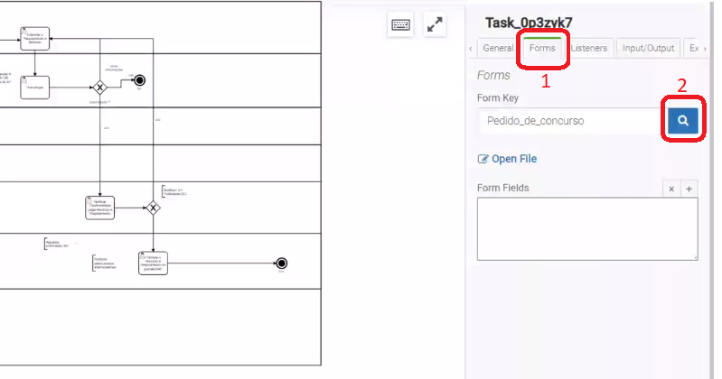
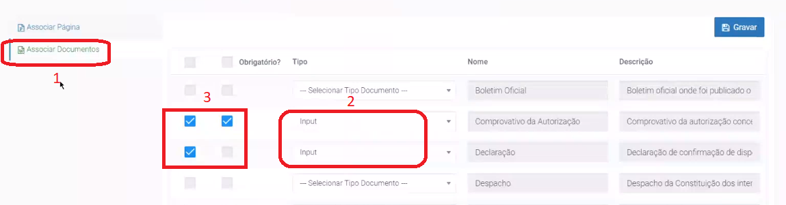

# Gestão Tipo Documento

A gestão de tipo de documentos (imagem a seguir) é uma funcionalidade do igrpweb que permite criar documentos que vão ser utilizados como _Input_ numa Etapa de um determinado processo. Isto porque, nos processos BPMN os documentos de _upload_ são inseridos de forma separada à página corresponde à etapa.  
Com isto é preciso criar os documentos que são necessários serem submetidos numa determinada Etapa e após a criação do mesmo, estes são selecionados na etapa como documentos de _Input_.

A imagem a seguir mostra-nos o formulário a ser preenchido na gestão do tipo de documentos, nomeadamente, escolha da aplicação corresponde, nome do documento, código e descrição do mesmo.

Após a criação do tipo de documento é preciso associá-lo à etapa correspondente, neste caso temos o exemplo da imagem a seguir que mostra como assoiar um documento à uma Etapa, de nome Pedido_de_concurso. Primeiro, escolhe-se a estapa correspondente, depois clicar no _tab Forms_ (1) e de seguida no botão pesquisa _Lookup_ (2).

Após clicar no botão _lookup_, tem a opção de Associar Documentos (imagem a seguir) (1), onde é possível escolher os documentos criados na Gestão de tipo de documentos, que podem ser do tipo _Input_ (2) ou _Output_. Os campos de _checkbox_ (3) permite selecionar os documentos que vão aparecer na etapa, e o segundo _checkbox_ permite assinalar o documento de _Input_ como Obrigatório ou não.  
Na gestão de Tipo de Documentos é que se faz também a associção de um _Report_ à uma Etapa.

