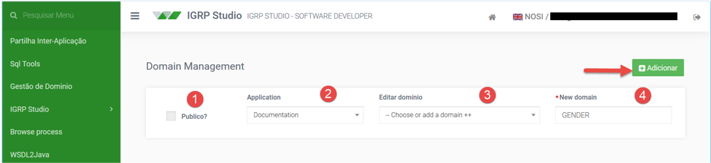
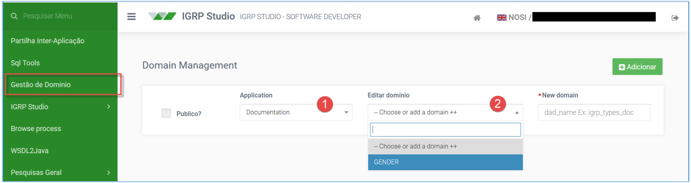
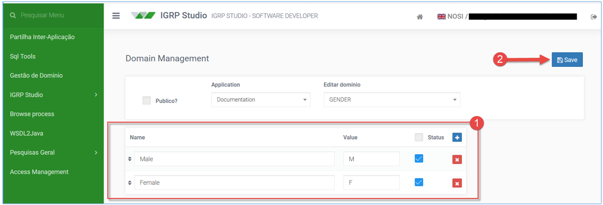
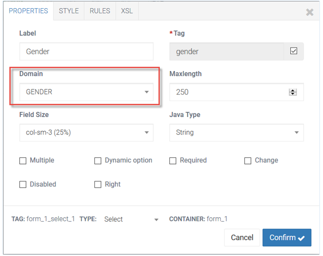
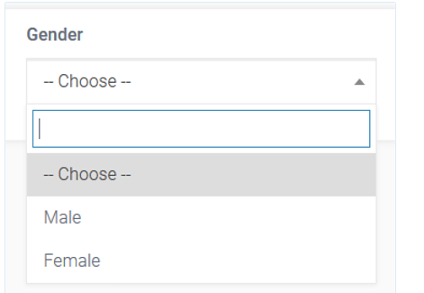
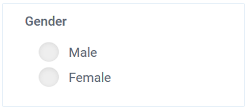

# Gestão de Domínio

Domínios facilitam a implementação de certas operações de Base de Dados, reduzem o trabalho do programador e permitem a padronização de valores que podem ser utilizados em aplicações diferentes para descrever o mesmo atributo, em objetos semelhantes.  
Domínios podem aumentar o número de tabelas na base de dados de uma aplicação, especialmente aquelas que têm muito poucas linhas. O igrpweb conta com uma página destinada à criação / gestão de domínios, que permite a sua partilha por todas as aplicações desenvolvidas sobre o _Framework_, logo a padronização dos valores utilizados em cada contexto.

### 1. Criando um domínio

Para criar um domínio devemos aceder a ferramenta no menu do lado esquerdo (imagem a seguir), definir se será público ou não, selecionar a aplicação, inserir o nome desejado e guardar clicando sobre o botão. Um domínio definido como público pode ser utilizado por todas as aplicações. Entretanto, só pode ser alterado pela aplicação que o criou.

Em seguida devemos inserir dados no domínio criado, ou seja, editá-lo.  
Para isso basta nos mesmo formulário selecionarmos a aplicação e o domínio desejado, ver a imagem seguinte.  
Para adicionar valores selecionamos o domínio criado (1ª imagem a seguir) [2] e automaticamente aparece um __FormList_ abaixo (2ª imagem a seguir), onde inserimos os valores pretendidos e salvamos com o botão **Save** (2ª imagem a seguir)[2].

A partir desse momento nosso domínio está pronto para uso. 

### 2. Utilizando um domínio em campo

Para utilizar um domínio num _combobox_, num _checkboxlist_ ou num _radiolist_ basta selecioná-lo no campo domínio na janela de propriedades da _field_ pretendida (1ª imagem a seguir). Na 2ª e 3ª imagem a seguir, podemos ver o aspeto do de campos _combobox_ e _radiolist_, respectivamente, utilizando o nosso domínio, lembrando este não é aplicável a um _checkboxlist_, pois ninguém pode pertencer a mais de um género ao mesmo tempo.  
Relativamente aos campos do _Form List_ o campo Nome corresponde ao que visualizamos no _layout_ da aplicação e Valor corresponde ao retorno de _fields_ que utilizam este domínio.
  
  
  

### 3. Domínio

Pedir as ocorrências de um determinado domínio pelo nome na aplicação atual.
`List listDom = Core.findDomainByCode( String domainsName );`

Pedir as ocorrências de um determinado domínio pelo nome e código da aplicação
`List listDom = Core.findDomainByCode( String domainsName, String codeApp );`

Pedir as ocorrências de um determinado domínio pelo nome e id da aplicação
`List listDom = Core.findDomainByCode(String domainsName, Integer idApp);`

Pedir a descrição de determinada ocorrência de um domínio pelo nome e chave na aplicação
`String description = Core.findDomainDescByKey(String domainsName, String key);`

Pedir a descrição de determinada ocorrência de um domínio pelo nome, chave e código da aplicação
`String description = Core.findDomainDescByKey( String domainsName, String key, String codeApp );

Pedir a descrição de determinada ocorrência de um domínio pelo nome, chave e código da aplicação
`String description = Core.findDomainDescByKey( String domainsName, String key, Integer idApp );`

Ex:  
Se tivermos o domínio  "gender"  com os itens [ ( "value": "M", "description": "Male" ), ( "value": "F", "description": "Female" ) ], a linha de código seguinte retorna a String "Female".  
`String genderDescription = Core.findDomainDescByKey( "gender", "F"); // returns "Female"`

### 4. Esconder um campo de Domínio

Para esconder uma da opções de domínio utiliza-se o seguinte código.  
Suponhamos queremos esconder uma opção com chave "SEG", no domínio manfiestacao:  
`this.manifestacao.SetValue(this.manfiestacao.getListOptions().remove("SEG"));`
