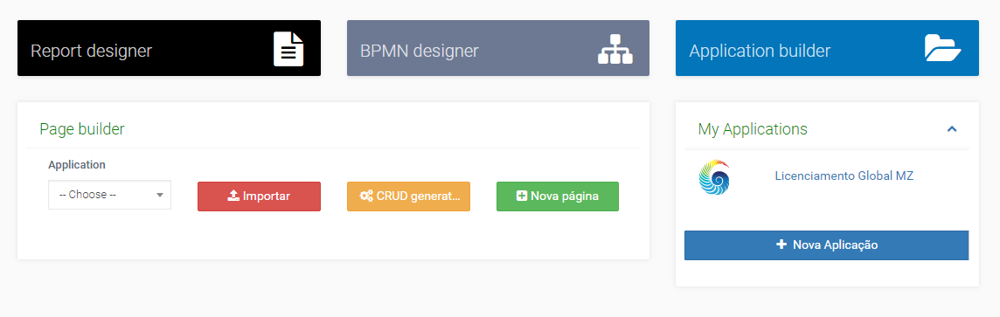
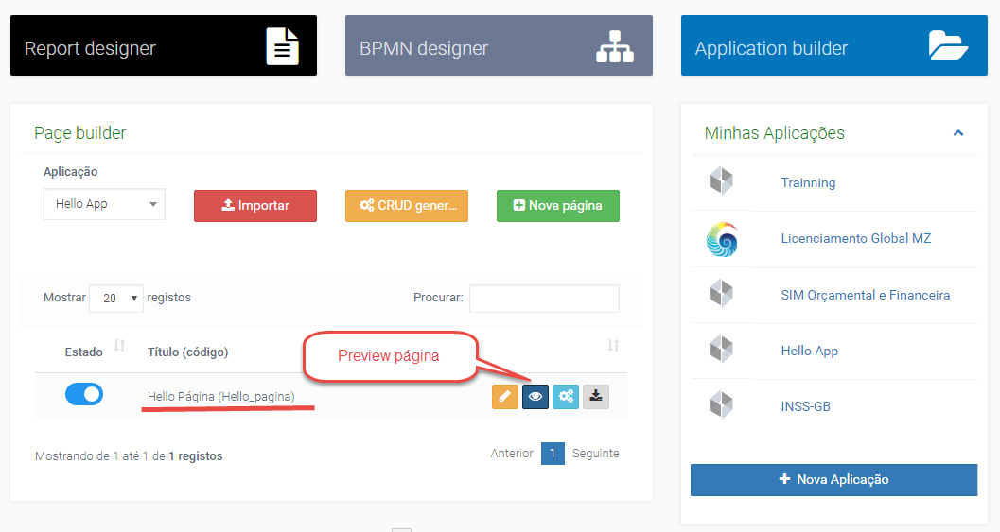
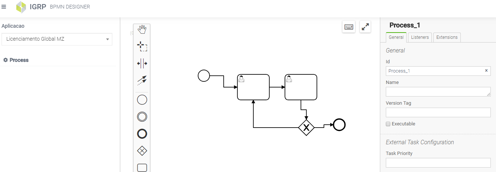
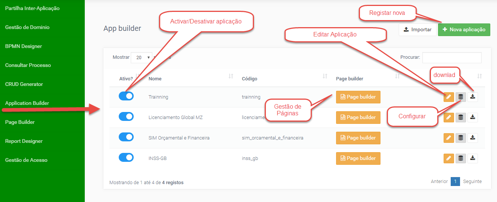

# IGRP Studio - Apresentação

O IGRP Studio é o ambiente utilizado para desenvolvimento de aplicações dentro de igrpweb, inclui os seguintes componentes:          
- **_Page Builder_** - gerador de interface;
- **_BMPN Designer_** - gerador de fliuxo de processo;
- **_Report Designer_** - gerador de relatorios;
- **_Application Buider_** - gestão de aplicações.

### 1. Page Builder

No _page buider_ podemos contar com diversas funcionalidades para criação da interface da aplicação, tais como: funcionalidades de importar páginas, gerar CRUD de páginas, gerar DAO de tabelas de base de dados deu ma determinada aplicação, criação de novas páginas e entre outras.

### 2. Report Designer  

O Gerador de relatórios tem a possibilidade para criação/alteração de _DataSource_. O _DataSource_ pode ser definido como Página, Etapa, Processo, Objeto ou _Query_.

### 3. BPMN Designer

O BPMN _Designer_, permite criar e configurar fluxos de processo baseado na anotação BPMN.

### 4. Application Builder 

A Gestão de Aplicação  dá-nos funcionalidade de pesquisar, criar, alterar, eliminar aplicações.
