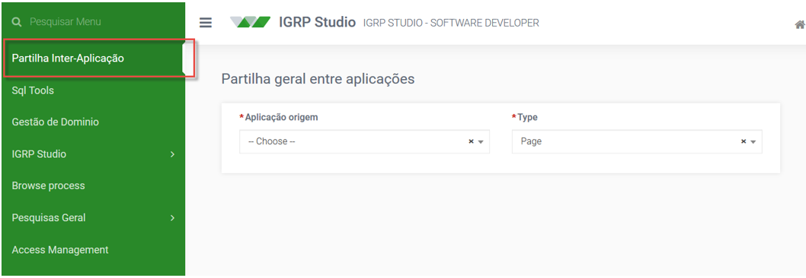
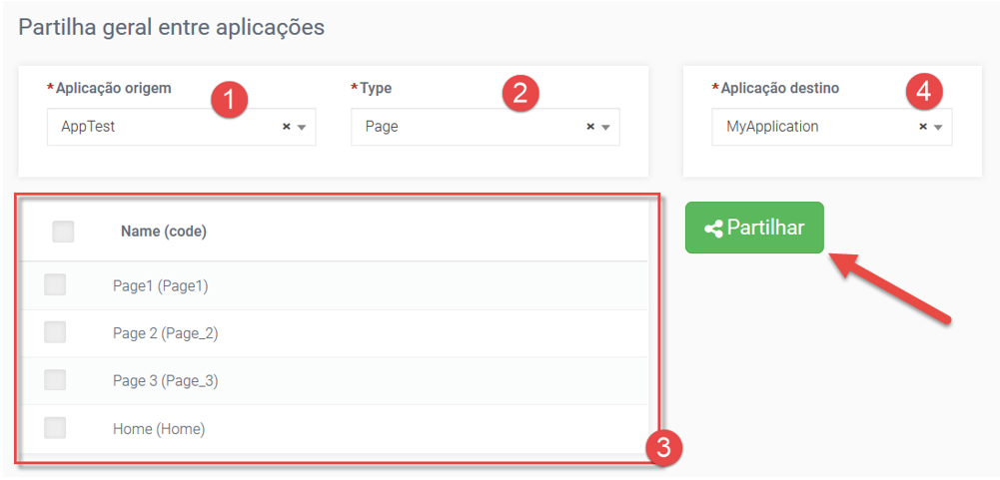

# Partilha Geral entre Aplicações 

O igrpweb permite a partilha de recursos, como páginas por exemplo, entre aplicações distintas, como forma de evitar a estar a recriar páginas com componentes antes já criados. Para isso acedemos a ferramenta de partilha no menu do lado esquerdo do IGRP Studio, conforme a imagem a seguir.

Em seguida, consoante a próxima imagem, escolhemos a Aplicação de Origem [1] e então já podemos escolher o Tipo de recurso a partilhar [2]. Ao escolhermos o Tipo é preenchida a tabela imediatamente abaixo [3] onde podemos escolher a lista de páginas, por exemplo, que queremos partilhar.

No _combobox_ Aplicação de destino [4], que aparece no momento de seleção da Aplicação de origem escolhemos a aplicação que passará a ter acesso ao recurso e então aparece o botão **Partilhar**  com que podemos finalizar a operação. A partir dessa altura a página fica disponível na aplicação nos campos **Action** de _fields_ como o _button_ e o _lookup_, por exemplo, podendo ainda ser invocada de outras formas como através da utilização de URL.