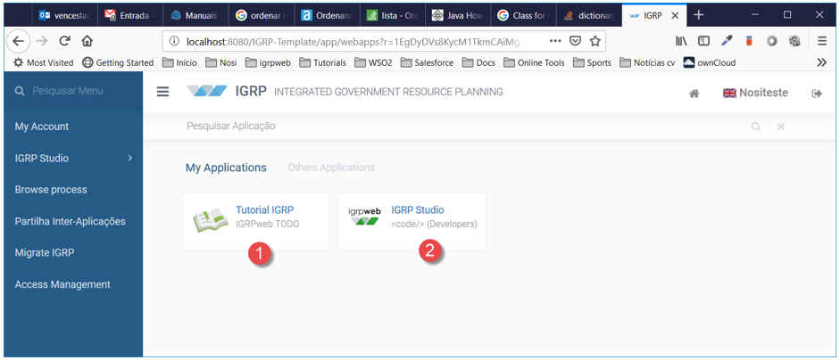
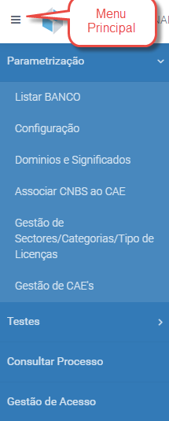
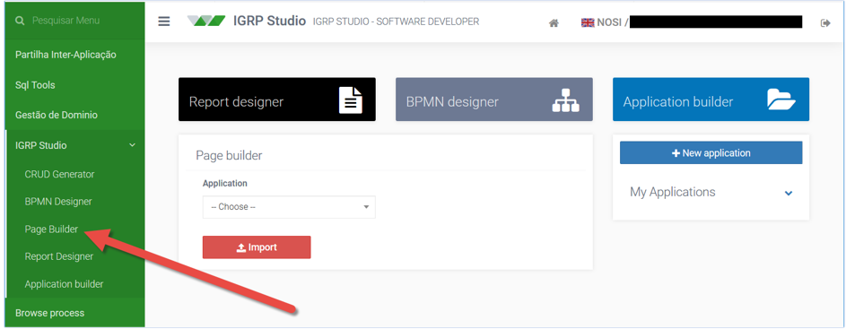
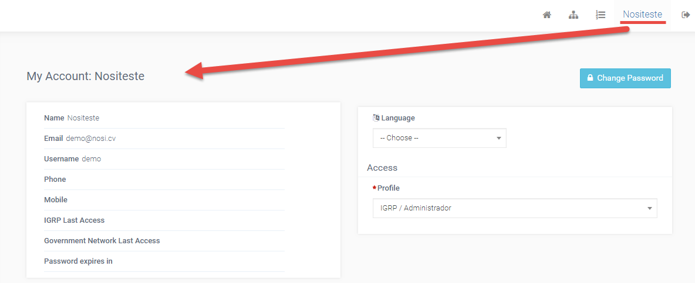

# Página Login e Página Home
### 1. Página Login

O igrpweb é uma aplicação web desenvolvida pela NOSi para integrar e planear todos os recursos de um governo.  
A ideia é permitir ter várias aplicações (do governo) dentro do mesmo espaço e de forma integrada a cooperarem entre si. A partir de uma entrada única (_Single-Sign-On_), permitirá aos utilizadores terem acesso aos módulos e processos que têm permissões.  
Para começar vamos para a página do _framework_ (imagem a seguir) e fazemos o _login_.

**_Login_** - Autenticação de utilizadores no sistema. O utilizador pode ser identificado a partir de _ActiveDirectory_, tabela de utilizadores ou qualquer outro serviço de Federação de Identidade (Google,Facebook...).  
Passos:  
1 - Aceder a IGRP  
Link: http://localhost:8080/IGRP/app/webapps?r=igrp/login/login   
User: demo@nosi.cv   
Password:demo

### 2. Página Home

Uma vez submetidas as credencias temos acesso a página inicial do igrpweb (ver a imagem a seguir).

Nesta página temos acesso a algumas aplicações:
- Tutorial IGRP [1] – documentação do igrpweb;
- IGRP Studio [2] – o ambiente de desenvolvimento do _framework_;
- Outras aplicações –  as aplicações que desenvolvemos e outras a que fomos convidados, sendo este o local padrão para a sua execução.

Entrando no IGRP Studio temos acesso à página inicial do ambiente de desenvolvimento, a _Home Page – Builder_. Esta página oferece acesso a todas as funcionalidades necessárias para o desenvolvimento de aplicações no igrpweb, acessíveis no menu do lado esquerdo, nomeadamente, _Application Builder, Access Management, SQL Tool e Domain Management_.

> **OBS**: Em algumas situações, o acesso poderá ser num ambiente, cujo o utilizador pertença ao domínio gov.cv. Nestas situações, poderá utilizar o nome.ultimoapelido. Por isso valide com o formador a informação atualizada para teste.

O IGRP Studio é a ferramenta de desenvolvimento de aplicações do igrpweb e está disponível na lista de aplicações do utilizador, quando faz _login_, se este tiver privilégios de desenvolvedor.  
A sua página inicial é o _Home Page Builder_, que dá acesso à diversos recursos e ferramentas necessárias ao processo de desenvolvimento, cujo estudo pode ser feito a partir dos documentos que indicamos nos próximos capítulos deste Guia.  
Após o utilizador efectuar o login no IGRP aparece o seguinte ecrã, onde são disponibilizados todas as aplicações que o utilizador actual tem acesso, podendo aceder a cada uma delas individualmente.
- Minhas Aplicações - aplicações que o utilizador tem permissão para aceder.
- Outras aplicações - aplicações do IGRP ás quais o utilizador não tem permissão para aceder.

O [docs.igrp.cv](https://docs3.igrp.cv/) auxilia o desenvolvedor nos primeiros passos do processo de concepção de aplicações no _framework_ igrpweb com um foco conciso e objetivo na compreensão geral do processo de criação de aplicações, conexão a bases de dados e execução, sem entrar em detalhes.  

- Top Menu - permissões de _Workflow_ que o utilizador tem acesso, designadamente Mapa de Processos e Minhas Tarefas.

### 3. Configurações de Conta

- Minha Conta - apresenta os dados do utlizador logado, com possibilidade de alterar a palavra passe, alterar idioma/linguagem e alterar perfil.
- _Logout_ - sair de aplicação IGRP.