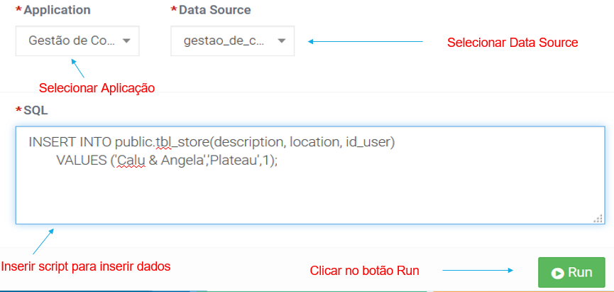

# SQL Tools
O _Sql Tool_ é uma ferramenta do igrpweb, destinada a teste de querys para o desenvolvedor. Independente da abordagem de acesso à Base de Dados, DAO ou _Query_, pois vez ou outa o programador se depara com uma situação onde é preferível fazer a própria _query_.  
A ferramenta oferece um formulário para seleção da aplicação e conexão de base de dados pretendidas e inserção da nossa _query_, executada quando clicamos sobre o botão **Run**, imagem a seguir [4]. Comporta também, imediatamente abaixo, uma tabela (segunda imagem), onde é apresentado o resultado, e cujas colunas são construídas dinamicamente, dependendo dos campos que forem solicitados à Bases de Dados.

### 1. Exemplo Prático

Neste exemplo é feita a seleção da aplicação e conexão de base de dados pretendidas e inserção da _query_ pretendida, executada com _click_ no botão **Run** das imagens a seguir, apresenta o resultado da _query_ de seleção executada para ver os dados inseridos.

