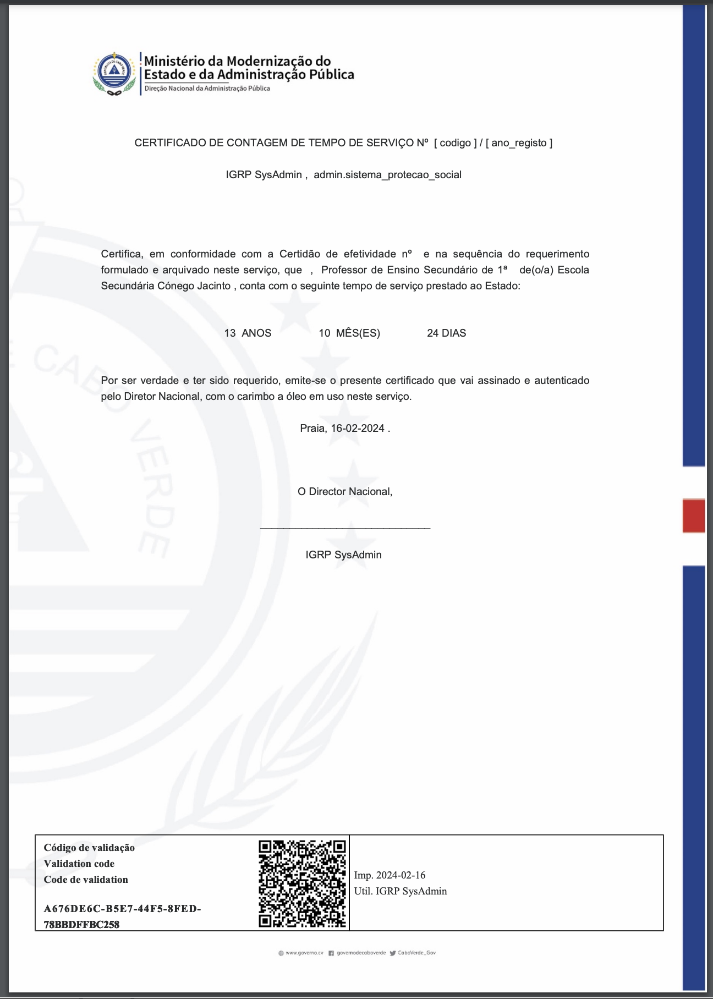

# Report Designer - Exemplo HTML com Footer modificado
Vamos ter um exemplo de um html _source_ de um _report_ que tira partido do footer com _qrcode_ ja existente, mas com um outro formato.

> DICA: neste span ```"<span footer="footer" no="print_report" tag="data_print">"``` o que é feito pos detrás é que deve apanhar no xml após row o print_report e dps o tag print.<br></br>
Coloco um extracto do xml do _report_ que o igrp envia para ser gerado o _report_ html:
```
<rows>
    <print_report>
        <name_app>sistema_protecao_social</name_app>
        <img_app>dnap.png</img_app>
        <link_qrcode>
        http://localhost:8080/SPS/app/webapps?r=igrp_studio/web-report/get-contraprova&amp;ctprov=iOKrWW5mujmHZa-sR0sRAjfSzDD4KwzFUdj45ej2DA4VrkJpQW6cE6qYnSZydPYs</link_qrcode>
        <img_brasao>brasao.png</img_brasao>
        <name_brasao />
        <data_print>2024-02-16</data_print>
        <name_contraprova>Contra Prova</name_contraprova>
        <value_contraprova>CEACAC64-F3CE-4DFB-8993-EEFF373EAFA9</value_contraprova>
        <user_print>IGRP SysAdmin</user_print>
        <link_img>/SPS/images/IGRP/IGRP2.3/</link_img>
        <template>por adicionar</template>
    </print_report>
    <content uuid="3b35ab65-f4c2-406f-b095-c7dd6cab32c6">
<title>QueryAnoRegistoContagem</title>
....
```
**O source do HTML do report em si:**
```
<style type="text/css">
  .bgfundo {
    position: absolute;
    left: 0;
    right: 0;
    top: 0;
    bottom: 0;
    height: 100%;
    width: 100%;
  }
  .certificado_body {
    font-family: sans-serif;
    overflow: hidden;
    position: relative;
    z-index: 1;
    padding-left: 2.25cm;
    padding-right: 3cm;
  }
  .page[hasfooter="N"] .containerQrcode {
    position: relative;
    float: right;
    margin-bottom: 0px;
  }
</style>
<div class="certificado_body">
  <p>&nbsp;</p>
  <p style="text-align: center;">&nbsp;</p>
  <p style="text-align: center;">&nbsp;</p>
  <p style="text-align: center;">&nbsp;</p>
  <p style="text-align: center;">&nbsp;</p>
  <p style="text-align: center;">&nbsp;</p>
  <p style="text-align: center;">CERTIFICADO DE CONTAGEM DE TEMPO DE SERVI&Ccedil;O N&ordm;&nbsp;&nbsp;[ codigo ]&nbsp;/&nbsp;[ ano_registo ]&nbsp;</p>
  <p style="text-align: center;">&nbsp;</p>
  <p style="text-align: center;">
    <span key="false" no="form" pos="a6b8ea6d-2cfc-431f-a672-534de7753fb3" tag="username" type="text"><b>[ username ]</b></span>&nbsp;,&nbsp;
    <span key="false" no="form" pos="a6b8ea6d-2cfc-431f-a672-534de7753fb3" tag="perfil" type="text"><b>[ perfil ]</b></span>&nbsp;
  </p>
  <p style="text-align: center;">&nbsp;</p>
  <p style="text-align: center;">&nbsp;</p>
  <p>&nbsp;</p>
  <p>&nbsp;</p>
  <p>
    Certifica, em conformidade com a Certid&atilde;o de efetividade n&ordm; <span key="false" no="form" pos="f3d9fd4a-49ea-4230-a92e-7a80d4119019" tag="comprovativos" type="text"><b>[ comprovativos ]</b></span>&nbsp;e na sequ&ecirc;ncia do
    requerimento formulado e arquivado neste servi&ccedil;o, que&nbsp;<span key="false" no="form" pos="a6b8ea6d-2cfc-431f-a672-534de7753fb3" tag="nome" type="text"><b>[ nome ]</b></span>&nbsp;,&nbsp;
    <span key="false" no="form" pos="a6b8ea6d-2cfc-431f-a672-534de7753fb3" tag="cargo" type="text"><b>[ cargo ]</b></span>&nbsp;&nbsp;&nbsp;de(o/a)
    <span key="false" no="form" pos="a6b8ea6d-2cfc-431f-a672-534de7753fb3" tag="servico" type="text"><b>[ servico ]</b></span>&nbsp;, conta com o seguinte tempo de servi&ccedil;o prestado ao Estado:
  </p>

  <p>&nbsp;</p>
  <p>&nbsp;</p>

  <p style="text-align: center;">
    <span key="false" no="form" pos="a6b8ea6d-2cfc-431f-a672-534de7753fb3" tag="num_anos_serv" type="text"><b>[ num_anos_serv ]</b></span>&nbsp;&nbsp;ANOS&nbsp; &nbsp; &nbsp; &nbsp; &nbsp; &nbsp; &nbsp; &nbsp;
    <span key="false" no="form" pos="a6b8ea6d-2cfc-431f-a672-534de7753fb3" tag="num_meses_serv" type="text"><b>[ num_meses_serv ]</b></span>&nbsp; M&Ecirc;S(ES)&nbsp; &nbsp; &nbsp; &nbsp; &nbsp; &nbsp; &nbsp; &nbsp;
    <span key="false" no="form" pos="a6b8ea6d-2cfc-431f-a672-534de7753fb3" tag="num_dias_serv" type="text"><b>[ num_dias_serv ]</b></span>&nbsp;DIAS
  </p>
  <p style="text-align: center;">&nbsp;</p>
  <p style="text-align: center;">&nbsp;</p>
  <p>Por ser verdade e ter sido requerido, emite-se o presente certificado que vai assinado e autenticado pelo Diretor Nacional, com o carimbo a &oacute;leo em uso neste servi&ccedil;o.</p>
  <p style="text-align: center;">&nbsp;</p>
  <p style="text-align: center;">
    Praia, <span key="false" no="default_form_report" pos="a6b8ea6d-2cfc-431f-a672-534de7753fb3" tag="p_data_atual" type="text"><b>[ data atual ]</b></span>&nbsp;.
  </p>

  <p style="text-align: center;">&nbsp;</p>
  <p style="text-align: center;">&nbsp;</p>
  <p style="text-align: center;">&nbsp;</p>
  <p style="text-align: center;">O Director Nacional,</p>
  <p style="text-align: center;">&nbsp;</p>
  <p style="text-align: center;">_____________________________</p>
  <p style="text-align: center;">&nbsp;</p>
  <p style="text-align: center;">
    <span key="false" no="form" pos="a6b8ea6d-2cfc-431f-a672-534de7753fb3" tag="username" type="text"><b>[ username ]</b></span>&nbsp;
  </p>
  <p style="text-align: center;">&nbsp;</p>
  <p style="text-align: center;">&nbsp;</p>
</div>

<p></p>

<table border="1" cellpadding="1" cellspacing="1" style="width: 90%; left: 30px; position: absolute; bottom: 70px; border: 1.2px solid lightgray;">
  <tbody>
    <tr>
      <td style="width: 50%; padding: 4px;">
        <div style="position: absolute; margin-left: 10px; width: 25%;">
          <p>
            <strong><span>C&oacute;digo de valida&ccedil;&atilde;o</span> </strong>
          </p>
          <p>
            <strong><span style="display: contents;">Validation code</span> </strong>
          </p>
          <p>
            <strong><span style="display: contents;">Code de validation&nbsp;</span> </strong>
          </p>
          <strong><span footer="footer" no="print_report" tag="value_contraprova" style="position: relative; top: 5px;" type="text">[ value_contraprova ]</span></strong>
        </div>
        <div class="containerQrcode" url="{rows/print_report/link_qrcode}">&nbsp;</div>
      </td>
      <td>
        <div>
          <p><span style="display: contents;">Imp.&nbsp;</span><span footer="footer" no="print_report" tag="data_print">Data da Impress&atilde;o</span></p>
          <p><span style="display: contents;">Util.&nbsp;</span><span footer="footer" no="print_report" tag="user_print">Nome Utilizador Logado</span></p>
        </div>
      </td>
    </tr>
  </tbody>
</table>
```
Tudo isto vai resultar neste PDF:
