# Report Designer - Exemplos Práticos
### 1. Criação do Report

Para se criar um novo _report_ é necessário escolher o nome da aplicação que irá utilizar este relatório. Se se tratar do primeiro relatório da aplicação em questão, nada irá aparecer em _Reports_, mas se a aplicação já tem relatórios, estes serão apresentados como mostra a imagem abaixo.  
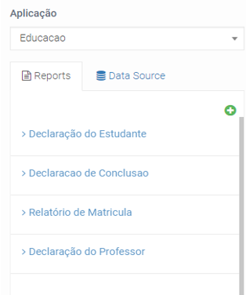

Para adicionar um novo relatório deve-se clicar sobre o botão **Novo _Report_**. Uma nova janela flutuante (modal) aparecerá. Nesta janela devemos preencher o título, o código (deve ser único para cada relatório), o tamanho da página do relatório, definir a orientação da página, ou seja, vertical (_portrait_) ou horizontal (_landscape_) e, por fim, determinar se queremos um rodapé pré-definido ou não.
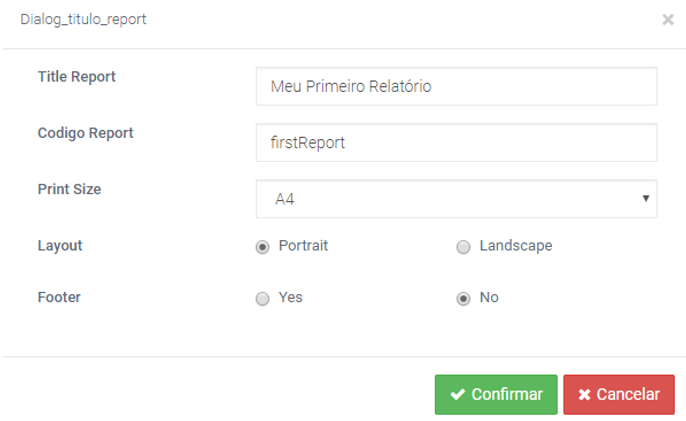

Ao confirmar podemos notar uma pequena diferença no menu de topo no ambiente de trabalho. Ao lado do nome “IGRP Studio”, é possível observar o nome que escolhemos para o relatório seguido de um asterisco * o que significa que só estará ligado à aplicação após clicar no botão “**Gravar**” (notará que o * desaparecerá), caso contrário, qualquer alteração feita no relatório (e o próprio relatório) se perderá caso, se por algum motivo sairmos do _Report Designer_.
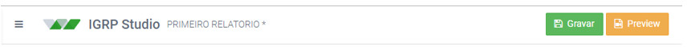

Para o primeiro relatório podemos escrever “Primeiro Relatório” como título (no campo _HEAD_). Aproveitamos as ferramentas de texto (na imagem abaixo) para formatar e dar mais visibilidade ao título. E no campo “_Body_”, para um primeiro relatório, podemos escrever “Meu primeiro relatório”.
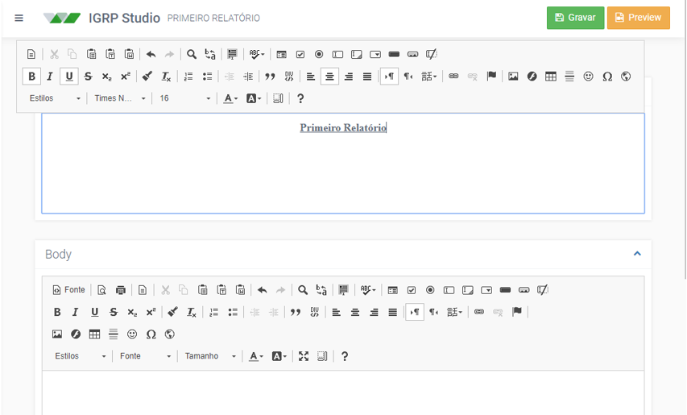

Clicamos no botão “**Gravar**” e aguardamos a confirmação da gravação, apresentado na imagem abaixo.
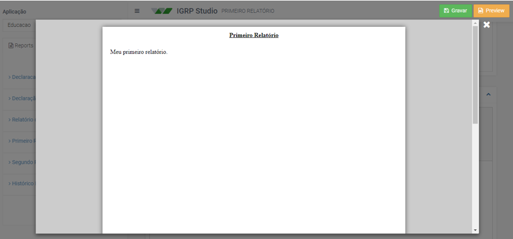

Após confirmação, clicamos em “**_Preview_**” para visualizar o nosso primeiro relatório.

Na próxima secção vamos ver como adicionar componentes ao nosso relatório.

### 2. Inserido informações da base de dados

Para adicionarmos informações da base de dados precisamos primeiramente já ter uma conexão com a base de dados na nossa aplicação (Caso não tenha uma conexão e/ou não sabe como criar, temos um tutorial simples em Anexos mostrando passo a passo como fazer). Tendo uma, já podemos prosseguir com a nossa inserção de dados no nosso relatório.
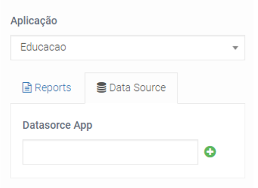

Ao lado do “_Reports_” existe uma aba chamada “_Data Source_”, ao clicarmos nele pela primeira vez veremos a aba apresentada na imagem acima.  
Clicamos no botão verde (+) para adicionarmos uma nova fonte de dados, no nosso caso, nossa base de dados.
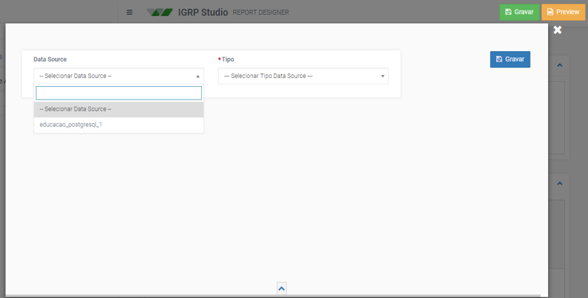

Na tela apresentada acima temos duas listas, a primeira, com o nome de “_Data Source_”, apresenta as conexões existentes na aplicação (no nosso caso só temos uma conexão à base de dados) e na segunda temos os tipos de Data Sources.

#### 2.1 Tipos de Data Source
Temos 4 tipos de _Data Source_: Objeto, Etapa, _Query_ e Página. Vamos ver cada uma.

##### 2.1.1 Objeto
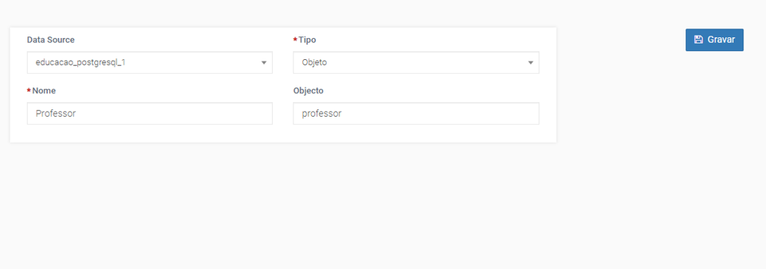

De forma simples, só precisamos dar um nome ao nosso objeto e no campo “Objeto”, escrever o nome da tabela na base de dados e clicar sobre “Gravar”. Podemos dar o nome que quisermos ao nosso objeto, mas no campo “Objeto” devemos escrever o nome da tabela na base de dados. No exemplo acima demos o nome “Professor” para o objeto professor. Ao gravar, retornará todos os nomes das colunas dessa tabela. Veremos mais adiante como utilizar essas informações no nosso relatório.

#### 2.1.2 Etapa
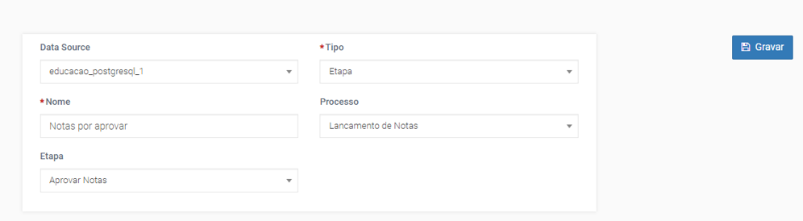

Este tipo de _Data Source_ é normalmente utilizado nos processos para apresentar recibos, pedidos, etc.  
Obtemos os dados através de uma etapa de um processo. É preciso um nome para quando formos utilizar este Data Source, escolhemos o processo que queremos de entre uma lista de processos existentes na aplicação e por fim escolhemos a etapa do processo do qual iremos obter informações. Na figura acima temos um exemplo de etapa a que demos o nome de “Notas por aprovar” num processo chamado “Lançamento de notas”. As informações que queremos obter se encontram na etapa “Aprovar Notas” e, assim como o nome sugere, as informações estão relacionadas com as notas, que foram enviadas para serem aprovadas nesta etapa.

#### 2.1.3 Query
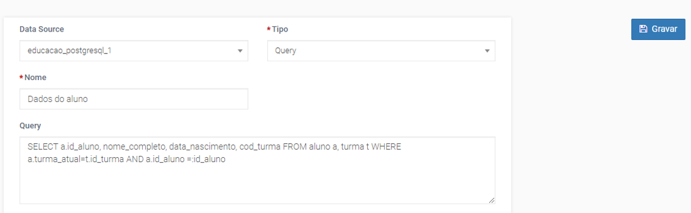

Este é o tipo de _Data Source_ mais utilizado por programadores porque retorna exatamente o que queremos. Permite-nos solicitar exatamente os dados que pretendemos em quantas tabelas quisermos. Para isso preenchemos o campo “Nome” com o nome pelo qual o _Data Source_ será designado e, no campo “_Query_”, a _query_ (requisição) em SQL ou na linguagem da base de dados sendo utilizada. No nosso exemplo demos o nome de “Dados do aluno”, pois a _query_ utilizada retorna somente as informações sobre o aluno e a turma a que ele pertence.

#### 2.1.4 Página
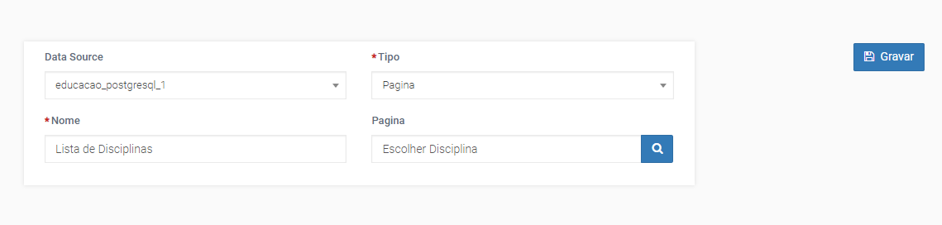

Neste tipo de _Data Source_ introduzimos no campo “Nome” o nome por que queremos designar o _data source_ e o campo “Pagina” é preenchido com o nome da página de que queremos extrair os dados. Para preencher o campo “Pagina”, precisamos clicar sobre o botão azul (com o desenho de uma lupa) e pesquisar pela página, conforme a figura que se segue.
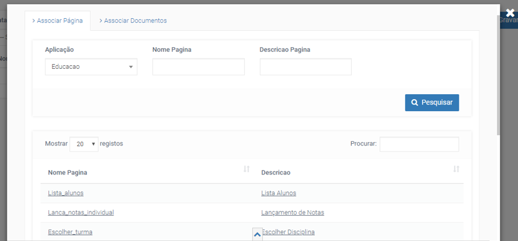

O campo “Aplicação” é preenchido por padrão juntamente com uma lista das páginas pertencentes àquela aplicação. Podemos pesquisar pela página através do botão “Pesquisar” ou procurar diretamente na lista. Ao selecionarmos a página, a tela desaparece e no campo “Página” veremos o nome da página escolhida.  
Estando tudo certo, clicando no botão “Gravar” para salvar o _Data Source_, que a partir de então já fica pronto para uso.

### 2.2 Extraindo dados do Data Source
Após escolher o tipo de _Data Source_, dar-lhe um nome e preencher os outros campos necessários poderemos “chamar” o _Data Source_ inserindo o nome no campo “_Datasource App_”.  
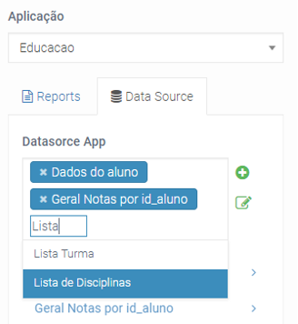

Podemos ver na imagem acima o campo “_Datasource_” já preenchido com os nomes de Professor e Disciplina e sendo preenchido “_List_” (reparar que temos a opção de autopreenchimento).  
Após preencher o nome (no nosso caso seria “Lista de Disciplinas”), este irá aparecer automaticamente na lista abaixo com todas as informações dos dados que poderemos extrair desse _data source_.
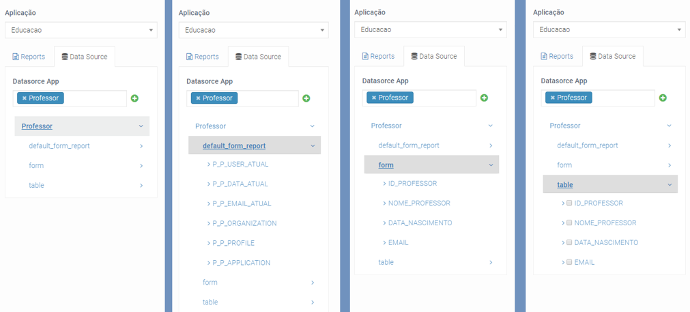

Todos os datasources terão esses três submenus: “_default_form_report_”, “_form_” e “_table_” como é possível verificar na imagem mais à esquerda, na imagem ao centro esquerdo vemos os componentes do submenu “_default_form_report_” e na imagem no centro direita vemos o submenu “_form_” expandido. O submenu “_table_” apresenta os mesmos componentes que o submenu “_form_”, mas existe uma diferença que é um _checkbox_ existente atrás de cada componente do submenu “_table_”.

#### 2.2.1 Submenu default_form_report
Neste submenu encontraremos todas as informações relacionadas com a aplicação em si, são elas o nome da aplicação, da organização, informações do utilizador atual, seu perfil, seu email e a data atual.

#### 2.2.2 Submenu form
Neste submenu encontraremos todas as colunas solicitadas pelo utilizador ao ser criado. Para a sua utilização, devemos primeiramente escolher em qual área de texto (_Head_ ou _Body_) iremos introduzir um dado da base de dados, após selecionar (apenas um clique do mouse no local onde queremos introduzir o dado) arrastamos o componente pretendido e ele irá aparecer na tela da mesma forma que o exemplo apresentado na imagem abaixo.
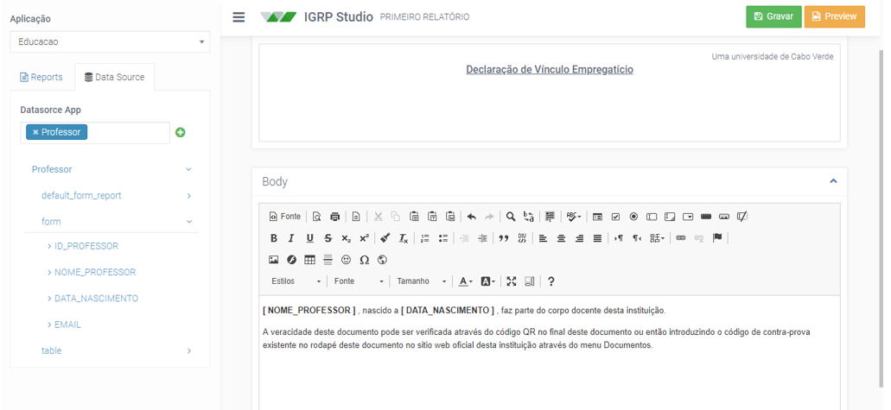

O componente introduzido será representado pelo nome entre colchetes “[]”, no nosso exemplo temos o “NOME_PROFESSOR” e “DATA_NASCIMENTO” como componentes a serem extraídos do nosso _Data Source_ chamado “Professor”. Vale salientar que só é possível introduzir um elemento por vez, por exemplo, só é possível escrever um “NOME_PROFESSOR” por vez.   
Por padrão, o _Report Designer_ pega o último registro existente e exibe no _Preview_. Para escolher um registro diferente precisamos de uma chave única para que o nosso _Report Designer_ o possa identificar e processar. Podemos utilizar o email, o número de telefone como chaves, desde que estes sejam únicas para cada registro, mas normalmente utilizamos um ID de identificação. No exemplo acima foi utilizado o “ID_PROFESSOR”, nome comumente utilizado para identificar o ID de uma tabela (ID_"nome da tabela").
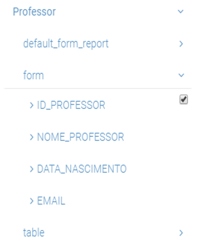

Após marcar a chave, clicar em “Gravar”, ao clicar em “_Preview_”, aparecerá uma tela pedindo para introduzir a chave, ao introduzir uma chave correta, veremos um relatório preenchido com os dados referentes àquela chave.

#### 2.2.3 Submenu table
O submenu “_table_” é diferente do “_form_”, pois o “_form_” está relacionada com elementos de um formulário, ou seja, um nome, uma data, uma idade, etc, enquanto que o “table” está relacionado com um ou mais elementos em uma tabela, uma lista com marca ou numerada. Podemos, então, dizer que o _checkbox_ serve para selecionarmos que elementos queremos introduzir na nossa tabela (ou lista).  
Para melhor entendimento vamos apresentar um exemplo prático, um histórico escolar onde podemos encontrar uma tabela com todas as disciplinas matriculadas por um aluno e suas respetivas notas.  
Primeiramente utilizar o editor para fazer o relatório. O resultado final será apresentado na imagem abaixo.
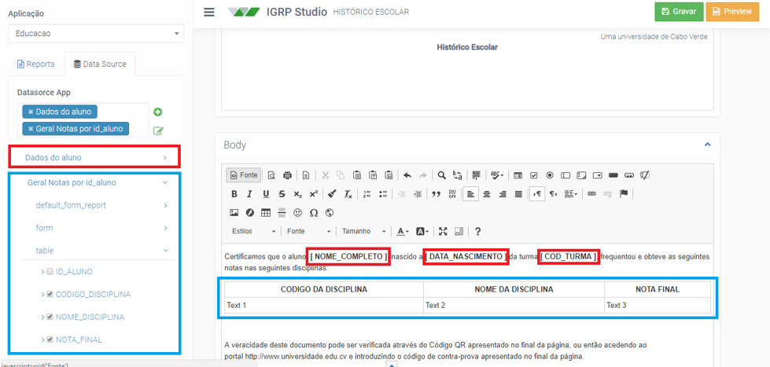

A imagem apresenta retângulos vermelhos referentes aos dados do aluno, adicionados através do submenu “_form_” retângulos, e azuis que se referem às notas desse aluno adicionados através do submenu “_table_”. O resultado final é a tabela encontrada no editor (campo _Body_). Reparem que é possível editar os nomes dos componentes da tabela.  
Para adicionar a tabela foi selecionado os componentes da tabela, através do _checkbox_ à esquerda do nome (visível na imagem acima), escolhemos a posição onde queremos adicionar a tabela no editor e arrastamos o submenu “_table_” (isso, mesmo se queremos mais do que um componente, temos de arrastar a tabela, ela irá levar todos os componentes selecionados para o editor) para o editor. Aparecerá a seguinte tela:  
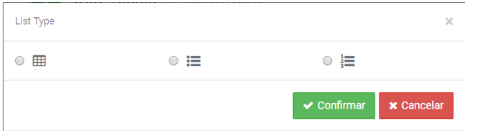

Podemos selecionar a primeira, que se refere a tabela, a segunda, que se refere a uma lista de marca ou a terceira, que se refere a uma lista numerada.  
Esses dois últimos se referem a listas. Utilizamos lista de marca para, por exemplo, exibir uma lista de documentos e lista numerada para, por exemplo, escolher a ordem dos documentos a serem entregues. Para o nosso exemplo, lista não seria a melhor opção, por isso vamos optar pela primeira opção referente à tabela. Em seguida, podemos escolher em “Agrupar por” Normal e confirmar. Pronto, já temos a nossa tabela no editor.  
Da mesma forma que foi apresentado no tópico do submenu “_form_”, é preciso escolher uma ou mais chaves para restringir a quantidade de elementos para preencher uma tabela, caso contrário, preencherá a tabela com todos os elementos possíveis.  
Um possível resultado do nosso exemplo seria o exemplo da figura seguinte:
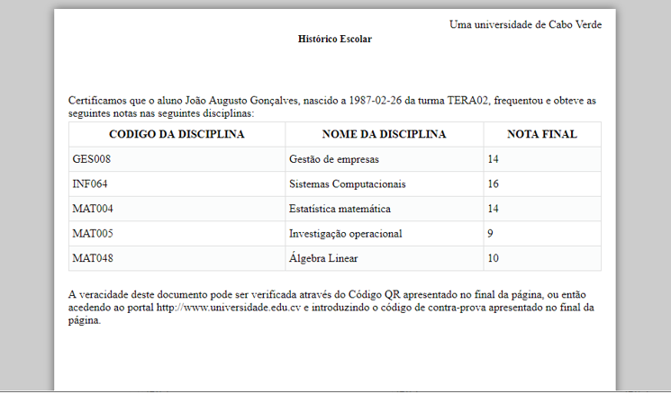
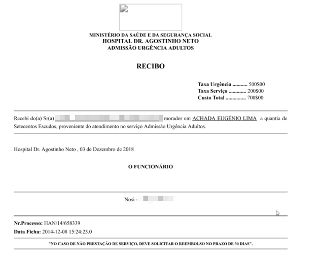

### 3. Chamando o relatório na aplicação
Com o relatório pronto e, caso tenha sido necessário defini-las, as chaves só precisamos inserir o relatório na aplicação desejada.
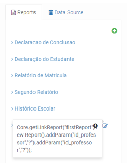

Voltando a _Reports_, procuramos pelo nosso relatório e mesmo à frente temos um ícone com a letra ‘i’ e outro para editar o nome e código do relatório. Ao passarmos o ponteiro do mouse em cima do ícone com a letra ‘i’ uma caixa com o código é apresentada, só um clique sobre o ícone e copiamos o código para a nossa área de transferência.

### 3.1 Explicando o código
`Core.getLinkReport( "firstReport", new Report().addParam( "id_professor","?"));`

“_Core_” é onde se encontra as principais funções e métodos auxiliares do IGRP. É o núcleo do IGRP. Para chamarmos uma função do “_Core_” introduzirmos o “_Core_” seguido de um ponto “.” seguido da função desejada ( _Core.”nome_da_funcao_sem_aspas()”_).

“_getLinkReport(‘codigo_relatorio’, ‘funcao_relatorio()’)_” é uma função do Core que recebe dois parâmetros. O primeiro é o código do modelo do nosso relatório e o segundo é o relatório. A função cria um novo relatório utilizando o modelo com o código introduzido no primeiro parâmetro, e, caso seja necessário, introduz os parâmetros no relatório adicionados no segundo parâmetro. No nosso exemplo temos “_firstReport_” como código do modelo do nosso relatório, no segundo criamos um novo relatório com adição de um novo parâmetro (dentro do nosso relatório) de nome “id_professor” e em seguida devemos substituir o “?” pelo valor do qual queremos os dados. Exemplo: (“id_professor”, 3).

Tendo o relatório pronto, o código na área de transferência, só falta associá-lo ao nosso botão.  
Selecionamos a página onde queremos incluir o relatório e clicamos sobre o botão “Gerar código” como mostra a imagem.
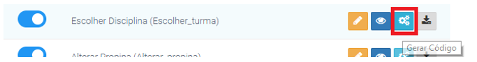

Uma nova página aparecerá com o _design_ da página. Para o nosso exemplo iremos inserir um botão na página. No momento em que o botão é largado no designer da página (_drag and drop_) uma função é criada no _Controller_ da página. Vamos em propriedades do botão e alterarmos o “_Custom Return_” para verdadeiro, como mostra a imagem a seguir:
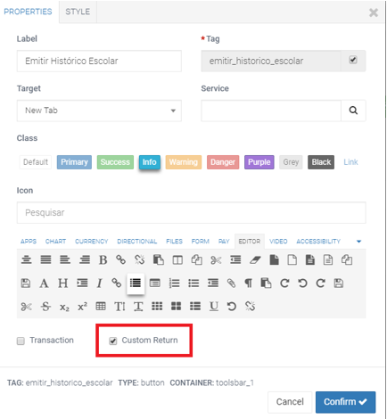

Após termos configurado toda página e confirmado as propriedades do botão, precisamos implementar um pequeno código para ligar o botão ao relatório. Para isso precisamos clicar em Java.
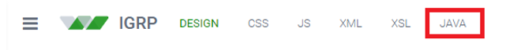

Importamos a biblioteca do _Report_ no nosso _Controller_. O caminho da biblioteca se encontra no retângulo a vermelho na imagem abaixo.  
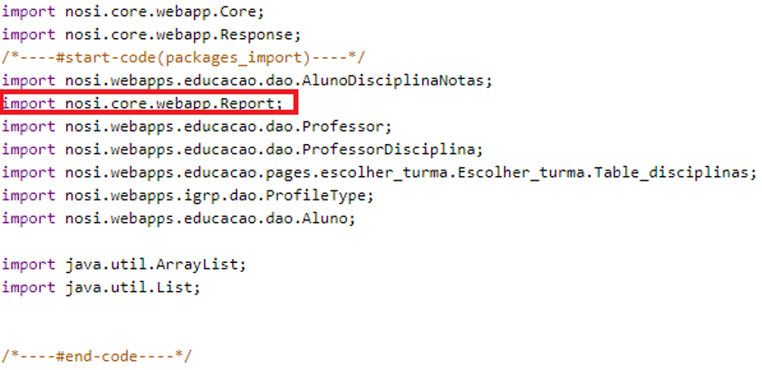

A imagem do código a seguir irá nos mostrar o quão fácil foi conectar o relatório à nossa aplicação.
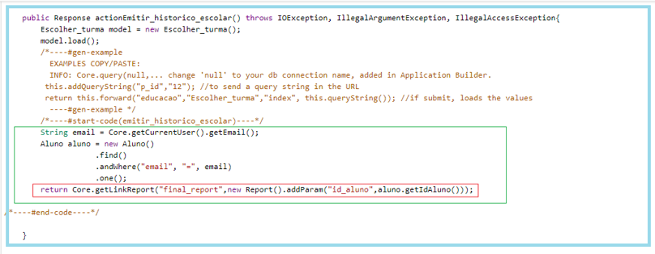

Dentro do retângulo a azul temos toda a função gerada pelo IGRP Web com exemplos referentes à ação a ser realizada ao clicar no botão, dentro do retângulo verde temos o código feito pelo programador, chamemos essa parte de condições, e a vermelho o código que conecta o botão da aplicação ao relatório, ou seja, assim que clicarem no botão a função é chamada e, se todas as condições se verificarem, nos é apresentado pelo browser o relatório solicitado. Reparem que substituímos o “?” pelo ID do aluno (“_aluno.getIdAluno()_”).

### 4. Exemplo
Numa universidade existe um portal para que os alunos possam visualizar as disciplinas no qual se encontram matriculados e visualizar as notas lançadas pelos professores. Na mesma página existe um botão de nome “Emitir Histórico Escolar”, como apresentado na imagem.
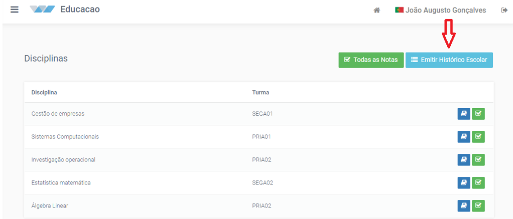

Este botão irá nos retornar o relatório solicitado:
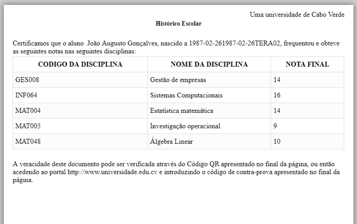

