# Report Designer
Ferramenta de geração de relatórios, que permite desenhar, parametrizar e gerar os mais diversos tipos de documentos em aplicações igrpweb. Estando no _Home Page Builder_ podemos acessá-la a partir dos botões assinalados na imagem a seguir. Podemos entender o seu funcionamento acompanhando um exemplo no documento _Report Designer_.

### 1. Introdução

_Report_ é a geração de relatórios sobre um determinado negócio. Trata-se de um dos pontos críticos para qualquer aplicação da área de gestão, uma vez que permite a geração dos mais diversos documentos, como declarações, lista e relatórios, por exemplo, que representam a concretização física de dados e informações referentes ao negócio, tornando-se assim vital para a “sobrevivência” da aplicação.

Pretendemos com este documento demonstrar como podemos utilizar o _Report Designer_ do IGRP Studio para produzir relatórios sobre os dados de aplicações baseadas na nossa _framework_. Começaremos por descrever o nosso ambiente de trabalho, em seguida produziremos um “Hello World!” do _Report Designer_, um simples relatório para entendermos o seu funcionamento e output. Mais à frente veremos como preencher o nosso relatório com dados de outras fontes (base de dados, processos, etc…) e, por fim, como juntar o relatório à nossa aplicação.

#### 1.1 Relatório

É um conjunto de informações utilizado para reportar resultados parciais ou totais de uma determinada atividade, experimento, projeto, ação, pesquisa ou outro evento que esteja acabado ou em andamento.

#### 1.2 Acesso

Dentro da aplicação IGRP Studio, é possível acessar o _Report Designer_ através de um dos botões apresentados na figura seguinte:
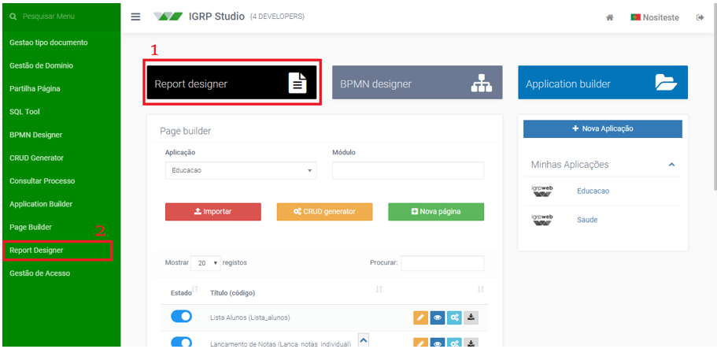
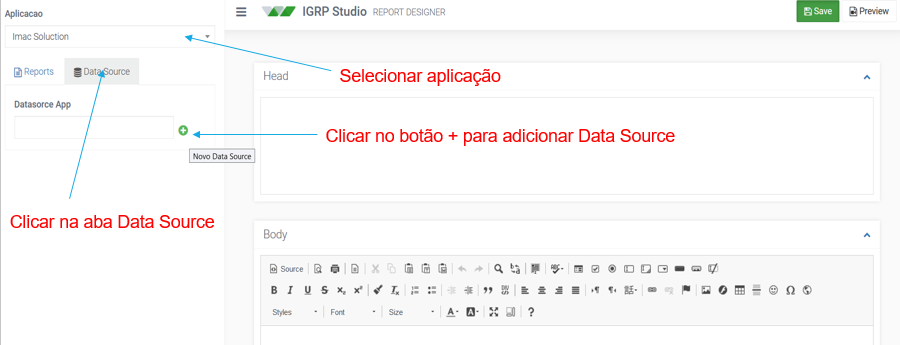

Ao clicar no botão apresentado na 1º imagem acima, (retângulo 1), o _Report Designer_ é apresentado numa nova página. Se optarmos pelo acesso no menu à esquerda, ao clicarmos sobre o botão “_Report Designer_” (retângulo 2) acedemos à página pretendida substituindo a atual.
O _Report Designer_ do IGRPWeb contém um ambiente de trabalho com ferramentas para auxiliar a construção de um relatório:<br></br>
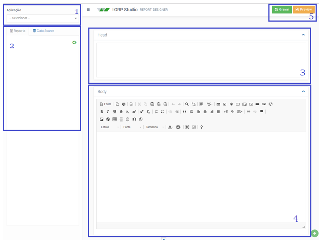

#### 1.3 Legenda da figura e instruções de inicialização

**Aplicação**<br></br>
Em primeiro lugar, deve-se escolher a aplicação do qual se pretende criar um relatório. A lista é composta de todas as aplicações pertencentes ao usuário atual.

**_Reports_**<br></br>
Após escolher a aplicação, todos os relatórios desenvolvidos para esta aplicação são apresentados nesta aba. É possível ver/editar um relatório ao clicar sobre o nome do relatório e criar um novo relatório clicando sobre o botão verde com o símbolo de adição (+).

**_Head_**<br></br>
Campo onde deverá ser construído o cabeçalho do relatório.

**_Body_**<br></br>
Campo onde deverá ser construído o corpo do relatório.

**Gravar e _Preview_**<br></br>
Ao clicar no botão “**Gravar**”, todas as alterações feitas no relatório serão salvas. O botão “**_Preview_**” permite a visualização da última versão gravada do relatório apresentado.

#### 1.4 Criar Data Source
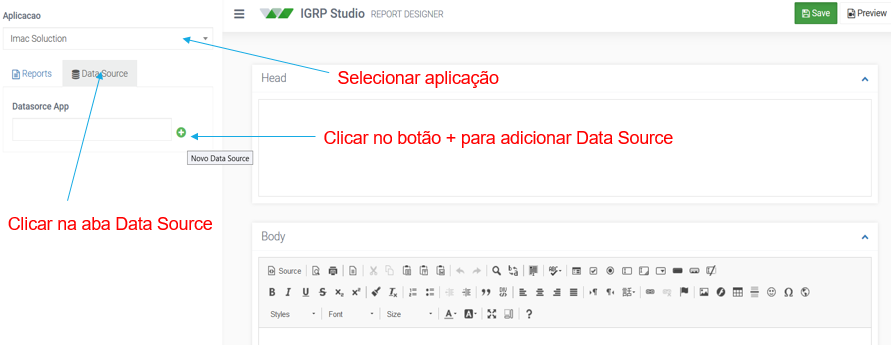
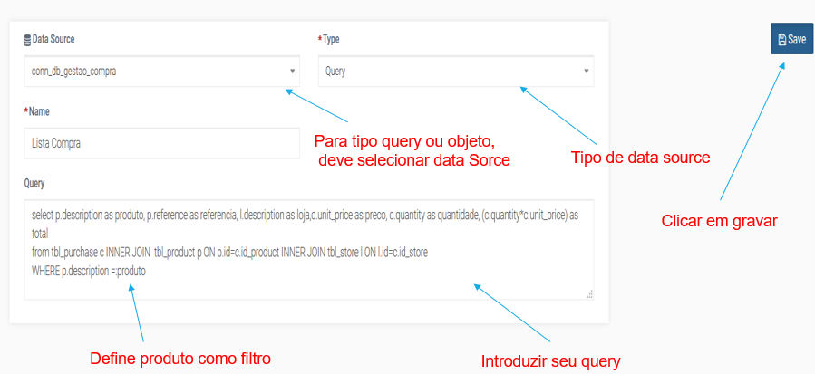
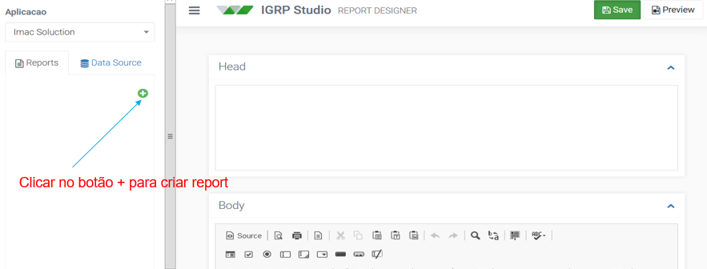
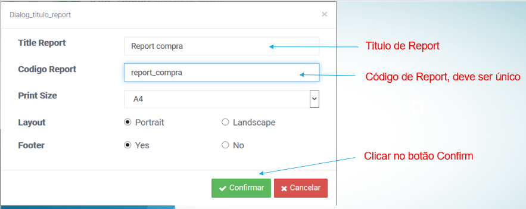
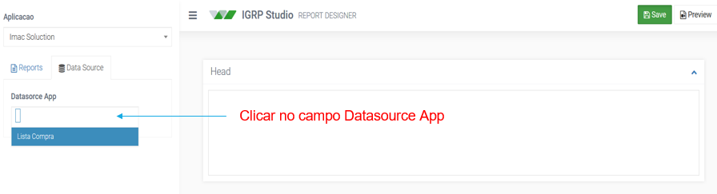
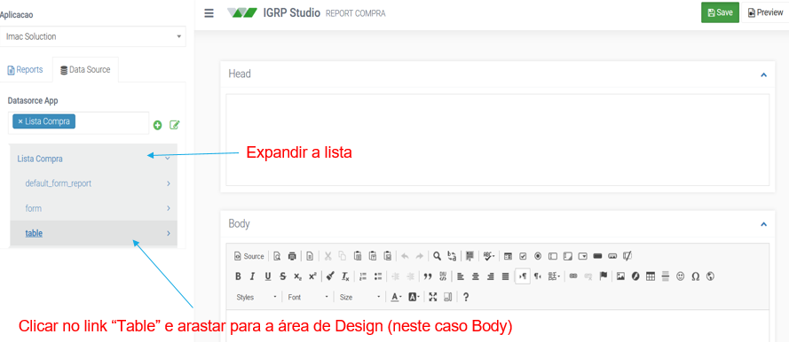
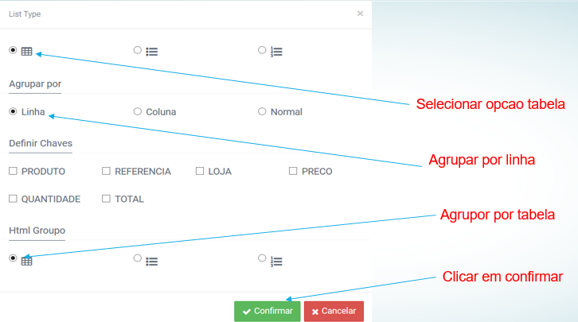
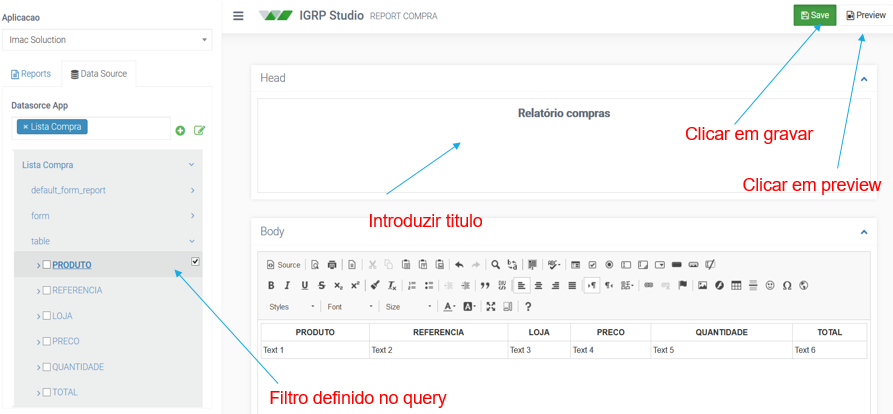

#### 1.5 Invocar Report através de link
- Criar uma página Relatório Compra _Link_;
- Adicionar componente _form_ no _UI Designer_;
- Adicionar campo _link_ no componente _form_.
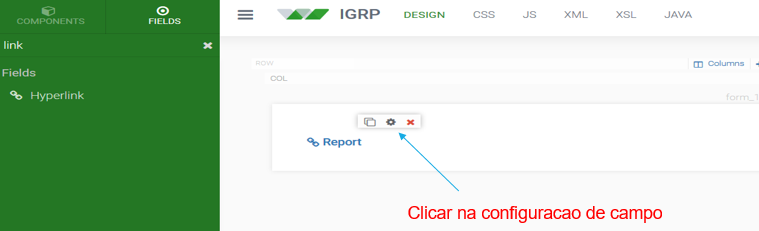
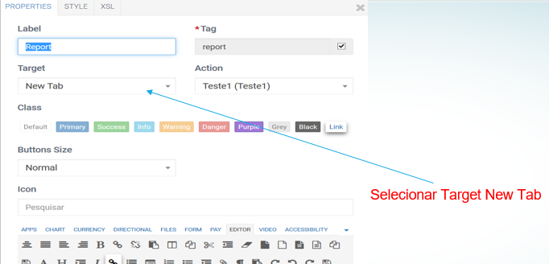
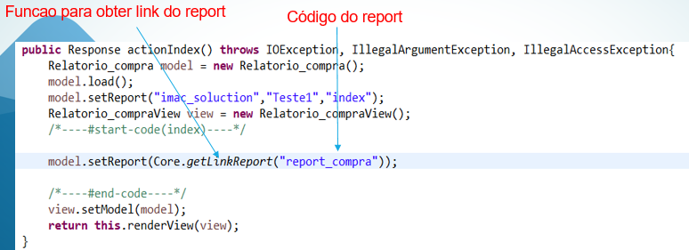

#### 1.6 Invocar Report através de botão
- Criar uma página Relatório Compra Botão;
- Adicionar componente _form_ no _UI Designer_;
- Adicionar campo _link_ no componente _form_.
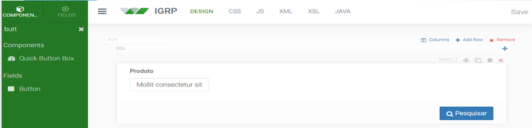
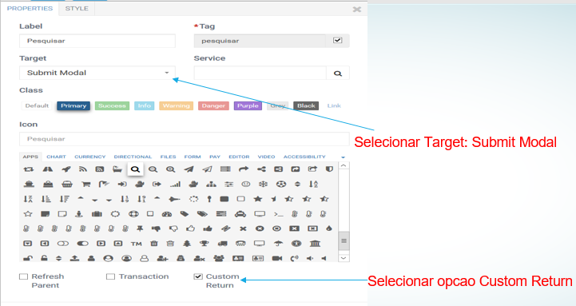
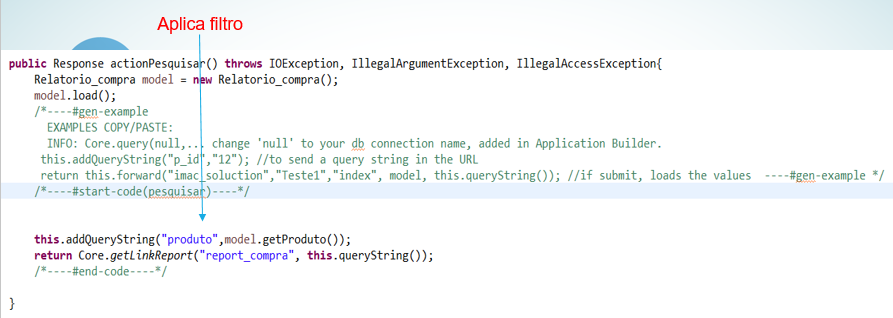

### 2. Programação em Java para utilização de Report
Pedir o _link_ de um _report_ pelo código<br></br>
`String linkReport = Core.getLinkReport( String code_report );`

Pedir o _link_ de um _report_ pelo código, enviando parâmetro<br></br>
`String linkReport = Core.getLinkReport( String code_report, Object report );`

Ex:<br></br>
```
String id = Core.getParam( "student_id" );
// a method can return
return Core.getLinkReportPDF( "student_report", new nosi.core.webapp.Report().addParam( "student_id", id ) ); //PDF output
```
ou
```
return Core.getLinkReport( "student_report", new nosi.core.webapp.Report().addParam( "student_id", id ) ); //html output
```
--------------------------------------------------------------------------------------------------------

#### 2.1 Utilizar Report na Lista
```
model.loadTable_1(Core.query("HelloDS","SELECT nome as text_2,data_nasc as date_2,id as id from t_teste"));
List table_1Array = model.getTable_1();
Hello_pagina.Table_1 table_1;
List table_1List  = new ArrayList();
for(int i=0;i
{
        table_1=table_1Array.get(i);
        table_1.setVer("igrp_studio", "WebReport", "get-report").addParam("code","hello_rep_linha").addParam("p_id",table_1.getId());
        table_1.setVer_desc("Ver");
        table_1List.add(table_1);         
}
 model.setTable_1(table_1List);
```
#### 2.2 Utilizar Report em formulario
```
 //model.setAbrir_hello_report(Core.getLinkReport("hello_report"));
 model.setAbrir_hello_report("igrp_studio", "WebReport", "get-report").addParam("code","hello_report");
```