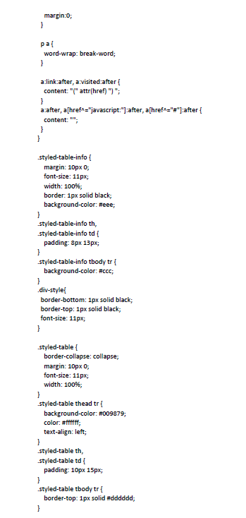

# Report em HTML usando Classes
### 1. Definir “Model” Comum:
```
public class ReciboPagamento {
private String logo_base64;
private String nome_estrutura;
private String nif_estrutura;
private String nome_servico;
private String nr_utente;
private String nm_utente;
private String dt_nasc;
private String morada;
private String n_acomp;
private String telefone;
private String email;
private String movel;
private String obs_label;
private String obs_exame_instrucao;
private String obs_content;
private String info_contato;
private String estrutura_contato;
private String recibo_title;
private String recibo_subtitle;
private String motivo_isencao;
private String total_extenso;
private String nu_nif;
private String nr_duc;
private String entidade;
private String referencia;
private String duc_montante;
private String custo_total;
private String white_space_size;
private String contra_prova;
private List recibo_valores = new ArrayList<>();
               //TO DO: Source --> Generate Getters and Setters..
}
```

### 2.  Criar Class para alimentar Model
```
public static String getReportPagamento() {
try {
SisVListaPagamento lista = new SisVListaPagamento().findOne(relacaoId);
ReciboPagamento model = new ReciboPagamento();
boolean isExame = lista.getTipo().equals(SisConst.TP_SOLICITACAO_EXAME);
try {
loadEstruturaInfo(relacaoId, cadastroId, organicaId);
model.setMorada(getMorada());
model.setNif_estrutura(getNif_estrutura());
model.setNome_estrutura(getNome_estrutura());
model.setNome_servico(getNome_servico());
model.setLogo_base64(getLogo_base64());
model.setEstrutura_contato(getEstrutura_contato());
} catch (IOException e) {
e.printStackTrace();
}
List <ReciboPagamento.recibo_valores> recibo_valores = new ArrayList<>();
addRowReciboValores(recibo_valores,"Cartão", lista.getPagaCartao());
addRowReciboValores(recibo_valores,"Taxa Serviço", lista.getTaxaServico());
addRowReciboValores(recibo_valores,"Marcação", lista.getMarcacao());
addRowReciboValores(recibo_valores,"Serviço", lista.getServico());

if(recibo_valores!= null)
model.setRecibo_valores(recibo_valores);
model.setCusto_total(lista.getCustoTotal() + "$00");
model.setDuc_montante(lista.getCustoTotal() + "$00");
model.setTotal_extenso(lista.getExtensao());
model.setNu_nif(lista.getNrNif());
model.setNr_duc(lista.getNrDuc());
return ReciboPagamentoHtml.getTemplate(model);
}catch (Exception e) {
e.printStackTrace();
return ReciboPagamentoHtml.getTemplate(null);                                   
}
}
```

### 3. Criar Classe para gerar Template
Funcao que retorna o template, com todos os conteudos:
```
return TEMPLATE.toString()
.replace("{header}", header)
.replace("{white_space_size}", model.getWhite_space_size())
.replace("{user_name}", Core.getCurrentUser().getName())
.replace("{sysdate}", Core.dateToString(Core.getCurrentDateUtil(), "yyyy-MM-dd"))
.replace("{contra-prova}", contraProva)
.replace("{nr_utente}", model.getNr_utente())
.replace("{nm_utente}", model.getNm_utente())
.replace("{dt_nasc}", model.getDt_nasc())
.replace("{morada}", model.getMorada())
.replace("{telefone}", model.getTelefone())
.replace("{email}", model.getEmail())
.replace("{movel}", model.getMovel())
.replace("{n_acomp}", model.getN_acomp())
.replace("{obs_label}", model.getObs_label())
.replace("{instrucao}", model.getObs_exame_instrucao())
.replace("{obs_content}", model.getObs_content())
.replace("{info_contato}", model.getInfo_contato())
.replace("{estrutura_contato}", model.getEstrutura_contato())
.replace("{recibo_table}", reciboTitle + reciboSubtitle + getReciboValores(model))
.replace("{valor_extenso}", model.getTotal_extenso())
.replace("{nif_estrutura}", model.getNif_estrutura())
.replace("{nome_estrutura}", model.getNome_estrutura())
.replace("{nu_nif}", model.getNu_nif())
.replace("{custo_total}", model.getCusto_total())
.replace("{duc_montante}", model.getDuc_montante())
.replace("{nr_duc}", model.getNr_duc())
.replace("{entidade}", model.getEntidade())
.replace("{referencia}", model.getReferencia())
.replace("{logo_rede_vint4}", "") 
.replace("{war_name}", Core.getDeployedWarName());
```
### 4. Chamar HTML apartir de um action
```
public Response actionRecibo() throws IOException, IllegalArgumentException, IllegalAccessException{
Lista_espera_consulta model = new Lista_espera_consulta();
model.load();
/*----#gen-example
EXAMPLES COPY/PASTE:
INFO: Core.query(null,... change 'null' to your db connection name, added in Application Builder.
return this.forward("sis","Report_preview","index",this.queryString()); //if submit, loads the values
Use model.validate() to validate your model
----#gen-example */
/*----#start-code(recibo)----*/
String Html= getReportTemlateHtml();
this.format = Response.FORMAT_HTML;
return this.renderView(Html);
/*----#end-code----*/
}
```
### 5. HTML template exemplo:
<br></br>
<br></br>
<br></br>
<br></br>
<br></br>
<br></br>
<br></br>
<br></br>


### 6.  Imagem do Report Criado


