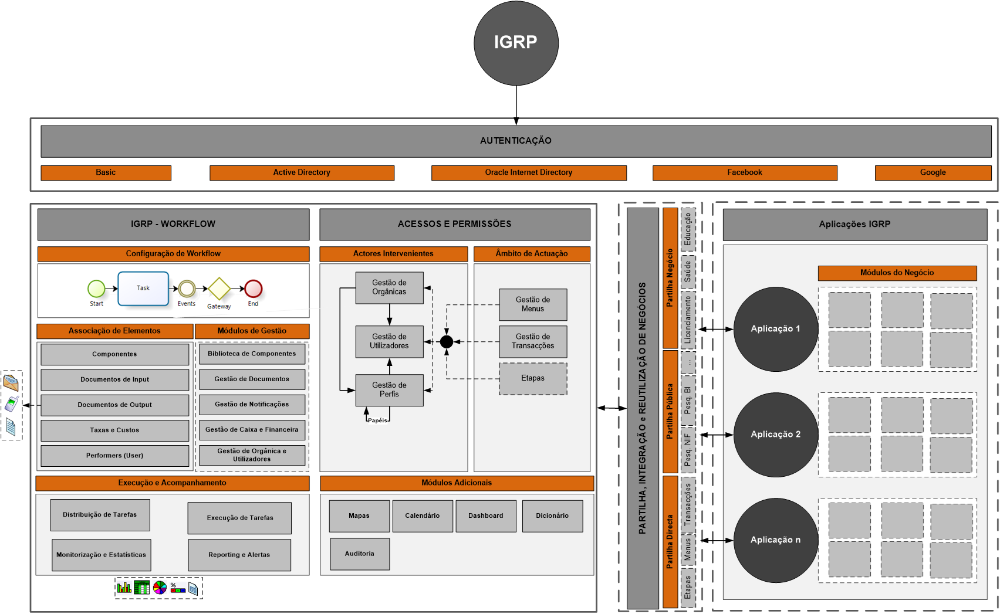

# igrpweb - Apresentação

### 1. Definição

A Plataforma igrpweb, desenvolvida pelo Núcleo Operacional para a Sociedade de Informação (NOSi), é uma plataforma de código aberto para criação de aplicações web. Com enfoque em etapas de negócio e processos, permite a geração automática de 80% do código, promovendo a customização ágil e escalabilidade conforme as necessidades organizacionais. A sua licença Apache 2.0 fomenta a colaboração inovadora.

### 1. Arquitetura

A arquitetura da igrpweb é concebida para ser leve e robusta, permitindo a interoperabilidade entre aplicações nativas e de terceiros. 

Oferece o IGRP Studio, um ambiente dedicado que inclui geradores de interface, fluxos de processo e relatórios, facilitando o desenvolvimento e gestão de aplicações. Além disso, a sua capacidade de trabalhar com diversas bases de dados evidencia a sua flexibilidade arquitetural.

