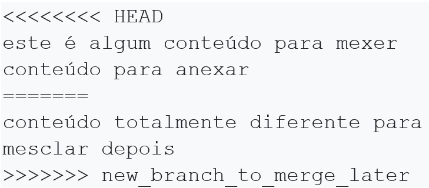
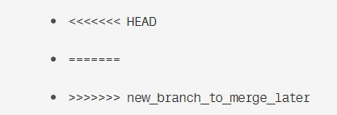

# Resolver Conflitos do Git

Os sistemas de controle de versão tratam de gerenciar contribuições entre vários autores distribuídos (geralmente desenvolvedores). Às vezes, vários desenvolvedores podem tentar editar o mesmo conteúdo. Se o Desenvolvedor A tentar editar o código que o Desenvolvedor B está editando, pode ocorrer um conflito. Os conflitos de _merge_ ocorrem quando alterações concorrentes são feitas na mesma linha de um arquivo ou quando uma pessoa edita um arquivo e outra pessoa exclui o mesmo arquivo.  
Para aliviar a ocorrência de conflitos, os desenvolvedores trabalharão em ramos isolados separados. A principal responsabilidade do comando _git merge_ é combinar ramificações separadas e resolver quaisquer edições conflitantes.  

Os conflitos geralmente surgem quando duas pessoas alteram as mesmas linhas em um arquivo ou se um desenvolvedor exclui um arquivo enquanto outro o modifica. Nesses casos, o Git não pode determinar automaticamente o que é correto. Os conflitos afetam apenas o desenvolvedor que está conduzindo a fusão, o restante da equipe não tem conhecimento do conflito. O Git marcará o arquivo como conflitante e interromperá o processo de mesclagem. É então responsabilidade dos desenvolvedores resolver o conflito.

### 1. Como identificar conflitos de mesclagem

Como vimos no exemplo anterior, o Git produzirá alguma saída descritiva nos informando que ocorreu um CONFLITO. A saída do _git status_ indica que há caminhos não mesclados devido a um conflito. O arquivo _merge.text_ agora aparece em um estado modificado. Vamos examinar o arquivo e ver o que foi modificado. A saída do _git status_ indica que há caminhos não mesclados devido a um conflito. O arquivo _merge.text_ agora aparece em um estado modificado. Vamos examinar o arquivo e ver o que foi modificado.
  
Podemos ver algumas novas adições estranhas.  

Pense nessas novas linhas como "divisores de conflito". A linha ======= é o "centro" do conflito. Todo o conteúdo entre o centro e a linha ««««««« HEAD é o conteúdo que existe no _branch master_ atual para o qual o HEAD ref está apontando. Alternativamente, todo o conteúdo entre o centro e »»»»»»» *_new_branch_to_merge_later_* é o conteúdo que está presente em nosso _branch_ de fusão.

### 2. Como resolver conflitos de mesclagem usando a linha de comando

Para resolver um conflito de _merge_ causado por alterações diferentes na linha, você deve escolher quais alterações dos diferentes _branches_ incorporar em um novo _commit_. A maneira mais direta de resolver um conflito de mesclagem é editar o arquivo em conflito. Abra o arquivo _merge.txt_ em seu editor favorito.  
Para ver o começo do conflito de _merge_ no arquivo, pesquise o marcador de conflito 
 «««««««  no arquivo. Quando abrir o arquivo no editor de texto, você verá as alterações do _branch_ HEAD ou base após a linha  ««««««« HEAD. Em seguida, você verá  =======, que divide suas alterações das alterações no outro _branch_, seguido por  »»»»»»» BRANCH-NAME. 

Para nosso exemplo, vamos simplesmente remover todos os divisores de conflito. O conteúdo _merge.txt_ modificado deve ser semelhante a: _este é algum conteúdo para mexer conteúdo para anexar conteúdo totalmente diferente para mesclar depois_.

Decida se você deseja manter apenas as alterações do seu _branch_, manter apenas as alterações do outro _branch_, ou fazer uma nova alteração, que pode incorporar alterações de ambos os branches. Exclua os marcadores de conflito  «««««««, ============== »»»»»»»  e faça as alterações desejadas no _merge_ final. 

