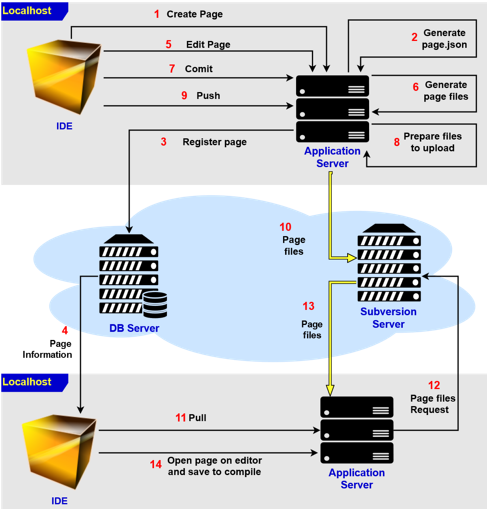
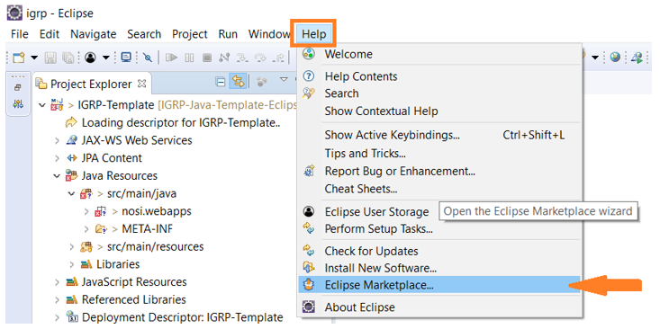
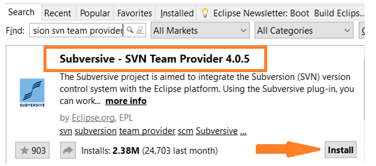
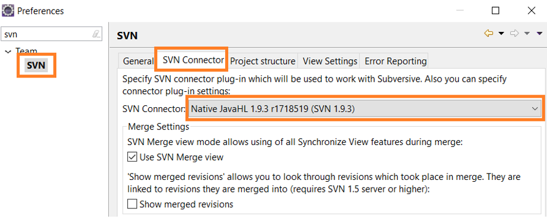
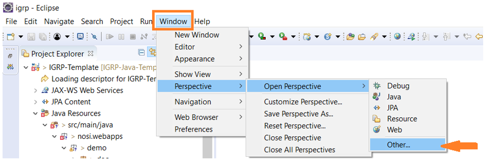
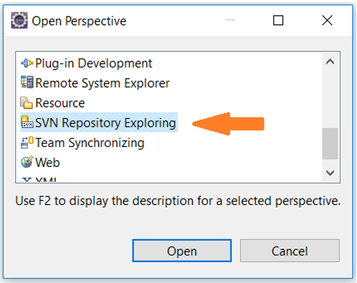
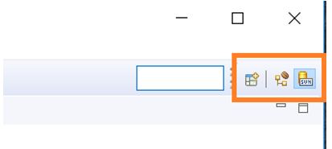
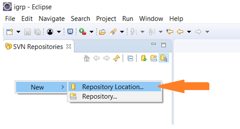
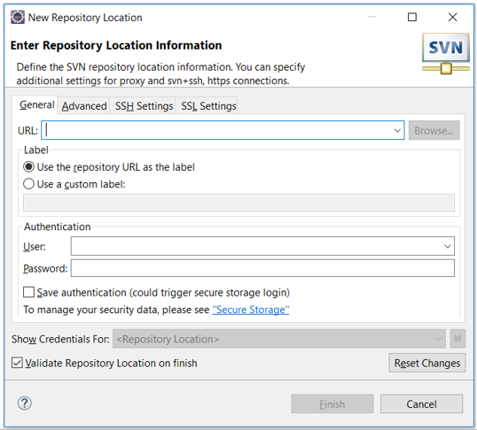

# Subversion

O controlo de versões é um dos pontos críticos no desenvolvimento de uma aplicação, especialmente quando se trabalha em equipa para que os programadores possam alterar com segurança os diversos ficheiros do projeto.   
Pretendemos assim, esquematizar e orientar os desenvolvedores na implementação desse sistema no IGRP web com o eclipse.

### 1. Descrição do processo
- O desenvolvedor cria uma página no seu IDE (ex: eclipse);
- Automaticamente é gerado um ficheiro _Page.json_ que é gravado no seu servidor local (ex: Tomcat);
- Automaticamente a página é registada no _DB Server_;
- Portanto, a partir desse momento a página passa a estar visível no IDE dos outros desenvolvedores;
- O desenvolvedor edita a página e ao salvar…
- São gerados os ficheiros _Model, View, Controler, XML e XSL_ correspondentes à página, que ficam apenas no seu servidor local, portanto indisponível para os outros desenvolvedores;
- O desenvolvedor faz _COMMIT_ da página…
- A página é preparada para _upload_ ao Servidor de _Subversion_;
- O desenvolvedor faz _PUSH_ da página…
- A página é enviada ao Servidor de _Subversion_, ficando agora disponível para os outros desenvolvedores;
- Os outros desenvolvedores devem fazer _PULL_ da página para que a possam ter em sua máquina;
- É feito o _download_ da página ao seu servidor local;
- Como a página não se encontra compilada os desenvolvedores que fizeram seu _PULL_ devem abri-la no editor de página e clicar em _SAVE_ para que a compilação seja feita.

### 2. Subversion control com Eclipse

Para implementar o _Subversion Control_ em Eclipse siga os passos seguintes:   
Vá para Help -> Eclipse MarketPlace conforme a imagem a seguir;  

**Passo 1**: Encontre o **Subversive – SVN Team Provider**, instale e reinicie o Eclipse;

**Passo 2**: 3. Vá para Window -> Preferences -> Team -> SVN -> SVN Conector e escolha o conector que acabou de instalar, conforme a imagem a seguir e _click Apply and Close_ e volte a reiniciar o eclipse após a configuração.

**Passo 4**: Vá para Window -> Perspecrtive -> OpenPerspective -> Other;

**Passo 5**: Na janela que aparece escolha _SVN Repository Explorer_ e clica em _Open_.  

A partir deste momento o _SVN repositor exploring_ passa a estar disponível no canto superior direito do Eclipse e você pode alternar entre ele e outras perspetivas com um _click_.  

**Passo 6**: _Click_ no botão direito no espaço em branco do lado esquerdo, e escolha New -> Repository Location;  
  
Na janela que aparece  

Baixe a aplicação **Sourcetree** e instale no seu computador. Baixe [aqui](https://bitbucket.org/product/).

