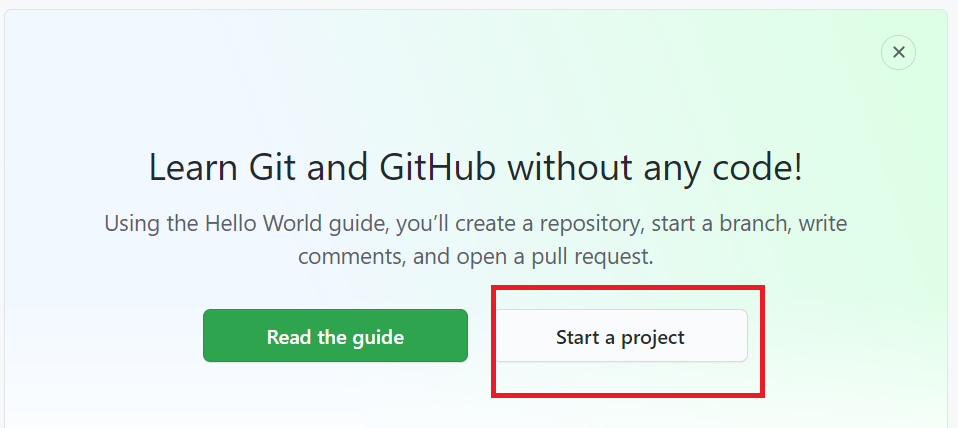
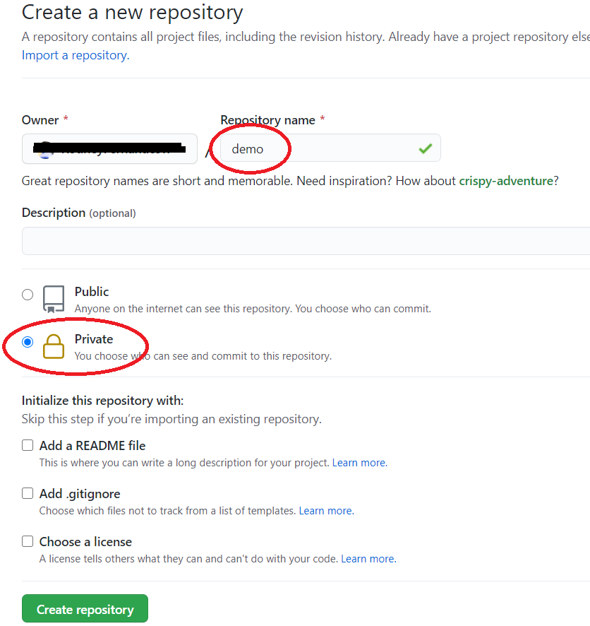
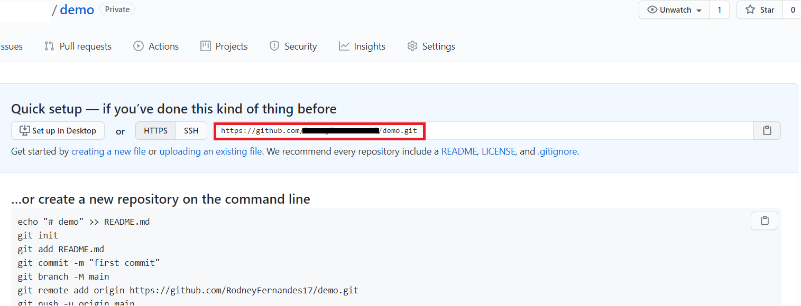
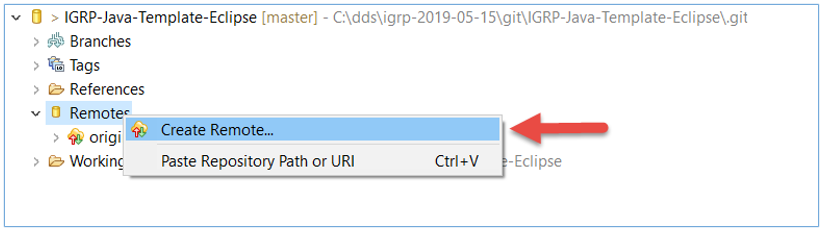
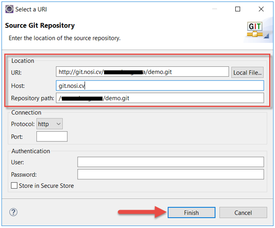
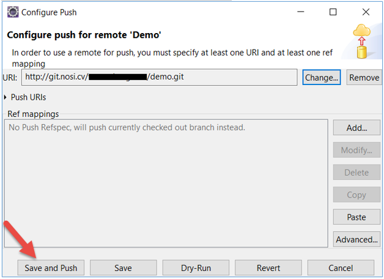
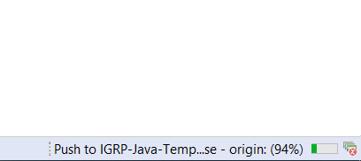
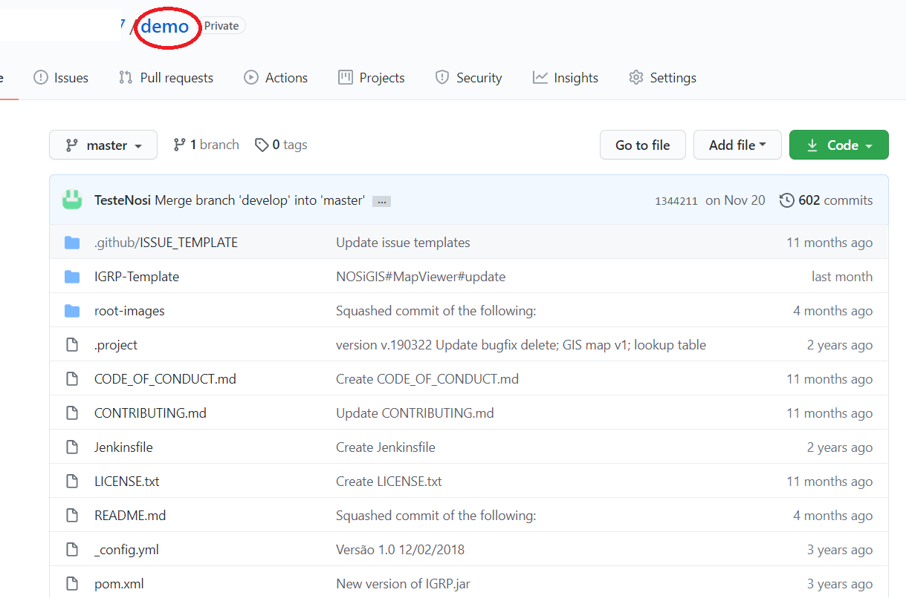

# GitHub

**Passo 1**: Vamos para [GitHub](https://github.com/) e fazemos **Sing IN**. Se ainda não tiver conta associada no Git é preciso criar uma conta.

**Passo 2**: Na página seguinte, criamos um novo projeto, clicando no botão assinalado na imagem a seguir.

**Passo 3**: No formulário seguinte definimos o nome do projeto, o nível de visibilidade e clicamos sobre o botão "**_create repository_**".

**Passo 4**: A partir deste momento temos o nosso repositório pronto para receber um projecto. Aqui, copiar o URL do repositório [assinalado na imagem] para podermos alojar e partilhar um projeto.

**Passo 5**: Partindo do princípio de que já temos o IGRP Template importado no nosso Eclipse, vamos para _Window->Show View->Other_ e na janela que se abre selecionamos _Git Repositories_ e clicamos no **Open**.

**Passo 6**: Escolher a opção de "existing local Git repository".

**Passo 7**: No Guia, que então se torna visível, expandimos as pastas do nosso IGRP Template, fazemos _click_ direito sobre **_Remotes_** e escolhemos **_Create Remote_**.

**Passo 8**: Em seguida, na janela que se abre damos um nome ao repositório remoto, selecionamos _Configure push_ e clicamos em **OK**.

**Passo 9**: Na janela seguinte, clicamos em **Change...** e na janela que se abre, colamos no campo URL o _link_ que copiamos no repositório que criamos anteriormente no NOSi GTILab. Os outros campos são automaticamente preenchidos, logo clicamos no **Finish**  para prosseguir.   

**Passo 10**: No campo URI, colar o URL que copiamos no passo 4.

**Passo 11**: Em seguida,  clicamos sore o botão **Save and Push**, introduzimos nossas credenciais na janela que se abre e clicamos no **OK**.   

**Passo 12**: Sempre que for pedido, fazer o _login_ com as credencias da conta do GitHub.   

**Passo 13**: Esperar até que termine o processo de clonagem do nosso projeto para o GitHub.

**Passo 14**: Na janela que se abre a seguir, clicamos em **Close** e aguardamos o Eclipse terminar a operação.

**Passo 15**: Finalizada a operação no IDE Eclipse ,fazemos _Refresh_ na página do nosso repositório e podemos ver os nosso IGRP Template.

